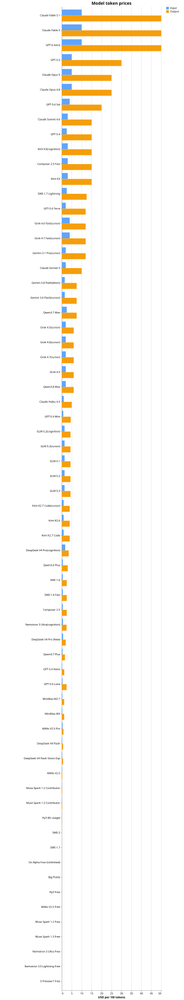
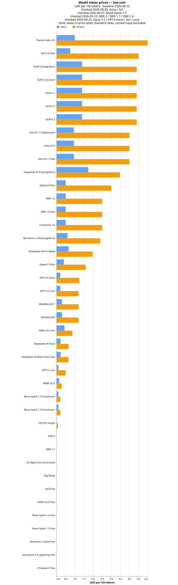

# delegate-skills

[](https://mkdn.review/?url=https%3A%2F%2Fraw.githubusercontent.com%2Foubakiou%2Fdelegate-skills%2Frefs%2Fheads%2Fmain%2FREADME.md)

[](./README.md)
[](./README_ja.md)

📖 Introduction article: [Don't Make the Expensive Model Do Everything — delegate-skills, a Casual Multi-Model Setup Built on Nothing but Standard Skills](https://dev.to/kiou_ouba_afbd120335456f3/dont-make-the-expensive-model-do-everything-delegate-skills-a-casual-multi-model-setup-built-on-1c9j)

**A skill set for LLM agents that delegates implementation, exploration, review, and chores to a subagent running a cheaper model or a model from another vendor (Claude → Codex, etc.) — compressing token cost.**

Keep an expensive model as the main agent and offload routine "read, investigate, fix" work to a cheaper-model child process. For example, when the main agent is Claude Fable 5 (input \$10 / output \$50 per 1M tokens), delegating code exploration to Claude Haiku 4.5 (\$1 / \$5) cuts the token cost of that work to 1/10. Delegation targets are not limited to Claude models: models available through Codex (`gpt-*`), Devin CLI, Cursor agent CLI, and opencode CLI can be selected by model name alone. Results come back through files and are read incrementally, so the main agent's context stays small.

## Features

- **Token cost compression** — delegate read/write-heavy routine work to cheaper models, reserving the expensive model's consumption for decision-making and final responsibility
- **Context isolation** — bulk file reading and trial-and-error logs stay in the child process; the main agent reads only the result's index → required sections
- **Multi-CLI support** — works whether the requester is Claude Code, Codex, Devin CLI, or Cursor, and delegation targets across Claude, Codex, Devin, Cursor, and opencode are selected by model name alone
- **Capability bridge** — bridges capabilities the main agent lacks, such as image generation (`delegate-imagegen`) and x.com research (`delegate-x-research`), through child processes
- **Fail-safe design** — recursion guard for multi-hop delegation, fail-closed on missing preconditions, and tool-permission limits such as no-push / read-only for delegation targets

## Quick start

### Prerequisites

- Node.js 24+ (the delegate scripts are a single bundled CLI that inlines `md2idx`; no `jq`, no `npx md2idx`, and no network access on first run)
- A POSIX shell to run the `.sh` shims, plus `git` when using follow-up sessions
- When using Claude family models: the `claude` CLI (logged in)
- When using `gpt-*`: the `codex` CLI (logged in)
- When using `swe-*` / `devin-*`: the `devin` CLI (logged in)
- When using `composer-*` / `cursor-*`: the Cursor agent CLI (command name `agent`; logged in or `CURSOR_API_KEY` set)
- When using `opencode/*`: the `opencode` CLI (logged in)
- When using `delegate-x-research` with the current backend: the `grok` CLI (logged in, with access to X research)

When using Codex as the requester, add the following to `.codex/config.toml` in the project where you installed the delegate skills, then restart Codex:

```toml
approval_policy = "on-request"
sandbox_mode = "danger-full-access"
```

> [!WARNING]
> Codex workers and a Codex requester run with `danger-full-access`, so the Codex sandbox is not a security boundary. We recommend using them inside a dedicated Dev Container, VM, ephemeral CI runner, or another hardened container. The agent can reach anything mounted or authenticated there; do not expose the host Docker socket or broad host directories. See the [Codex isolation boundary contract](./docs/design/spec.md#requester-codex-と外部隔離境界).

### Installation

#### gh skill (GitHub CLI v2.90.0+)

```bash
# Install an individual skill for Claude Code
gh skill install oubakiou/delegate-skills delegate-explore --agent claude-code --scope project

# For Codex
gh skill install oubakiou/delegate-skills delegate-explore --agent codex --scope project

# Install all delegate skills at once
for skill in delegate-explore delegate-implement delegate-chore delegate-review delegate-imagegen delegate-x-research delegate-htmldoc; do
  gh skill install oubakiou/delegate-skills "$skill" --agent claude-code --scope project
done
```

#### skills CLI ([vercel-labs/skills](https://github.com/vercel-labs/skills))

```bash
# Pick skills / agents interactively
npx skills add oubakiou/delegate-skills

# List available skills
npx skills add oubakiou/delegate-skills --list

# Install a specific skill for a specific agent non-interactively
npx skills add oubakiou/delegate-skills --skill delegate-explore -a claude-code -y
```

### Try it

Apart from the Codex requester setup above, no extra configuration is needed. Ask the main agent as usual, and it delegates automatically based on each skill's description.

```text
Find out where authentication is implemented in this repository
```

→ The main agent triggers `delegate-explore`, and a `haiku` child process does the investigation. The main agent reads only the result file's index → required sections.

You can also delegate explicitly by naming a skill.

```text
Review this branch's diff with delegate-review
```

To make the main agent delegate more aggressively, add one line to your project's CLAUDE.md / AGENTS.md.

```markdown
- To save tokens, actively delegate tasks to subagents using the delegate-\* skills
```

## How it works

The model-name prefix selects the execution backend:

| Model name                            | Backend          |
| ------------------------------------- | ---------------- |
| `sonnet` / `haiku` / `opus` / `fable` | Claude Code      |
| `gpt-*`                               | Codex            |
| `swe-*` / `devin-*`                   | Devin CLI        |
| `composer-*` / `cursor-*`             | Cursor agent CLI |
| `opencode/<provider>/<model>`         | opencode CLI     |

Each backend runs as a child process and exchanges request/response files with the main agent, keeping detailed work out of the main context. Runs are one-shot by default. See [protocol-v1](https://mkdn.review/?url=https%3A%2F%2Fgithub.com%2Foubakiou%2Fdelegate-skills%2Fblob%2Fmain%2Fdocs%2Fdesign%2Fprotocol-v1.md) and [spec.md](https://mkdn.review/?url=https%3A%2F%2Fgithub.com%2Foubakiou%2Fdelegate-skills%2Fblob%2Fmain%2Fdocs%2Fdesign%2Fspec.md) for details.

### Resumable worker sessions

For larger `delegate-implement` or `delegate-chore` tasks that may need a review/fix loop, the main agent can opt into a resumable session. If resume validation fails, it does not silently start a replacement; the agent issues a normal run instead. Claude, Codex, Devin, Cursor, and opencode support this mode.

OpenCode does not guarantee output outside the repository cwd: direct edit/write and explicit-path reads are rejected, while bash redirects can still write. The edit/write block for read-only task types assumes an environment without a managed OpenCode config, which can override the permissions delegate-skills injects. If the request exceeds `DELEGATE_REQUEST_INLINE_MAX`, the run fails before the child starts. Catalog lookup is advisory, not an allowlist; `retryable` is a classification hint, not an instruction to retry automatically.

## Skills

| skill                 | Purpose                                      | Tool permissions                 | Default model | env                                                                              |
| --------------------- | -------------------------------------------- | -------------------------------- | ------------- | -------------------------------------------------------------------------------- |
| `delegate-explore`    | Read-only code / doc / web / MCP exploration | read-only (web & MCP allowed)    | `haiku`       | `DELEGATE_EXPLORE_MODEL` / `DELEGATE_WORK_DIR`                                   |
| `delegate-implement`  | Code implementation & edits (one commit)     | Edit/Write/Bash (no push)        | `sonnet`      | `DELEGATE_IMPLEMENT_MODEL` / `DELEGATE_WORK_DIR`                                 |
| `delegate-chore`      | Fallback chores                              | Edit/Write/Bash (no push)        | `haiku`       | `DELEGATE_CHORE_MODEL` / `DELEGATE_WORK_DIR`                                     |
| `delegate-review`     | Code/doc review (diff findings)              | read-only                        | `opus`        | `DELEGATE_REVIEW_MODEL` / `DELEGATE_WORK_DIR`                                    |
| `delegate-imagegen`   | Image generation/editing via Codex           | Codex subprocess                 | `gpt-5`       | `DELEGATE_IMAGEGEN_MODEL` / `DELEGATE_WORK_DIR` / `DELEGATE_IMAGEGEN_OUTPUT_DIR` |
| `delegate-x-research` | x.com / X research                           | X research subprocess            | `grok-build`  | `DELEGATE_X_RESEARCH_MODEL` / `DELEGATE_WORK_DIR`                                |
| `delegate-htmldoc`    | HTML document generation (fixed template)    | output-dir writes only (no push) | `haiku`       | `DELEGATE_HTMLDOC_MODEL` / `DELEGATE_WORK_DIR`                                   |

Rationale for default models: explore / chore are read-centric and low-risk, so `haiku`; implement needs editing judgment, so `sonnet`; review's finding quality directly shapes the result and is judgment-heavy, so `opus`; htmldoc only fills content into a bundled fixed template, so `haiku`.

`delegate-imagegen` intentionally has no user-facing model prompt, but operators can set `DELEGATE_IMAGEGEN_MODEL`. If the user does not specify an output directory, generated files go under `delegate-imagegen-output/`.

`delegate-x-research` is a capability bridge for X research, so operators can set `DELEGATE_X_RESEARCH_MODEL` but the main agent should not ask users to pick a backend model.

`delegate-htmldoc` generates self-contained HTML documents by filling content into a fixed template bundled with the skill (`references/template.html` + `references/styleguide.md`), so the design stays identical across runs and models. The worker never generates or edits CSS. Chart and image assets are prepared by the parent (e.g. via dataviz-svg or `delegate-imagegen`) and passed by path: SVGs are inlined into the document, raster images are copied next to the output HTML and referenced relatively. If the user does not specify an output path, generated files go under `delegate-htmldoc-output/`.

## Environment variables

Most users only need the model variables.

### Common settings

| Variable                       | Default                                | Purpose                                        |
| ------------------------------ | -------------------------------------- | ---------------------------------------------- |
| `DELEGATE_<TYPE>_MODEL`        | per skill                              | Override the model for a delegate type         |
| `DELEGATE_X_RESEARCH_MODEL`    | `grok-build`                           | Select the `delegate-x-research` model         |
| `DELEGATE_WORK_DIR`            | mktemp default (`TMPDIR`, else `/tmp`) | Store request, response, and observe files     |
| `DELEGATE_IMAGEGEN_OUTPUT_DIR` | `delegate-imagegen-output`             | Set the default image-generation output folder |

Model resolution order: `DELEGATE_<TYPE>_MODEL` → skill-specific default.

### Advanced settings

| Variable                                 | Default                          | Purpose                                                                                                             |
| ---------------------------------------- | -------------------------------- | ------------------------------------------------------------------------------------------------------------------- |
| `DELEGATE_RESPONSE_INLINE_MAX`           | `10240` bytes                    | Response inline/stepwise threshold                                                                                  |
| `DELEGATE_RUN_CONTENT_MAX`               | `16384` bytes (`0` = unlimited)  | Maximum inline content in one-shot JSON output                                                                      |
| `DELEGATE_REQUEST_INLINE_MAX`            | `262144` bytes                   | Maximum request embedded in the worker prompt                                                                       |
| `DELEGATE_METRICS_FILE`                  | unset                            | Optional JSONL telemetry output                                                                                     |
| `DELEGATE_OBSERVE_HEARTBEAT_INTERVAL`    | `10` seconds                     | Observe heartbeat interval                                                                                          |
| `DELEGATE_OBSERVE_LOCK_TIMEOUT_SECONDS`  | `30` seconds                     | Observe lock timeout                                                                                                |
| `DELEGATE_CHILD_BASH_TIMEOUT_MS`         | `300000` ms (`0` = no injection) | Claude child Bash timeout                                                                                           |
| `DELEGATE_CODEX_HOME_PRUNE`              | `1` (`0` = keep)                 | Prune successful-run caches; auth is always removed                                                                 |
| `DELEGATE_CODEX_HOOKS`                   | `1` (`0`/`false`/`no` = off)     | Run project hooks on Codex `implement`/`chore` runs (bypasses hook trust)                                           |
| `DELEGATE_OPENCODE_PURE`                 | unset (off)                      | `1` / `true` / `yes` extends `--pure` to every task type. `explore` / `review` / `htmldoc` always run with `--pure` |
| `DELEGATE_OPENCODE_MCP_SOURCE`           | unset (do not inject)            | `claude` / `cursor` / `codex` selects the MCP source; unset means do not inject                                     |
| `OPENCODE_EXPERIMENTAL_OUTPUT_TOKEN_MAX` | `64000` for delegated runs       | OpenCode per-step output budget, including reasoning tokens; an explicit caller value is preserved                  |
| `DELEGATE_OBSERVE_STALL_TIMEOUT_SECONDS` | `0` (disabled)                   | Stop a child after this many seconds without stream growth                                                          |
| `DELEGATE_OBSERVE_STREAM_MAX_BYTES`      | `65536` bytes (`0` = unlimited)  | Maximum stdout/stderr retained in observe JSON                                                                      |
| `DELEGATE_RUN_RETENTION_DAYS`            | `0` (disabled)                   | Delete old per-run scratch directories                                                                              |

### Work files and telemetry

For reproducible local debugging and external watchdogs, set `DELEGATE_WORK_DIR=.temp/delegate/work` so request, response, observe JSON, and per-run scratch files stay under a repo-local ignored directory.
Set `DELEGATE_RUN_RETENTION_DAYS` to prune old per-run scratch directories in that work directory; request, response, and observe JSON files are kept for audit/debugging.
Completed runs record usage and timing in observe JSON. Usage is marked `measured` when the backend exposes it; otherwise, a request/response-only estimate is recorded and must not be compared with measured usage. Set `DELEGATE_METRICS_FILE` for JSONL telemetry and use `scripts/summarize-metrics.ts` to aggregate it. See [spec.md](https://mkdn.review/?url=https%3A%2F%2Fgithub.com%2Foubakiou%2Fdelegate-skills%2Fblob%2Fmain%2Fdocs%2Fdesign%2Fspec.md) for the field-level contract.
When a child CLI fails with a recognized model-resolution error signature (currently Devin and Cursor), the run's observe JSON records the classification (transient vs permanent) in `error`, and the parent can read it with `read-json.sh .error.kind`. Unrecognized failures leave `error` absent. OpenCode records catalog misses as `error.kind = model_catalog_miss` (advisory lookup, not an allowlist).

## Models and reasoning effort

### Supported model names

Use these documented names with `DELEGATE_<TYPE>_MODEL`:

| Runtime          | Model names                                                                                                                                                                                                                                                                                                                          | Notes                                                                                                                  |
| ---------------- | ------------------------------------------------------------------------------------------------------------------------------------------------------------------------------------------------------------------------------------------------------------------------------------------------------------------------------------ | ---------------------------------------------------------------------------------------------------------------------- |
| Claude CLI       | `fable`, `opus`, `sonnet`, `haiku`, `claude-fable-5`, `claude-opus-5`, `claude-opus-5[1m]`, `claude-opus-4-8`, `claude-opus-4-8[1m]`, `claude-sonnet-5`, `claude-sonnet-5[1m]`, `claude-sonnet-4-6`, `claude-haiku-4-5`                                                                                                              | Aliases for Claude family models, plus full `claude-*` model IDs for version pinning (`[1m]` = 1M-context variant)     |
| Codex CLI        | `gpt-6-astra`, `gpt-5.6`, `gpt-5.6-sol`, `gpt-5.6-terra`, `gpt-5.6-luna`, `gpt-5`, `gpt-5.5`, `gpt-5.4`, `gpt-5.4-mini`, `gpt-5.4-nano`, `gpt-5.3-codex-spark`                                                                                                                                                                       | `delegate-imagegen` only accepts the `gpt*` / Codex branch                                                             |
| Devin CLI        | `swe-1.7`, `swe-1.7-lightning`, `swe-1.6`, `swe-1.6-fast`, `devin-glm-5.2`, `devin-deepseek-v4-pro`, `devin-nemotron-3-ultra`, `devin-kimi-k3`                                                                                                                                                                                       | `devin-*` strips the prefix before passing the model to Devin CLI                                                      |
| Cursor agent CLI | `composer-2.5`, `composer-2.5-fast`, `cursor-grok-4.5`, `cursor-grok-4.6`, `cursor-grok-4.6-fast`, `cursor-gemini-3.1-pro`, `cursor-gemini-3.6-flash-minimal`, `cursor-gemini-3.6-flash-low`, `cursor-gemini-3.6-flash-medium`, `cursor-gemini-3.6-flash-high`, `cursor-kimi-k2.7-code`, `cursor-glm-5.2-high`, `cursor-glm-5.2-max` | `cursor-*` strips the backend selector once, then converts per model (e.g. grok effort → a catalog slug)               |
| opencode CLI     | `opencode/opencode-go/glm-5.2`                                                                                                                                                                                                                                                                                                       | Notation is `opencode/<provider>/<model>` (provider required). Round-trip verified; pick others from `opencode models` |

The list above is documented support, not a hard allowlist. The target CLI must also expose the requested model. `delegate-x-research` uses `DELEGATE_X_RESEARCH_MODEL` instead, with documented model `grok-build`.

### Reasoning effort

Append `@<effort>` to a model name:

```sh
DELEGATE_IMPLEMENT_MODEL=gpt-5.5@high
```

| Backend / model                            | Supported values                                 | Notes                                                                     |
| ------------------------------------------ | ------------------------------------------------ | ------------------------------------------------------------------------- |
| Claude                                     | `low`, `medium`, `high`, `xhigh`, `max`          | Passed as `--effort`                                                      |
| Codex                                      | `low`, `medium`, `high`, `xhigh`, `max`, `ultra` | Passed as reasoning config                                                |
| `cursor-glm-5.2`                           | `high`, `max`                                    | Converted to the bracket override `glm-5.2[reasoning=<effort>]`           |
| `cursor-grok-4.5`                          | `low`, `medium`, `high`                          | Converted to the catalog slug `cursor-grok-4.5-<effort>`                  |
| `cursor-grok-4.6` / `cursor-grok-4.6-fast` | `low`, `medium`, `high`, `xhigh`                 | Converted to `cursor-grok-4.6-<effort>` / `cursor-grok-4.6-<effort>-fast` |
| `devin-kimi-k3`                            | `low`, `high`, `max`                             | Converted to the Devin model variant slug (`kimi-k3-high`, etc.)          |
| OpenCode                                   | Passed through to `--variant`                    | Delegate does not validate the value                                      |
| Other Devin models, imagegen, X research   | Not supported                                    | No effort suffix                                                          |

Invalid values and unsupported combinations stop before dispatch, except OpenCode effort. OpenCode passes `@<effort>` through to `--variant` without validating the value; when the catalog can be read and lists the requested model, an unsupported effort is reported after the run via the observe event `effort_unsupported` and a warning at the start of the response Summary; if the catalog cannot be read, no warning is emitted. Do not combine a Cursor model slug that already encodes the effort with an `@...` suffix.

For Cursor models that use the `cursor-` selector, the selector is the delegate backend selector and must appear exactly once. A doubled prefix (`cursor-cursor-*`) or a direct grok effort catalog slug (`cursor-grok-4.5-low` / `-medium` / `-high`, `cursor-grok-4.6-low` / `-medium` / `-high` / `-xhigh`, or the corresponding `-fast` forms) stops before dispatch with exit 6; use the `cursor-grok-4.5[@<effort>]` or `cursor-grok-4.6[-fast][@<effort>]` notation instead. A follow-up that inherits one of these legacy notations from an existing session cannot resume (exit 5); start a new resumable run with the corrected notation.

Without a suffix, delegate-skills does not set an effort override and the target CLI default applies. The documented exceptions are `gpt-5.5`, `gpt-5.4`, and `gpt-5.4-mini` (catalog default `medium`), `cursor-grok-4.5` (catalog default `medium`), `cursor-grok-4.6` and `cursor-grok-4.6-fast` (effort resolves to `high`), and Cursor model slugs that already encode the effort (`-high` / `-max`, and the `cursor-gemini-3.6-flash-*` variants).

For `cursor-grok-4.6`, omitting the effort keeps the run non-fast by mapping to `cursor-grok-4.6-high`; the catalog's bare `grok-4.6` otherwise defaults to `high` plus `fast`. Fast is selected only with the explicit `cursor-grok-4.6-fast` name, which maps to `cursor-grok-4.6-high-fast` when its effort is omitted.

Requested and effective values are recorded in observe JSON when the backend exposes them. See [spec.md](https://mkdn.review/?url=https%3A%2F%2Fgithub.com%2Foubakiou%2Fdelegate-skills%2Fblob%2Fmain%2Fdocs%2Fdesign%2Fspec.md) for details. Codex `max` / `ultra` support was verified with Codex CLI v0.144.1 and `gpt-5.6-sol`; older CLIs may reject those values.

`gpt-6-astra` supports the same Codex effort suffixes listed above (`low` through `ultra`), as advertised by the local Codex model catalog. The catalog default for `gpt-6-astra` and `gpt-5.6-sol` is `low`; without a suffix, the effective effort depends on the target CLI configuration and defaults.

## Model price reference

[`shared/model-token-prices.json`](shared/model-token-prices.json) contains a manually curated token price snapshot for supported delegate model families. `scripts/sync-shared.ts` bundles a copy into each skill directory. The top-level `retrieved_at` is the baseline verification date; a model entry’s `retrieved_at`, when present, overrides it. Partial updates do not advance the baseline date. It is reference data for cost analysis and reporting only; delegate-skills does not use it as a cost gate.

When a backend reports measured tokens but no cost (e.g. Codex), the observe usage additionally carries `cost_usd_estimated` converted from this table, kept separate from the measured `cost_usd` field so downstream aggregation can tell the two apart. `cost_estimate_basis` records whether cached-input rates were applied, and the fields are omitted entirely when the table has no usable entry for the model.



Models with input prices at or below \$1 or output prices at or below \$5 per 1M tokens:



## Architecture

See [docs/design/spec.md](https://mkdn.review/?url=https%3A%2F%2Fgithub.com%2Foubakiou%2Fdelegate-skills%2Fblob%2Fmain%2Fdocs%2Fdesign%2Fspec.md#p:2).

## Development

See [docs/design/development.md](https://mkdn.review/?url=https%3A%2F%2Fgithub.com%2Foubakiou%2Fdelegate-skills%2Fblob%2Fmain%2Fdocs%2Fdesign%2Fdevelopment.md).

## License

MIT
