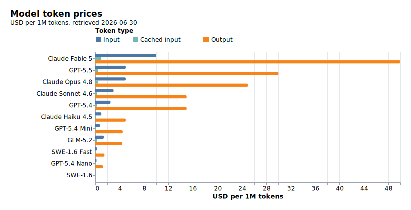
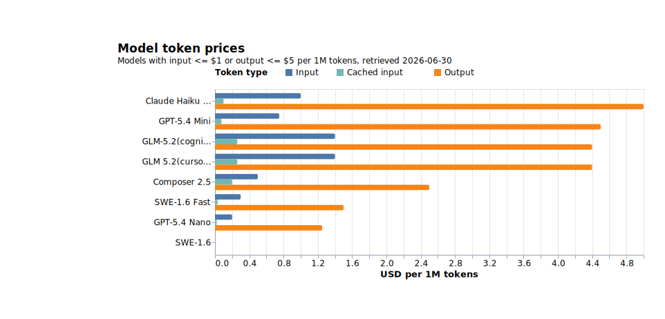

# delegate-skills

[](https://mkdn.review/?url=https%3A%2F%2Fraw.githubusercontent.com%2Foubakiou%2Fdelegate-skills%2Frefs%2Fheads%2Fmain%2FREADME_ja.md)

[](./README.md)
[](./README_ja.md)

**実装・調査・レビュー・雑務などのタスクを、より安価なモデルや別ベンダーのモデル（Claude → Codex 等）の subagent に委譲してトークン費用を圧縮する LLM エージェント向け skill 集。**

高価なモデルを main agent に据えたまま、「読む・調べる・直す」といった定型作業だけを安価なモデルの子プロセスへ逃がす。たとえば main が Claude Fable 5（input \$10 / output \$50 per 1M tokens）のとき、コード探索を Claude Haiku 4.5（\$1 / \$5）へ委譲すれば、その作業のトークン単価は 1/10 になる。委譲先は Claude 系モデルに限らず、Codex（`gpt-*`）・Devin CLI・Cursor agent CLI 経由のモデルもモデル名だけで指定できる。委譲結果はファイル経由で必要な部分だけ段階的に読み取るため、main の context も膨らまない。

## 特徴

- **トークン費用の圧縮** — 読む量・書く量の多い定型作業を安価なモデルへ委譲し、高価なモデルの消費を意思決定と最終責任に集中させる
- **context の分離** — 大量のファイル読解や試行錯誤のログは子プロセス側に隔離され、main は結果の index → 必要 section だけを読む
- **マルチ CLI 対応** — 呼び出し元（requester）が Claude Code / Codex / Devin CLI / Cursor のいずれでも動作し、委譲先もモデル名だけで同じ 4 系統から選べる
- **capability bridge** — 画像生成（`delegate-imagegen`）や x.com 調査（`delegate-x-research`）など、main 側にない能力を子プロセスで橋渡しする
- **安全側に倒した設計** — 多段委譲の再帰防止、前提不足時の fail-closed、委譲先の push 禁止・read-only などのツール権限制限

## クイックスタート

### 前提条件

- Node.js と `md2idx`（`npx md2idx` が実行可能なこと。各 skill が多用するため `npm install -g md2idx` でのグローバルインストールを推奨）
- `jq`
- Claude 系モデルを使う場合: `claude` CLI（ログイン済み）
- `gpt-*` を使う場合: `codex` CLI（ログイン済み）
- `swe-*` / `devin-*` を使う場合: `devin` CLI（ログイン済み）
- `composer-*` / `cursor-*` を使う場合: Cursor agent CLI（コマンド名は `agent`。ログイン済み、または `CURSOR_API_KEY` 設定済み）
- 現在の backend で `delegate-x-research` を使う場合: `grok` CLI（ログイン済み、X 調査へアクセス可能）

### インストール

#### gh skill（GitHub CLI v2.90.0+）

```bash
# Claude Code 向けに個別 skill をインストール
gh skill install oubakiou/delegate-skills delegate-explore --agent claude-code --scope project

# Codex 向け
gh skill install oubakiou/delegate-skills delegate-explore --agent codex --scope project

# 全 delegate skill をまとめてインストール
for skill in delegate-explore delegate-implement delegate-chore delegate-review delegate-imagegen delegate-x-research; do
  gh skill install oubakiou/delegate-skills "$skill" --agent claude-code --scope project
done
```

#### skills CLI（[vercel-labs/skills](https://github.com/vercel-labs/skills)）

```bash
# 対話的に skill / agent を選んでインストール
npx skills add oubakiou/delegate-skills

# 利用可能な skill を一覧表示
npx skills add oubakiou/delegate-skills --list

# 特定 skill を特定 agent へ非対話でインストール
npx skills add oubakiou/delegate-skills --skill delegate-explore -a claude-code -y
```

### 使ってみる

インストール後の追加設定は不要。main agent に普段どおり依頼すれば、各 skill の description に基づいて自動で委譲される。

```text
このリポジトリの認証処理がどこで実装されているか調べて
```

→ main agent が `delegate-explore` を発動し、`haiku` の子プロセスが調査する。main は結果ファイルの index → 必要 section だけを読む。

skill 名を指定して明示的に委譲することもできる。

```text
delegate-review でこのブランチの差分をレビューして
```

より積極的に委譲させたい場合は、プロジェクトの CLAUDE.md / AGENTS.md に一文足しておくとよい。

```markdown
- token を節約するため delegate-\* skill を利用して積極的にタスクをサブエージェントに委譲してください
```

## 仕組み

main agent（高価なモデル）の context を汚さず、定型的・機械的な作業を安価なモデルへ委譲する。委譲先の実行系は**モデル名のプレフィックスで決まる**:

| モデル名                              | 実行系                      | 起動方法                            |
| ------------------------------------- | --------------------------- | ----------------------------------- |
| `sonnet` / `haiku` / `opus` / `fable` | Claude 子プロセス           | `claude -p`（`delegate-claude.sh`） |
| `gpt-*`                               | Codex 子プロセス            | `codex exec`（`delegate-codex.sh`） |
| `swe-*` / `devin-*`                   | Devin CLI 子プロセス        | `devin -p`（`delegate-devin.sh`）   |
| `composer-*` / `cursor-*`             | Cursor agent CLI 子プロセス | `agent -p`（`delegate-cursor.sh`）  |

プレフィックスの意味:

- `swe-*` と `composer-*` は各 CLI ネイティブのモデル名なのでそのまま渡す（例: `swe-1.6`、`composer-2.5`）
- `devin-*` と `cursor-*` は「この CLI 経由で使う」ことを固定するバックエンド固定プレフィックスで、剥がした残りをモデル名として渡す（例: `devin-glm-5.2` → Devin CLI に `glm-5.2`、`cursor-glm-5.2-high` → Cursor agent CLI に `glm-5.2-high`）

いずれのパスもシェルラッパ経由で子プロセスを起動するため、requester が Claude Code / Codex / Devin CLI / Cursor でも同じように動作する。main↔sub の受け渡しは[ファイルベース（リクエスト/レスポンス）](https://mkdn.review/?url=https%3A%2F%2Fgithub.com%2Foubakiou%2Fdelegate-skills%2Fblob%2Fmain%2Fdocs%2Fdesign%2Fprotocol-v1.md)で、両方とも [md2idx](https://github.com/oubakiou/md2idx) 形式（`index` + `sections`）を採用し段階読み取りでトークンを節約する。

`delegate-imagegen` は画像生成向けだが、モデル解決は他 delegate と同じ形に揃える。`DELEGATE_IMAGEGEN_MODEL` で子モデルを選び、`gpt*` は Codex、非 `gpt*` は Claude へフォールバックせず中止する。

`delegate-x-research` は `DELEGATE_X_RESEARCH_MODEL`（既定 `grok-build`）を解決し、現在の X 調査 backend（現時点では Grok CLI）を起動して x.com / X の投稿・アカウント・スレッド・反応を調査する。Claude / Codex へはフォールバックしない。

## skill 一覧

| skill                 | 用途                                       | ツール権限                   | 既定モデル   | env                                                                              |
| --------------------- | ------------------------------------------ | ---------------------------- | ------------ | -------------------------------------------------------------------------------- |
| `delegate-explore`    | read-only のコード/ドキュメント探索・読解  | read-only                    | `haiku`      | `DELEGATE_EXPLORE_MODEL` / `DELEGATE_WORK_DIR`                                   |
| `delegate-implement`  | コード実装・修正（1 コミットに収まる単位） | Edit/Write/Bash（push なし） | `sonnet`     | `DELEGATE_IMPLEMENT_MODEL` / `DELEGATE_WORK_DIR`                                 |
| `delegate-chore`      | フォールバック雑務                         | Edit/Write/Bash（push なし） | `haiku`      | `DELEGATE_CHORE_MODEL` / `DELEGATE_WORK_DIR`                                     |
| `delegate-review`     | コード/ドキュメントレビュー（差分の指摘）  | read-only                    | `opus`       | `DELEGATE_REVIEW_MODEL` / `DELEGATE_WORK_DIR`                                    |
| `delegate-imagegen`   | Codex による画像生成/編集                  | Codex 子プロセス             | `gpt-5`      | `DELEGATE_IMAGEGEN_MODEL` / `DELEGATE_WORK_DIR` / `DELEGATE_IMAGEGEN_OUTPUT_DIR` |
| `delegate-x-research` | x.com / X 調査                             | X 調査子プロセス             | `grok-build` | `DELEGATE_X_RESEARCH_MODEL` / `DELEGATE_WORK_DIR`                                |

既定モデルの根拠: explore / chore は read 中心・低リスクで `haiku`、implement は編集の判断を要するため `sonnet`、review は指摘品質が成果物に直結し判断比重が高いため `opus`。

`delegate-imagegen` はユーザーにモデル選択を求めないが、運用側は `DELEGATE_IMAGEGEN_MODEL` で切り替えられる。出力先の明示がなければ生成物は `delegate-imagegen-output/` 配下に置く。

`delegate-x-research` は X 調査の capability bridge として扱い、運用側は `DELEGATE_X_RESEARCH_MODEL` で切り替えられるが、ユーザーに backend モデル選択を求めない。

## 環境変数

| 環境変数                                 | 既定                                     | 説明                                                     |
| ---------------------------------------- | ---------------------------------------- | -------------------------------------------------------- |
| `DELEGATE_<TYPE>_MODEL`                  | skill 毎                                 | 種別別のモデル上書き                                     |
| `DELEGATE_WORK_DIR`                      | mktemp 既定（`TMPDIR`、無ければ `/tmp`） | リクエスト/レスポンスファイルの置き場                    |
| `DELEGATE_RESPONSE_INLINE_MAX`           | `10240` bytes                            | `read-response.sh auto` の inline/段階読みの閾値         |
| `DELEGATE_METRICS_FILE`                  | 未設定                                   | proxy-metric テレメトリの JSONL 出力先（任意）           |
| `DELEGATE_OBSERVE_HEARTBEAT_INTERVAL`    | `10` 秒                                  | observe JSON の heartbeat 更新間隔                       |
| `DELEGATE_OBSERVE_STALL_TIMEOUT_SECONDS` | `0`（無効）                              | stdout/stderr bytes が増えない子を指定秒数後に kill      |
| `DELEGATE_OBSERVE_STREAM_MAX_BYTES`      | `65536` bytes（`0` は無制限）            | observe JSON に保存する stdout/stderr content 上限       |
| `DELEGATE_RUN_RETENTION_DAYS`            | `0`（無効）                              | request 準備時に古い run ごとの scratch directory を削除 |
| `DELEGATE_IMAGEGEN_OUTPUT_DIR`           | `delegate-imagegen-output`               | `delegate-imagegen` の既定出力先                         |
| `DELEGATE_X_RESEARCH_MODEL`              | `grok-build`                             | `delegate-x-research` のモデル                           |

モデル解決順: `DELEGATE_<TYPE>_MODEL` → skill 固有デフォルト。

ローカルでの再現調査や外部 watchdog からの監視には `DELEGATE_WORK_DIR=.temp/delegate/work` を設定し、request / response / observe JSON / run ごとの scratch file をリポジトリ内の ignore 済みディレクトリに集約する。
`DELEGATE_RUN_RETENTION_DAYS` を設定すると、その work directory 内の古い run ごとの scratch directory を削除する。監査・デバッグ用の request / response / observe JSON は削除しない。

`DELEGATE_<TYPE>_MODEL` で指定できるドキュメント済みモデル名:

| 実行系           | モデル名                                                                         | 補足                                                     |
| ---------------- | -------------------------------------------------------------------------------- | -------------------------------------------------------- |
| Claude CLI       | `fable`, `opus`, `sonnet`, `haiku`                                               | Claude 系モデルの alias                                  |
| Codex CLI        | `gpt-5`, `gpt-5.5`, `gpt-5.4`, `gpt-5.4-mini`, `gpt-5.4-nano`                    | `delegate-imagegen` は `gpt*` / Codex 分岐のみ受け付ける |
| Devin CLI        | `swe-1.6`, `swe-1.6-fast`, `devin-glm-5.2`                                       | `devin-*` は prefix を剥がして Devin CLI に渡す          |
| Cursor agent CLI | `composer-2.5`, `composer-2.5-fast`, `cursor-glm-5.2-high`, `cursor-glm-5.2-max` | `cursor-*` は prefix を剥がして Cursor agent CLI に渡す  |

上記はドキュメント済みの対応モデルであり、厳密な allowlist ではない。実行先 CLI 側でも指定モデルが利用可能である必要がある。`delegate-x-research` は別途 `DELEGATE_X_RESEARCH_MODEL` を使い、ドキュメント済みモデルは `grok-build`。

## モデル価格参照データ

[`shared/model-token-prices.json`](shared/model-token-prices.json) に、delegate 対象モデルファミリの token 単価スナップショットを置く。`scripts/sync-shared.ts` が各 skill ディレクトリへコピーを同梱する。これはコスト分析やレポート用の参照データであり、delegate-skills は cost gate としては使わない。



input が 100 万 token あたり \$1 以下、または output が 100 万 token あたり \$5 以下のモデル:



## アーキテクチャ

[docs/design/spec.md](https://mkdn.review/?url=https%3A%2F%2Fgithub.com%2Foubakiou%2Fdelegate-skills%2Fblob%2Fmain%2Fdocs%2Fdesign%2Fspec.md#p:2) を参照。

## 開発

[docs/design/development.md](https://mkdn.review/?url=https%3A%2F%2Fgithub.com%2Foubakiou%2Fdelegate-skills%2Fblob%2Fmain%2Fdocs%2Fdesign%2Fdevelopment.md) を参照。

## ライセンス

MIT
