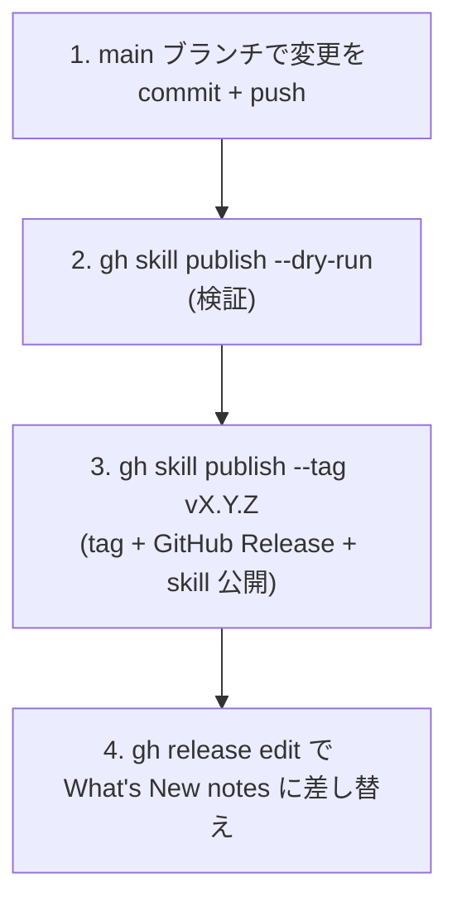

# 開発ガイド

delegate-skills の開発ワークフロー。仕様は [spec.md](spec.md)、プロトコルは [protocol-v1.md](protocol-v1.md) を参照。

## アーキテクチャ

各 skill は共有スクリプトのコピーを同梱する（self-contained）。`gh skill install` は Claude Code 向けには `.claude/skills/<skill>/scripts/...`、Codex 向けには同じ相対構成の `.agents/skills/<skill>/scripts/...` に配置する:

```
main agent
  ├─ <skill>/scripts/prepare.sh              前提チェック → モデル解決 → チェーン確認 → リクエスト生成
  │   ├─ check-md2idx.sh                     前提条件チェック（npx md2idx, fail-closed）
  │   ├─ resolve-model.sh                    モデル解決（種別env → デフォルト）
  │   ├─ check-delegate-chain.sh             多段委譲の再帰防止（同一種別2度禁止 → exit 4）
  │   └─ build-request.sh                    request_file / response_file を mktemp で事前確保（ts + 乱数を共有）
  ├─ <skill>/scripts/dispatch.sh             モデル名プレフィックスによる決定論的な実行系分岐
  │   ├─ model が gpt* → delegate-codex.sh で Codex 子プロセス
  │   ├─ model が swe*|devin-* → delegate-devin.sh で Devin CLI 子プロセス
  │   ├─ model が composer*|cursor-* → delegate-cursor.sh で Cursor agent CLI 子プロセス
  │   └─ それ以外 → delegate-claude.sh で Claude 子プロセス（claude -p）
  └─ <skill>/scripts/read-response.sh auto で読み取り（大きい response は段階読み）→ 検証
```

`delegate-imagegen` は画像出力まわりの既定値を保つため `<skill>/scripts/prepare-imagegen.sh` と `<skill>/scripts/delegate-imagegen-codex.sh` を使う。`prepare-imagegen.sh` も `DELEGATE_IMAGEGEN_MODEL` を解決して `model` を返すが、imagegen は `gpt*`/Codex 分岐のみ受け付ける。

`delegate-x-research` は共有の `prepare.sh` と `<skill>/scripts/delegate-x-research-grok.sh` を使う。現在のラッパは `grok -p -m "$model"` を呼び、worker のレポートを同じレスポンスプロトコルで書き出す。

共有スクリプト/アセットの正本は `shared/` にあり、`scripts/sync-shared.ts` が各 skill へコピーする。

## ディレクトリ構成

```
delegate-skills/
  fixtures/
    metrics/                        # テレメトリの固定シナリオとベースライン
      baseline.json
      scriptable-chore/{request.md,response.md}
      read-heavy-chore/{request.md,response.md}
      mixed-chore/{request.md,response.md}
  skills/                          # gh skill install のソース（正本の SKILL.md）
    delegate-explore/
      SKILL.md
      scripts/                     # sync-shared.ts が shared/ からコピー
    delegate-implement/{SKILL.md, scripts/}
    delegate-chore/{SKILL.md, scripts/}
    delegate-review/{SKILL.md, scripts/}
    delegate-imagegen/{SKILL.md, scripts/}
    delegate-x-research/{SKILL.md, scripts/}
  .claude/skills/<skill>/scripts/  # Claude Code 向け gh skill install 配置
  .agents/skills/<skill>/scripts/  # Codex 向け gh skill install 配置
  shared/                          # 共有スクリプト/アセットの正本（種別・実行系非依存）
    model-token-prices.json
    resolve-model.sh
    check-md2idx.sh
    check-delegate-chain.sh
    delegate-codex.sh
    delegate-claude.sh
    delegate-devin.sh
    delegate-cursor.sh
    dispatch.sh
    prepare.sh
    observe-json.sh
    build-request.sh
    read-request.sh
    build-response.sh
    read-response.sh
  scripts/
    sync-shared.ts                 # shared/ → 各 skill（+ in-source test）
    summarize-metrics.ts           # テレメトリ JSONL の集計
    run-metrics-fixtures.sh        # 固定 metrics fixtures の実行
    check-metrics-baseline.sh      # fixture ベースラインのドリフト検知
  docs/
    design/
      spec.md
      protocol-v1.md
  README.md
```

## セットアップ

devcontainer 前提。初回はリポジトリ root で `local_setup.sh` を実行する。

```sh
./local_setup.sh
```

主な処理:

- `npm ci`（`package-lock.json` があればロック厳守、無ければ `npm install`）
- `claude` / `codex` / `vp` / `typescript-language-server` を `/usr/local/bin` にシンボリックリンク
- `.claude/settings.local.json` / `CLAUDE.local.md` を example から生成（無ければ）
- 既定 skill の `gh skill install`
- `git config core.hooksPath .githooks`（pre-commit hook を有効化）

## ツールチェーン

format / lint / test / 型チェックは [vite-plus](https://www.npmjs.com/package/vite-plus)（`vp`）に集約する。設定は [`vite.config.ts`](../../vite.config.ts)。

| コマンド         | 役割                                                      |
| ---------------- | --------------------------------------------------------- |
| `vp check`       | format + lint + 型チェックの横断確認（CI / 最終確認向け） |
| `vp check --fix` | 上記を自動修正付きで実行                                  |
| `vp test`        | Vitest 実行                                               |

- **format**（oxfmt）: セミコロンなし / シングルクォート / 末尾カンマ `es5`
- **lint**（oxlint, type-aware）: `correctness` / `perf` / `restriction` / `style` / `suspicious` を `error`。個別 off ルールは `vite.config.ts` の `rules` を参照
- import の並びは fmt（oxfmt の sortImports）が所有する。lint の `sort-imports` は別アルゴリズムで衝突するため off

TypeScript のコード調査・変更検証には Claude Code の `LSP` deferred tool を併用する（`goToDefinition` / `findReferences` / `getDiagnostics`）。`getDiagnostics` は指定ファイル中心のため、横断的な最終確認は `vp check` を使う。

## テスト

Vitest の **in-source testing** で種別非依存の汎用部品を単体検証する。対象は `vite.config.ts` の `test.includeSource`（`shared/**`、各 skill の `scripts/*-sanitize*.ts` 等）。

正本（canonical）は `shared/` 側に置き、各 skill 配下の生成コピーはテストを重複実行しない。インストール先である `.claude/skills/`（Claude Code）や `.agents/skills/`（Codex）側ではなく、正本である `skills/` 側を直接テスト対象にして回帰検出漏れを防ぐ。

wrapper の session mode は `scripts/delegate-wrapper-session.test.ts` で fake CLI を PATH 先頭に置いて検証する。通常 run、`resumable`、`followup`、handle 欠落時の fail-closed、response_file 未生成時の failed response を backend ごとに fixture 化し、実 CLI や外部 API を呼ばない。

## shared/ 同期パターン

self-contained 配布のため、共有スクリプト/アセットは `shared/` を正本とし各 skill 配下へコピー同梱する（`gh skill install` 単体でも動くようにする）。同期は `scripts/sync-shared.ts` が担う。

| コマンド                    | 役割                                        |
| --------------------------- | ------------------------------------------- |
| `npm run sync-shared`       | `shared/` の正本を各 skill のコピーへ同期   |
| `npm run sync-shared:check` | drift 検出（ズレがあれば失敗、fail-closed） |

生成コピー（`skills/*/scripts/*.sh`、`skills/*/model-token-prices.json` 等）を直接編集してはならない。編集は `shared/` 側で行い、同期を走らせる。

backend の CLI 出力を observe JSON へ正規化する処理も `shared/observe-json.sh` に置く。`usage` の実測値抽出や推定 fallback、session reuse の `lineage` / `backend_session` / `run_context` helper、follow-up validation を変更した場合は、`scripts/observe-json.test.ts` に JSONL capture / Devin ATIF export / fallback / stale-context 判定の fixture 的な shell test を追加し、`npm run sync-shared` で各 skill へ同期する。

## git hooks（pre-commit）

`.githooks/pre-commit` が以下を順に実行する:

1. `sync-shared:check` で生成コピーの直接編集を早期検出
2. `vp check --fix` で format / lint を自動修正し、変更を再ステージ
3. `vp check --fix` が正本を書き換えた場合に `sync-shared` でコピーへ再同期し再ステージ
4. 最終ドリフト検証（fail-closed）
5. `vp test`

## リリースプロセス

`gh skill publish` で GitHub Releases と `gh skill` レジストリに **同一の `vX.Y.Z` git tag で**公開する。

| 公開先                | 配布物                                     | 公開コマンド                    |
| --------------------- | ------------------------------------------ | ------------------------------- |
| GitHub Releases       | リリースノート（What's New）               | `gh skill publish` が兼ねる     |
| `gh skill` レジストリ | 各 delegate 系 skill（`gh skill install`） | `gh skill publish --tag vX.Y.Z` |

### 全体フロー



#### 1. main に変更を commit + push

リリース対象の変更がすべて main にマージされた状態にする。

#### 2. dry-run で検証

```bash
gh skill publish --dry-run
```

`skills/*/SKILL.md` の `name` がディレクトリ名と一致するか、frontmatter の検証等をリリース前に行う。

#### 3. gh skill publish でタグ + Release + skill 公開

```bash
gh skill publish --tag v0.1.0
```

`--tag` を渡すと対話なしで publish する。タグは push 済みの main HEAD に切られるため、手順 1 の push を先に完了しておく。

#### 4. リリースノートを差し替え

```bash
gh release edit v0.1.0 --notes-file <notes.md>
```

publish が付ける auto notes を What's New 形式に置き換える。

### リリースチェックリスト

- [ ] リリース対象の変更がすべて main にマージ済み
- [ ] `vp check` がエラーなし
- [ ] `vp test` が全パス
- [ ] `gh skill publish --dry-run` がエラーなし
- [ ] `gh skill publish --tag vX.Y.Z` 後、tag が正しい commit を指す（`git ls-remote --tags origin vX.Y.Z`）
- [ ] `gh release edit` で What's New ノートに差し替え済み

## ローカル skill の再インストール

`skills/<skill-name>/` を編集した後で Claude Code から最新版を試すには、対象 skill を再インストールする:

```bash
gh skill install . <skill-name> --from-local --agent claude-code --scope project --force
```

## コーディング規約

[../../AGENTS.md](../../AGENTS.md) に従う。要点:

- 一時ファイル・ディレクトリは必ず `.temp/` 配下に作成する
- linter を無効化する場合、まず無効化しない対応を検討し、難しい場合はコメントで理由を記述する
- 明確な理由がなければ `let` ではなく `const` を使う
- コメントは WHY が非自明な場合のみ書く。識別子で表現できる WHAT は書かない
- 現在のタスク・修正経緯・呼び出し元への言及はコメントに書かない（PR description / commit message に属する）
- コミット前にサブエージェントでセルフレビューを行うか、`AskUserQuestion` でユーザーに確認する
