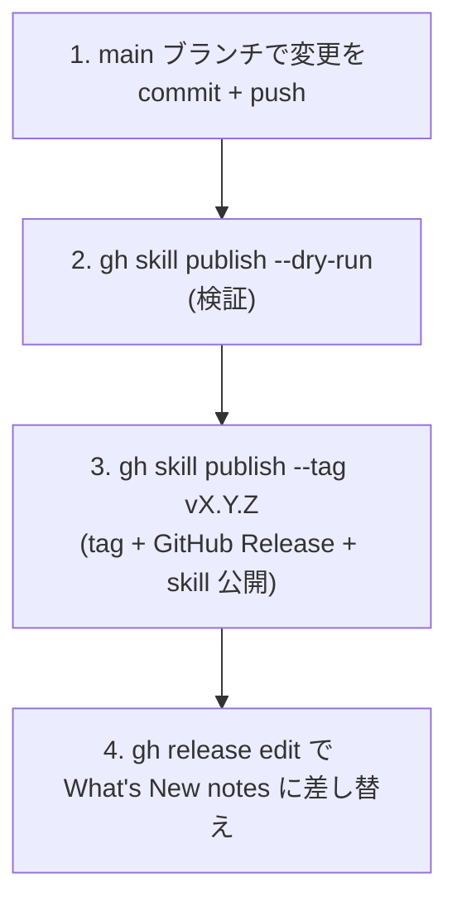

# 開発ガイド

delegate-skills の開発ワークフロー。仕様は [spec.md](spec.md)、プロトコルは [protocol-v1.md](protocol-v1.md) を参照。

## アーキテクチャ

実装の正本は `shared/src/**/*.ts`（TypeScript）で、`vp build` が単一ファイル CLI `shared/dist/delegate-cli.mjs`（`md2idx` 内包・外部依存ゼロ・コミット対象）へバンドルする。各 skill が同梱するのはこのバンドルと、直接実行されるエントリポイントの `.sh` **exec shim**（`exec node .../delegate-cli.mjs <subcommand> "$@"` の数行）だけ。`gh skill install` は Claude Code 向けには `.claude/skills/<skill>/scripts/...`、Codex 向けには同じ相対構成の `.agents/skills/<skill>/scripts/...` に配置する。実行時に必要なのは Node.js 24+ と対象バックエンド CLI のみで、`jq` も `npx md2idx` も要らない:

```
main agent
  └─ <skill>/scripts/run.sh                  → delegate-cli run（通常 run の one-shot: prepare → dispatch → read-response）
      ├─ (prepare)          前提なし → モデル解決 → チェーン確認 → リクエスト生成（md2idx を in-process 利用）
      │                     resolve-model / check-delegate-chain / build-request を in-process で呼ぶ
      ├─ (dispatch)         モデル名プレフィックスによる決定論的な実行系分岐
      │   ├─ model が gpt* → wrapper codex で Codex 子プロセス
      │   ├─ model が swe*|devin-* → wrapper devin で Devin CLI 子プロセス
      │   ├─ model が composer*|cursor-* → wrapper cursor で Cursor agent CLI 子プロセス
      │   └─ それ以外 → wrapper claude で Claude 子プロセス（claude -p）
      └─ (read-response)    selector で読み取り（review 既定は decision、他は auto）→ 検証
```

直接実行される `.sh` shim は `run.sh` / `prepare.sh` / `dispatch.sh` / `resolve-model.sh` / `check-delegate-chain.sh` / `build-request.sh` / `read-request.sh` / `build-response.sh` / `read-response.sh` / `read-json.sh` / `delegate-{claude,codex,cursor,devin}.sh`（backend wrapper は `delegate-cli wrapper <backend>`）で、それぞれ対応するサブコマンドへ委譲する。`read-json.sh` は `jq -r <dotpath>` 相当の最小 JSON リーダで、SKILL.md の run 出力 / observe JSON 読み取りに使う（jq 依存の撤廃用）。

`run.sh` は成功・失敗とも単一 JSON（`exit_code` / `status` / `content` / `content_truncated` / `response_file` / `observe_file` / `run_dir`）を stdout へ返し、内部処理の exit code を透過する。resumable / follow-up・observe 監視・background 実行など途中で親の判断を挟むフローは、従来どおり個別 shim（`prepare.sh` / `dispatch.sh` / `read-response.sh`）を直接使う。

`delegate-imagegen` は画像出力まわりの既定値を保つため `<skill>/scripts/prepare-imagegen.sh`（→ `delegate-cli prepare-imagegen`）と `<skill>/scripts/delegate-imagegen-codex.sh`（→ `delegate-cli wrapper imagegen`）を使う。prepare-imagegen も `DELEGATE_IMAGEGEN_MODEL` を解決して `model` を返すが、imagegen は `gpt*`/Codex 分岐のみ受け付ける。one-shot は共通 run と同一契約の `<skill>/scripts/run-imagegen.sh`（→ `delegate-cli run-imagegen`）が担う。

requester も Codex の場合は `scripts/codex-devcontainer.sh [Codex の引数...]` を使う。launcher は実行環境が安全だと推測せず、起動ごとに launcher 自体が isolation を提供しないこと、full-access の到達範囲、外部隔離境界の必要性を stderr へ1回警告して起動を続ける。同梱 Dev Container、専用 VM、一時的な CI runner、別の hardened container を外部境界として利用する。通常は `codex --sandbox danger-full-access --ask-for-approval on-request` へ引数を透過する一方、subcommand 後も含め argv 全体を確認し、sandbox / approval flag、bypass alias、`-c` / `--config`、profile 選択、remote app-server など execution boundary または policy を上書きし得る引数を保守的に拒否する。

非対話 run で approval も無効にする場合だけ `scripts/codex-devcontainer.sh --unattended [codex exec の引数...]` を使う。launcher が `codex exec --dangerously-bypass-approvals-and-sandbox` を構成するため、呼び出し側では `exec` を渡さない。trusted repository と専用の短命 credential を前提とし、MCP、mount、egress を外部隔離境界で制限する。

`delegate-x-research` は共有の `prepare.sh` と `<skill>/scripts/delegate-x-research-grok.sh`（→ `delegate-cli wrapper xresearch`）を使う。現在のラッパは `grok -p -m "$model"` を呼び、worker のレポートを同じレスポンスプロトコルで書き出す。one-shot は共通 run と同一契約の `<skill>/scripts/run-x-research.sh`（→ `delegate-cli run-x-research`）が担う（共通 dispatch は grok を明示拒否するため dispatch だけ専用 wrapper に差し替える）。

実装の正本は `shared/src/`、そのバンドルと shim の正本は `shared/`（`dist/delegate-cli.mjs` + `*.sh`）にあり、`scripts/sync-shared.ts` が各 skill へコピーする。

## ディレクトリ構成

```
delegate-skills/
  fixtures/
    metrics/                        # テレメトリの固定シナリオとベースライン
      baseline.json
      scriptable-chore/{request.md,response.md}
      read-heavy-chore/{request.md,response.md}
      mixed-chore/{request.md,response.md}
  skills/                          # gh skill install のソース（正本の SKILL.md）
    delegate-explore/
      SKILL.md
      scripts/                     # sync-shared.ts が shared/ からコピー
    delegate-implement/{SKILL.md, scripts/}
    delegate-chore/{SKILL.md, scripts/}
    delegate-review/{SKILL.md, scripts/}
    delegate-imagegen/{SKILL.md, scripts/}
    delegate-x-research/{SKILL.md, scripts/}
    delegate-htmldoc/{SKILL.md, references/, scripts/}
  .claude/skills/<skill>/scripts/  # Claude Code 向け gh skill install 配置（gitignore）
  .agents/skills/<skill>/scripts/  # Codex 向け gh skill install 配置（gitignore）
  shared/                          # バンドル + shim の正本（種別・実行系非依存）
    model-token-prices.json
    src/                           # TypeScript 実装の正本（in-source test 隣接）
      main.ts                      # サブコマンド dispatch（run / prepare / dispatch / wrapper … / read-json）
      prepare.ts  dispatch.ts  run-oneshot.ts  read-json.ts
      wrapper-common.ts  wrapper-wait.ts  wrapper-report.ts  wrapper-dedicated.ts
      wrapper-{claude,codex,cursor,devin,imagegen,xresearch}.ts
      observe-{store,lock,followup,effort,usage,cost,timing}.ts
      prompt-constraints.ts  delegate-mcp.ts  backend.ts  build-*.ts  read-*.ts  resolve-model.ts
    dist/delegate-cli.mjs          # vp build 生成の単一ファイル CLI（md2idx 内包・コミット対象）
    resolve-model.sh  check-delegate-chain.sh          # 直接実行エントリの exec shim
    build-request.sh  read-request.sh  build-response.sh  read-response.sh  read-json.sh
    prepare.sh  dispatch.sh  run.sh
    delegate-claude.sh  delegate-codex.sh  delegate-devin.sh  delegate-cursor.sh
  vite.cli.config.ts               # CLI バンドル専用の vite-plus config（build.ssr / ssr.noExternal）
  scripts/
    sync-shared.ts                 # shared/（dist + shim + asset）→ 各 skill（+ in-source test）
    summarize-metrics.ts           # テレメトリ JSONL の集計
    run-metrics-fixtures.sh        # 固定 metrics fixtures の実行
    run-latency-bench.sh           # レイテンシ反復ベンチ（duration p50 の移行前後比較）
    check-metrics-baseline.sh      # fixture ベースラインのドリフト検知
    check-no-jq-md2idx.sh          # 配布 tree に jq / md2idx 参照が残っていないかの静的検査
    test-execution-capability.ts   # Vitest 起動前の子プロセス capability preflight
  docs/
    design/
      spec.md
      protocol-v1.md
  README.md
```

## セットアップ

devcontainer 前提。初回はリポジトリ root で `local_setup.sh` を実行する。

```sh
./local_setup.sh
```

主な処理:

- `npm ci`（`package-lock.json` があればロック厳守、無ければ `npm install`）
- `claude` / `codex` / `vp` / `typescript-language-server` を `/usr/local/bin` にシンボリックリンク
- `.claude/settings.local.json` / `CLAUDE.local.md` を example から生成（無ければ）
- 既定 skill の `gh skill install`
- `git config core.hooksPath .githooks`（pre-commit hook を有効化）

## ツールチェーン

format / lint / test / 型チェックは [vite-plus](https://www.npmjs.com/package/vite-plus)（`vp`）に集約する。設定は [`vite.config.ts`](../../vite.config.ts)。

| コマンド              | 役割                                                       |
| --------------------- | ---------------------------------------------------------- |
| `vp check`            | format + lint + 型チェックの横断確認（CI / 最終確認向け）  |
| `vp check --fix`      | 上記を自動修正付きで実行                                   |
| `npm test`            | CLI + global preflight 付きの正規 Vitest gate              |
| `npm run build`       | `vp build --config vite.cli.config.ts` で CLI バンドル生成 |
| `npm run build:check` | 再ビルド byte 比較（コミット済み dist のドリフト検知）     |

- **format**（oxfmt）: セミコロンなし / シングルクォート / 末尾カンマ `es5`
- **lint**（oxlint, type-aware）: `correctness` / `perf` / `restriction` / `style` / `suspicious` を `error`。個別 off ルールは `vite.config.ts` の `rules` を参照
- import の並びは fmt（oxfmt の sortImports）が所有する。lint の `sort-imports` は別アルゴリズムで衝突するため off
- **build**（`vp build`）: `shared/src/main.ts` を `shared/dist/delegate-cli.mjs` へ SSR バンドル（`md2idx` 内包 / `import.meta.vitest` 除去）。dist は生成物だがコミット対象（`gh skill install` がリポジトリ内容をそのまま配布するため）で lint 対象外。`shared/src/` を編集したら `npm run build` → `npm run sync-shared` を回す

テストの正規コマンドは `npm test` とする。`test` script 本体が Vitest 起動前に、`vite.config.ts` の `globalSetup` が test worker 作成前に、それぞれ sync / async の Node 子プロセスを sentinel 付きで起動し、spawn error・exit status・signal・stdout を検証する。capability が成立しない環境では `TEST_ENVIRONMENT_UNSUPPORTED` を 1 件だけ返して fail-closed に停止し、test skip や成功扱いにはしない。preflight は npm lifecycle の `pretest` に置かないため、`ignore-scripts=true` の環境でも省略されない。`globalSetup` は `vp test` を直接実行した場合にも同じ防護を適用する。対象を絞る場合は `npm test -- <filter>` を使う。

TypeScript のコード調査・変更検証には Claude Code の `LSP` deferred tool を併用する（`goToDefinition` / `findReferences` / `getDiagnostics`）。`getDiagnostics` は指定ファイル中心のため、横断的な最終確認は `vp check` を使う。

## テスト

Vitest の **in-source testing** で TS モジュールを単体検証する。対象は `vite.config.ts` の `test.includeSource`（`shared/src/**/*.ts` ほか）。各モジュールの `if (import.meta.vitest)` ブロックにテストを隣接させ、バンドル時は `define` で dead-code 除去される。

契約テストは Node / bash / fake backend CLI の子プロセスを実際に起動する。preflight は `status === 0` だけではなく spawn error が無いことと sentinel stdout が一致することを要求するため、sandbox が子プロセスを抑止しながら status 0 を返す環境でも製品 assertion の失敗や偽成功として分類しない。Codex では、管理・host policy が許す場合に新しい session を `--sandbox danger-full-access` で開始するか、通常の terminal / CI で `npm test` を再実行する。project `.codex/config.toml` は CLI override より優先度が低く managed requirements の制約も受けるため、repository の設定だけで実行 capability が得られるとは見なさない。

正本（canonical）は `shared/src/` 側に置き、各 skill 配下の生成コピー（バンドル）はテストを重複実行しない。CLI レベルの契約（argv / stdout / exit code / observe JSON）は fake CLI golden で end-to-end 検証する:

- `scripts/delegate-wrapper-session.test.ts`: 4 backend の session mode（通常 run / `resumable` / `followup` / handle 欠落時の fail-closed / response_file 未生成時の failed response）を fake CLI を PATH 先頭に置いて検証。follow-up validation は `delegate-cli validate-followup` internal subcommand 経由で TS 実装を叩く。
- `scripts/delegate-run.test.ts`: run / run-imagegen / run-x-research の one-shot 契約。
- `scripts/delegate-mcp.test.ts` は TS 化に伴い削除し、MCP 抽出/描画のカバレッジは `shared/src/delegate-mcp.ts` の in-source test（fake codex CLI 含む）へ移設した。

配布 tree に `jq` / `md2idx` への参照が残っていないことは `scripts/check-no-jq-md2idx.sh`（CI / pre-commit）が静的検査する。

## shared/ 同期パターン

self-contained 配布のため、バンドル `shared/dist/delegate-cli.mjs` と `shared/*.sh` shim を各 skill 配下へコピー同梱する（`gh skill install` 単体でも動くようにする）。同期は `scripts/sync-shared.ts` が担い、`shared/`（および `shared/dist/`）を readdir で自動列挙する。

| コマンド                    | 役割                                                       |
| --------------------------- | ---------------------------------------------------------- |
| `npm run sync-shared`       | `shared/` の dist + shim + asset を各 skill のコピーへ同期 |
| `npm run sync-shared:check` | drift 検出（dist の再ビルド byte 比較含む、fail-closed）   |

実装は `shared/src/**/*.ts` が正本、生成物は `shared/dist/delegate-cli.mjs`、生成コピー（`skills/*/scripts/*`、`skills/*/model-token-prices.json` 等）は直接編集してはならない。編集は `shared/src/` で行い、`npm run build` → `npm run sync-shared` を走らせる。

backend の CLI 出力を observe JSON へ正規化する処理は `shared/src/observe-{store,usage,timing,cost,effort,followup,lock}.ts` に置く。`usage` の実測値抽出や推定 fallback、session reuse の `lineage` / `backend_session` / `run_context` helper、follow-up validation を変更した場合は、対応モジュールの in-source test（`import.meta.vitest` ブロック）にケースを追加し、`npm run build` → `npm run sync-shared` で各 skill へ同期する。end-to-end の等価性は fake CLI golden（`scripts/delegate-wrapper-session.test.ts` / `delegate-run.test.ts`）が担保する。

## モデル追加・価格更新

`DELEGATE_<TYPE>_MODEL` で指定できるモデルを追加（または価格改定を反映）する際の作業一覧。

1. **価格表の正本を更新**: `shared/model-token-prices.json` の `models` にエントリを追加する。`pricing_source` は `pricing_sources` に定義済みの key を使い、未定義の source なら先に追加する。無料プレビュー等は `pricing_status` で明示し、価格が見つからない場合は `null` + `pricing_status: "not_listed_in_source"` とする。既定エイリアス（例: `swe` → 最新版）の付け替えが必要なら alias エントリも更新する。`retrieved_at` を確認日に更新する
2. **effort suffix の許容値セットを更新**: 追加モデルが `@effort` suffix に対応する場合、`shared/src/observe-effort.ts` の `validateModelEffort` の backend / モデル別許容値を更新する。Cursor モデルは bracket override のパラメータ名（`effort` / `reasoning` 等）と許容値がモデル別なので、**実 CLI で受理を確認してから**検証ヘルパと `shared/src/wrapper-cursor.ts` の bracket 変換の両方へ追加する。未確認のモデルは追加せず fail-closed（exit 6）のままにする。検証ヘルパ・wrapper 変換・README の Effort handling 節・テスト（`observe-effort.ts` の in-source suffix 検証、`scripts/delegate-wrapper-session.test.ts` の argv assert）は同一コミットで更新する
3. **skill コピーへ同期**: `npm run sync-shared`。`skills/*/model-token-prices.json` を直接編集しない
4. **README 更新（英日両方）**: `README.md` と `README_ja.md` の Documented model names 表と Effort handling 節（suffix 対応状況・既定挙動表）に追加する。両言語の記載が対応していることを確認する
5. **価格チャート再生成**: `docs/assets/model-token-prices.svg`（全 priced モデル）と `docs/assets/model-token-prices-low-cost.svg`（input ≤ \$1 または output ≤ \$5 per 1M tokens のみ）を更新後の JSON から再生成する（dataviz-svg skill / Vega-Lite）。low-cost 側の掲載可否は閾値で機械的に判定する
6. **テスト追加**: 価格解決やコスト推定の挙動が変わる場合（新 provider、prefix 解決、alias 変更等）は `shared/src/observe-cost.ts` の in-source test にケースを追加する
7. **検証**: `npm run sync-shared:check` / `vp check` / `npm test`

## git hooks（pre-commit）

`.githooks/pre-commit` が以下を順に実行する:

1. `sync-shared:check` で生成コピーの直接編集を早期検出
2. `vp check --fix` で format / lint を自動修正
3. `vp check --fix` が正本を書き換えた場合に `npm run build`（CLI 再バンドル）→ `sync-shared` でコピーへ再同期
4. hook がワークツリーを変更した場合、hook 自身は `git add` せず（commit が index.lock を保持しているため）、変更ファイルを表示して **exit 1** で止める。利用者が内容を確認し `git add -u && git commit` で再ステージする
5. 最終ドリフト検証（dist 再ビルド byte 比較含む、fail-closed）
6. `check-no-jq-md2idx.sh` で配布 tree（+ 正本 TS の spawn）に jq / md2idx 参照が残っていないことを静的検査
7. `metrics:baseline:check` で metrics レコード形状のドリフト検知
8. `npm test`

CI（`.github/workflows/ci.yml`）も pinned Node / Linux の clean checkout で同じゲート（`build:check` / `sync-shared:check` / `check-no-jq-md2idx` / `metrics:baseline:check` / `vp check` / `npm test`）を PR 必須にする。

## issue triage（ラベル）

issue には重要度と対応コストのラベルを 1 つずつ付ける。

| ラベル             | 基準                                                         |
| ------------------ | ------------------------------------------------------------ |
| `priority: high`   | skill の中核価値（委譲の成功率・成果物の信頼性）を直接損なう |
| `priority: medium` | 実害はあるが発生頻度が低い、または利用側で回避可能           |
| `priority: low`    | 利便性向上・リソース節約など、なくても運用が回る             |
| `cost: large`      | 複数コンポーネントへの変更や設計判断を伴う                   |
| `cost: medium`     | `shared/` 複数ファイル + テスト + ドキュメントに及ぶ         |
| `cost: small`      | 局所的な変更やドキュメント追記で収まる                       |

対応順は priority 優先、同 priority なら cost の小さいものから着手する。

## リリースプロセス

`gh skill publish` で GitHub Releases と `gh skill` レジストリに **同一の `vX.Y.Z` git tag で**公開する。

| 公開先                | 配布物                                     | 公開コマンド                    |
| --------------------- | ------------------------------------------ | ------------------------------- |
| GitHub Releases       | リリースノート（What's New）               | `gh skill publish` が兼ねる     |
| `gh skill` レジストリ | 各 delegate 系 skill（`gh skill install`） | `gh skill publish --tag vX.Y.Z` |

### 全体フロー



#### 1. main に変更を commit + push

リリース対象の変更がすべて main にマージされた状態にする。

#### 1.5. 次バージョンタグを決める（毎回ここを間違えやすい）

**目分量で決めない。必ず remote の既存タグを取得してから最大タグの次を採る。**

```bash
git fetch --tags origin
git tag -l 'v*' --sort=-v:refname | head -1   # 現在の最大タグ
```

- 次タグ = 最大タグの次（互換保持のマイナー変更なら patch/minor、破壊的変更や前提条件の変更なら minor を上げる。0.x なので minor bump に意味のある変更を載せる）。
- **既存タグを再利用・移動しない**。`v0.16.0` のような公開済みタグは古いコミットを指しており、そこへ新しい HEAD を載せ替えるのは公開済みリリースの破壊になる。「次の番号」は必ず最大タグより大きくする。
- ローカルのタグは古いことがある（remote に自分の知らない release がある）。**判断前に必ず `git fetch --tags`**。
- タグが HEAD より前を指していないか確認する: `git merge-base --is-ancestor <最大タグ> HEAD && echo ok`（ok なら HEAD が新しく、その最大タグ+1 が正しい次番号）。

#### 2. dry-run で検証

```bash
gh skill publish --dry-run
```

`skills/*/SKILL.md` の `name` がディレクトリ名と一致するか、frontmatter の検証等をリリース前に行う。

> `gh skill publish` は SKILL.md を探してリポジトリを再帰スキャンする。`.temp/` にテスト由来のスクラッチディレクトリが大量に溜まっていると、その走査で `--dry-run` / publish が無応答（実質ハング）になる現象がある。ハングしたら `.temp/` を掃除してから再実行する。

#### 3. gh skill publish でタグ + Release + skill 公開

```bash
gh skill publish --tag v0.1.0
```

`--tag` を渡すと対話なしで publish する。タグは push 済みの main HEAD に切られるため、手順 1 の push を先に完了しておく。

#### 4. リリースノートを差し替え

```bash
gh release edit v0.1.0 --notes-file <notes.md>
```

publish が付ける auto notes を What's New 形式に置き換える。

### リリースチェックリスト

- [ ] リリース対象の変更がすべて main にマージ済み
- [ ] `git fetch --tags origin` 済みで、次タグ = 既存最大タグ（`git tag -l 'v*' --sort=-v:refname | head -1`）の次番号。既存タグの再利用・移動はしない
- [ ] `vp check` がエラーなし
- [ ] `npm test` が全パス
- [ ] `gh skill publish --dry-run` がエラーなし
- [ ] `gh skill publish --tag vX.Y.Z` 後、tag が正しい commit を指す（`git ls-remote --tags origin vX.Y.Z`）
- [ ] `gh release edit` で What's New ノートに差し替え済み

## ローカル skill の再インストール

`skills/<skill-name>/` を編集した後で Claude Code から最新版を試すには、対象 skill を再インストールする:

```bash
gh skill install . <skill-name> --from-local --agent claude-code --scope project --force
```

## コーディング規約

[../../AGENTS.md](../../AGENTS.md) に従う。要点:

- 一時ファイル・ディレクトリは必ず `.temp/` 配下に作成する
- linter を無効化する場合、まず無効化しない対応を検討し、難しい場合はコメントで理由を記述する
- 明確な理由がなければ `let` ではなく `const` を使う
- コメントは WHY が非自明な場合のみ書く。識別子で表現できる WHAT は書かない
- 現在のタスク・修正経緯・呼び出し元への言及はコメントに書かない（PR description / commit message に属する）
- コミット前にサブエージェントでセルフレビューを行うか、`AskUserQuestion` でユーザーに確認する
