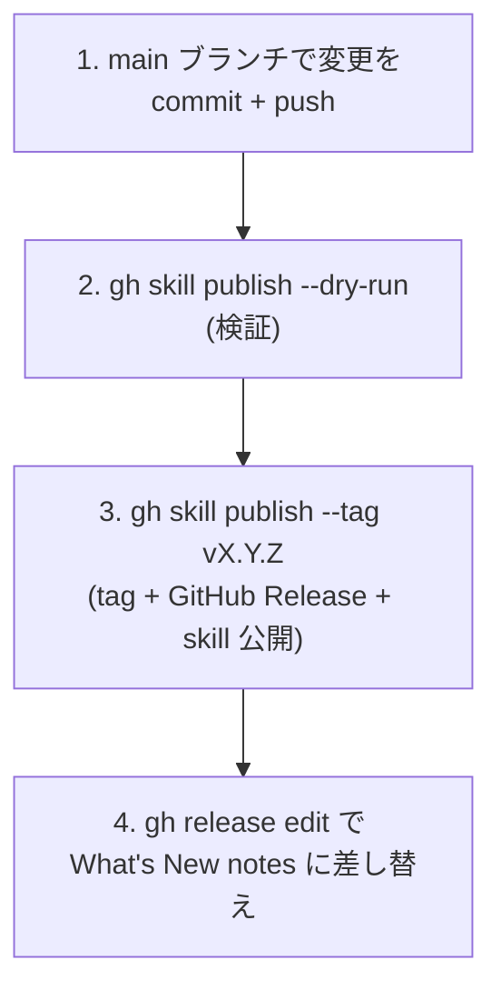

# 開発ガイド

delegate-skills の開発ワークフロー。仕様は [spec.md](spec.md)、プロトコルは [protocol-v1.md](protocol-v1.md) を参照。

## アーキテクチャ

実装の正本は `shared/src/**/*.ts`（TypeScript）で、`vp build` が単一ファイル CLI `shared/dist/delegate-cli.mjs`（`md2idx` 内包・外部依存ゼロ・コミット対象）へバンドルする。各 skill が同梱するのはこのバンドルと、直接実行されるエントリポイントの `.sh` **exec shim**（`exec node .../delegate-cli.mjs <subcommand> "$@"` の数行）だけ。`gh skill install` は Claude Code 向けには `.claude/skills/<skill>/scripts/...`、Codex 向けには同じ相対構成の `.agents/skills/<skill>/scripts/...` に配置する。実行時に必要なのは Node.js 24+ と対象バックエンド CLI のみで、`jq` も `npx md2idx` も要らない:

```
main agent
  └─ <skill>/scripts/run.sh                  → delegate-cli run（通常 run の one-shot: prepare → dispatch → read-response）
      ├─ (prepare)          前提なし → モデル解決 → チェーン確認 → リクエスト生成（md2idx を in-process 利用）
      │                     resolve-model / check-delegate-chain / build-request を in-process で呼ぶ
      ├─ (dispatch)         モデル名プレフィックスによる決定論的な実行系分岐
      │   ├─ model が gpt* → wrapper codex で Codex 子プロセス
      │   ├─ model が swe*|devin-* → wrapper devin で Devin CLI 子プロセス
      │   ├─ model が composer*|cursor-* → wrapper cursor で Cursor agent CLI 子プロセス
      │   ├─ model が opencode/* → wrapper opencode で opencode CLI 子プロセス
      │   └─ それ以外 → wrapper claude で Claude 子プロセス（claude -p）
      └─ (read-response)    selector で読み取り（review 既定は decision、他は auto）→ 検証
```

直接実行される `.sh` shim は `run.sh` / `prepare.sh` / `dispatch.sh` / `resolve-model.sh` / `check-delegate-chain.sh` / `build-request.sh` / `read-request.sh` / `build-response.sh` / `read-response.sh` / `read-json.sh` / `delegate-{claude,codex,cursor,devin,opencode}.sh`（backend wrapper は `delegate-cli wrapper <backend>`）で、それぞれ対応するサブコマンドへ委譲する。`read-json.sh` は `jq -r <dotpath>` 相当の最小 JSON リーダで、SKILL.md の run 出力 / observe JSON 読み取りに使う（jq 依存の撤廃用）。

`run.sh` は成功・失敗とも単一 JSON（`exit_code` / `status` / `content` / `content_truncated` / `response_file` / `observe_file` / `run_dir`）を stdout へ返し、内部処理の exit code を透過する。resumable / follow-up・observe 監視・background 実行など途中で親の判断を挟むフローは、従来どおり個別 shim（`prepare.sh` / `dispatch.sh` / `read-response.sh`）を直接使う。

`delegate-imagegen` は画像出力まわりの既定値を保つため `<skill>/scripts/prepare-imagegen.sh`（→ `delegate-cli prepare-imagegen`）と `<skill>/scripts/delegate-imagegen-codex.sh`（→ `delegate-cli wrapper imagegen`）を使う。prepare-imagegen も `DELEGATE_IMAGEGEN_MODEL` を解決して `model` を返すが、imagegen は `gpt*`/Codex 分岐のみ受け付ける。one-shot は共通 run と同一契約の `<skill>/scripts/run-imagegen.sh`（→ `delegate-cli run-imagegen`）が担う。

requester も Codex の場合は `scripts/codex-devcontainer.sh [Codex の引数...]` を使う。launcher は実行環境が安全だと推測せず、起動ごとに launcher 自体が isolation を提供しないこと、full-access の到達範囲、外部隔離境界の必要性を stderr へ1回警告して起動を続ける。同梱 Dev Container、専用 VM、一時的な CI runner、別の hardened container を外部境界として利用する。通常は `codex --sandbox danger-full-access --ask-for-approval on-request` へ引数を透過する一方、subcommand 後も含め argv 全体を確認し、sandbox / approval flag、bypass alias、`-c` / `--config`、profile 選択、remote app-server など execution boundary または policy を上書きし得る引数を保守的に拒否する。

非対話 run で approval も無効にする場合だけ `scripts/codex-devcontainer.sh --unattended [codex exec の引数...]` を使う。launcher が `codex exec --dangerously-bypass-approvals-and-sandbox` を構成するため、呼び出し側では `exec` を渡さない。trusted repository と専用の短命 credential を前提とし、MCP、mount、egress を外部隔離境界で制限する。

`delegate-x-research` は共有の `prepare.sh` と `<skill>/scripts/delegate-x-research-grok.sh`（→ `delegate-cli wrapper xresearch`）を使う。現在のラッパは `grok -p -m "$model"` を呼び、worker のレポートを同じレスポンスプロトコルで書き出す。one-shot は共通 run と同一契約の `<skill>/scripts/run-x-research.sh`（→ `delegate-cli run-x-research`）が担う（共通 dispatch は grok を明示拒否するため dispatch だけ専用 wrapper に差し替える）。

実装の正本は `shared/src/`、そのバンドルと shim の正本は `shared/`（`dist/delegate-cli.mjs` + `*.sh`）にあり、`scripts/sync-shared.ts` が各 skill へコピーする。

## ディレクトリ構成

```
delegate-skills/
  fixtures/
    metrics/                        # テレメトリの固定シナリオとベースライン
      baseline.json
      scriptable-chore/{request.md,response.md}
      read-heavy-chore/{request.md,response.md}
      mixed-chore/{request.md,response.md}
  skills/                          # gh skill install のソース（正本の SKILL.md）
    delegate-explore/
      SKILL.md
      scripts/                     # sync-shared.ts が shared/ からコピー
    delegate-implement/{SKILL.md, scripts/}
    delegate-chore/{SKILL.md, scripts/}
    delegate-review/{SKILL.md, scripts/}
    delegate-imagegen/{SKILL.md, scripts/}
    delegate-x-research/{SKILL.md, scripts/}
    delegate-htmldoc/{SKILL.md, references/, scripts/}
  .claude/skills/<skill>/scripts/  # Claude Code 向け gh skill install 配置（gitignore）
  .agents/skills/<skill>/scripts/  # Codex 向け gh skill install 配置（gitignore）
  shared/                          # バンドル + shim の正本（種別・実行系非依存）
    model-token-prices.json
    src/                           # TypeScript 実装の正本（in-source test 隣接）
      main.ts                      # サブコマンド dispatch（run / prepare / dispatch / wrapper … / read-json）
      prepare.ts  dispatch.ts  run-oneshot.ts  read-json.ts
      wrapper-common.ts  wrapper-wait.ts  wrapper-report.ts  wrapper-dedicated.ts
      wrapper-{claude,codex,cursor,devin,opencode,imagegen,xresearch}.ts
      observe-{store,lock,followup,effort,usage,cost,timing}.ts
      prompt-constraints.ts  delegate-mcp.ts  backend.ts  build-*.ts  read-*.ts  resolve-model.ts
      test-scratch.ts                # テスト用スクラッチの生成・回収 (テスト専用・非配布)
    dist/delegate-cli.mjs          # vp build 生成の単一ファイル CLI（md2idx 内包・コミット対象）
    resolve-model.sh  check-delegate-chain.sh          # 直接実行エントリの exec shim
    build-request.sh  read-request.sh  build-response.sh  read-response.sh  read-json.sh
    prepare.sh  dispatch.sh  run.sh
    delegate-claude.sh  delegate-codex.sh  delegate-devin.sh  delegate-cursor.sh  delegate-opencode.sh
  vite.cli.config.ts               # CLI バンドル専用の vite-plus config（build.ssr / ssr.noExternal）
  scripts/
    sync-shared.ts                 # shared/（dist + shim + asset）→ 各 skill（+ in-source test）
    summarize-metrics.ts           # テレメトリ JSONL の集計
    run-metrics-fixtures.sh        # 固定 metrics fixtures の実行
    run-latency-bench.sh           # レイテンシ反復ベンチ（duration p50 の移行前後比較）
    check-metrics-baseline.sh      # fixture ベースラインのドリフト検知
    check-no-jq-md2idx.sh          # 配布 tree に jq / md2idx 参照が残っていないかの静的検査
    test-execution-capability.ts   # Vitest 起動前の子プロセス capability preflight
    clean-devcontainer-disk.sh     # コンテナディスクの再生成可能キャッシュ回収
  docs/
    design/
      spec.md
      protocol-v1.md
  README.md
```

## セットアップ

devcontainer 前提。初回はリポジトリ root で `local_setup.sh` を実行する。

```sh
./local_setup.sh
```

`postCreateCommand`（`local_setup.sh`）は Devin CLI など対話 login を伴うインストールを含むため、非対話の `devcontainer up` では exit 1 になり得る。その場合も image build と container start は完了しているので、container 内の対話端末で `./local_setup.sh` を再実行して setup を継続する。

主な処理:

- コンテナディスクの掃除（`scripts/clean-devcontainer-disk.sh --threshold 90`。満杯だと後続の `npm ci` 自体が書き込めないため最初に実行する）
- `npm ci`（`package-lock.json` があればロック厳守、無ければ `npm install`）
- `claude` / `codex` / `opencode` / `vp` / `typescript-language-server` を `/usr/local/bin` にシンボリックリンク
- `.claude/settings.local.json` / `CLAUDE.local.md` を example から生成（無ければ）
- 既定 skill の `gh skill install`
- `git config core.hooksPath .githooks`（pre-commit hook を有効化）

## コンテナディスクの掃除

VS Code server / npm / agent のキャッシュはコンテナディスク上で再蓄積し、放置すると ENOSPC で Bash ツールを含む全書き込みが停止する。`scripts/clean-devcontainer-disk.sh` が固定 allowlist 内の再生成可能キャッシュだけを冪等に回収する。

| コマンド                                                 | 用途                                                                  |
| -------------------------------------------------------- | --------------------------------------------------------------------- |
| `bash scripts/clean-devcontainer-disk.sh --dry-run`      | 削除せず候補・skip 理由・回収見込みだけを表示する                     |
| `bash scripts/clean-devcontainer-disk.sh`                | 閾値を見ずに無条件で回収する（手動実行）                              |
| `bash scripts/clean-devcontainer-disk.sh --threshold 90` | 使用率 90% 以上、または空き容量が既定下限 5GiB 未満のときだけ回収する |
| `npm test -- scripts/clean-devcontainer-disk.test.ts`    | 契約テスト                                                            |

`local_setup.sh`（初回）と `postStartCommand`（毎起動）は `--threshold 90` で呼ぶ。掃除の非 0 終了と script 不在は警告に変換され、setup と container 起動をブロックしない。終了コードは 0 が正常系（no-op / safety skip を含む）、1 が operational failure、2 が引数エラー。

使用中リソースは削除しない。process listing が取得できない場合や、共有 `/vscode` volume 上のように他コンテナの liveness を証明できない場合は、category ごと skip して理由を報告する。`/vscode/vscode-server/bin` の世代は手動確認候補として表示するだけで自動削除しない。

### ディスク不足時の手動実行

`df -Ph /` の空きが少ないとき、書き込みエラーが出たとき、起動時掃除が「掃除後も閾値を超過している」と警告したときは、閾値を待たずに手動で回収する。

```sh
# 1. 何が消えるか、どれだけ回収できるかを先に確認する（ファイルシステムは変更しない）
bash scripts/clean-devcontainer-disk.sh --dry-run

# 2. 閾値を見ずに回収する
bash scripts/clean-devcontainer-disk.sh
```

出力の `candidate` が回収見込み、`skip` は安全に削除できないと判定した分、`manual-candidate` / `manual-only` は自動削除しない手動確認候補を示す。末尾の集計表で category ごとの回収量・skip 量・未回収量を確認する。

削除されるのは再生成可能なキャッシュだけで、消えても次回の利用時に再取得される（VS Code 拡張のダウンロードキャッシュ、npm の `_cacache`、cursor-agent の旧世代）。拡張本体、cursor-agent の最新世代、使用中のプロセスが参照している entry は削除しない。連続実行しても安全で、2 回目以降は候補なしの no-op になる。

スクリプト自身は一時ファイルを作らないため、使用率 100% でも実行できる。ただし `npm cache clean --force` は npm 側が書き込めず失敗し得るので、その場合は検証済みの `_cacache` 直接削除へフォールバックし、npm 経路の失敗として exit 1 を返す（回収自体は行われる）。

回収量はキャッシュの溜まり具合に依存する。2026-08-08 の実行では 96% → 94%（空き 3.2GiB → 4.3GiB）で約 1.07GiB を回収したが、これは保証値ではない。掃除後も閾値を超える場合は次の診断順に進む。

### ENOSPC 時の診断順

1. `df -PhT / /workspaces/delegate-skills` でコンテナ側（overlay）と repository 側（host mount）を区別する。repository が host mount なら `.temp/` はコンテナディスクを圧迫していない
2. `bash scripts/clean-devcontainer-disk.sh --dry-run` で回収見込みと skip 理由を確認し、必要なら引数なしで実行する
3. 掃除後も閾値を超える場合はスクリプトが警告を出す。手動確認候補（`/vscode/vscode-server/bin` の世代、共有 volume 上の entry）は、その volume を使う全 container の停止を確認したうえで手動で削除する
4. コンテナ側で解消しない場合は host で `docker system df` を実行し、image / container / local volume / build cache の内訳を確認する。内訳で実際に大きい種別だけを対象にし、`docker system prune`・named volume の個別削除・Docker Desktop の仮想ディスク reclaim はそれぞれ削除対象と危険性を確認したうえで別手順として実行する

## ツールチェーン

format / lint / test / 型チェックは [vite-plus](https://www.npmjs.com/package/vite-plus)（`vp`）に集約する。設定は [`vite.config.ts`](../../vite.config.ts)。

| コマンド              | 役割                                                       |
| --------------------- | ---------------------------------------------------------- |
| `vp check`            | format + lint + 型チェックの横断確認（CI / 最終確認向け）  |
| `vp check --fix`      | 上記を自動修正付きで実行                                   |
| `npm test`            | CLI + global preflight 付きの正規 Vitest gate              |
| `npm run build`       | `vp build --config vite.cli.config.ts` で CLI バンドル生成 |
| `npm run build:check` | 再ビルド byte 比較（コミット済み dist のドリフト検知）     |

- **format**（oxfmt）: セミコロンなし / シングルクォート / 末尾カンマ `es5`
- **lint**（oxlint, type-aware）: `correctness` / `perf` / `restriction` / `style` / `suspicious` を `error`。個別 off ルールは `vite.config.ts` の `rules` を参照
- import の並びは fmt（oxfmt の sortImports）が所有する。lint の `sort-imports` は別アルゴリズムで衝突するため off
- **build**（`vp build`）: `shared/src/main.ts` を `shared/dist/delegate-cli.mjs` へ SSR バンドル（`md2idx` 内包 / `import.meta.vitest` 除去）。dist は生成物だがコミット対象（`gh skill install` がリポジトリ内容をそのまま配布するため）で lint 対象外。`shared/src/` を編集したら `npm run build` → `npm run sync-shared` を回す

テストの正規コマンドは `npm test` とする。`test` script 本体が Vitest 起動前に、`vite.config.ts` の `globalSetup` が test worker 作成前に、それぞれ sync / async の Node 子プロセスを sentinel 付きで起動し、spawn error・exit status・signal・stdout を検証する。capability が成立しない環境では `TEST_ENVIRONMENT_UNSUPPORTED` を 1 件だけ返して fail-closed に停止し、test skip や成功扱いにはしない。preflight は npm lifecycle の `pretest` に置かないため、`ignore-scripts=true` の環境でも省略されない。`globalSetup` は `vp test` を直接実行した場合にも同じ防護を適用する。対象を絞る場合は `npm test -- <filter>` を使う。

TypeScript のコード調査・変更検証には Claude Code の `LSP` deferred tool を併用する（`goToDefinition` / `findReferences` / `getDiagnostics`）。`getDiagnostics` は指定ファイル中心のため、横断的な最終確認は `vp check` を使う。

## テスト

Vitest の **in-source testing** で TS モジュールを単体検証する。対象は `vite.config.ts` の `test.includeSource`（`shared/src/**/*.ts` ほか）。各モジュールの `if (import.meta.vitest)` ブロックにテストを隣接させ、バンドル時は `define` で dead-code 除去される。

### テスト用スクラッチ

テストが作る一時ディレクトリは `shared/src/test-scratch.ts` の `createTestScratchDir` / `createTestScratchFile` 経由で作る。`.temp/` 直下を直接掘らない。

- 生成先は専用 namespace `.temp/test-scratch/<run>/` 配下に閉じる。削除判定を名前ではなくパスの包含で決めるための境界で、`.temp/` 直下に置かれた手動作業ディレクトリを巻き込まない
- 削除は `onTestFinished` で予約されるので、テスト側に `afterEach` / `try-finally` の後片付けを書かない。**`it` / `test` の本体からのみ呼べる**（`describe` 直下や `beforeAll` からの呼び出しは fail-fast する）
- 各 worker process が残す run ディレクトリは、次回実行時に globalSetup（`scripts/test-execution-capability.ts`）の sweep が回収する。sweep は所有 pid の生存を主判定、mtime を副判定にし、preflight の fail-closed 判定より後で実行され、失敗しても警告に留まる
- 失敗調査で scratch を残したいときは `KEEP_TEST_SCRATCH=1` を付ける。削除が抑止され、保持したパスが stderr に出る

```sh
KEEP_TEST_SCRATCH=1 npm test -- delegate-wrapper-session
```

専用 namespace 導入前の checkout では `.temp/` 直下に旧世代の `*-test-*` が大量に残っている。sweep は名前マッチを使わないためこれらを回収しないので、一度だけ手動で回収する。対象は既知 prefix の明示 allowlist に限られ、`.temp/delegate/` などは触らない。

```sh
node --experimental-strip-types -e "import('./shared/src/test-scratch.ts').then((m) => console.log(m.recoverLegacyTestScratch()))"
```

契約テストは Node / bash / fake backend CLI の子プロセスを実際に起動する。preflight は `status === 0` だけではなく spawn error が無いことと sentinel stdout が一致することを要求するため、sandbox が子プロセスを抑止しながら status 0 を返す環境でも製品 assertion の失敗や偽成功として分類しない。Codex では、管理・host policy が許す場合に新しい session を `--sandbox danger-full-access` で開始するか、通常の terminal / CI で `npm test` を再実行する。project `.codex/config.toml` は CLI override より優先度が低く managed requirements の制約も受けるため、repository の設定だけで実行 capability が得られるとは見なさない。

同梱 default Dev Container の reference qualification は、host から Dev Containers CLI で build / start した新しい container に対して行う。`docker inspect` で privilege、namespace、mount を、`docker info` で runtime security option を確認し、container 内で process preflight、multi-level process、`npm test`、最小の実 Codex delegate、failure 後の auth cleanup を検証する。最後に container を stop し、`Running=false` と `Pid=0` を確認する。

build / boundary 確認は repository root で実行する。`--remove-existing-container` は同名の既存 container を停止・削除するため、対象名を確認し、qualification 専用 container にだけ実行する:

```sh
QUAL_REPO_ROOT="$(pwd -P)"
QUAL_CONTAINER_NAME="${USER}-delegate-skills"
docker ps -a --filter "name=^/${QUAL_CONTAINER_NAME}$"
npx -y @devcontainers/cli@0.87.0 up \
  --workspace-folder "${QUAL_REPO_ROOT}" \
  --remove-existing-container
docker inspect "${QUAL_CONTAINER_NAME}"
docker info
```

container 内の capability と canonical test:

```sh
node scripts/test-execution-capability.ts
node -e 'const {spawnSync}=require("node:child_process"); const child=spawnSync(process.execPath,["-e","const {spawnSync}=require(\\"node:child_process\\");const grandchild=spawnSync(process.execPath,[\\"-e\\",\\"process.stdout.write(\\\\\\"LEVEL3_OK\\\\\\")\\"],{encoding:\\"utf8\\"});if(grandchild.status!==0||grandchild.stdout!==\\"LEVEL3_OK\\")process.exit(1);process.stdout.write(\\"LEVEL2_OK\\")"],{encoding:"utf8"}); if(child.status!==0||child.stdout!=="LEVEL2_OK")process.exit(1); process.stdout.write("MULTILEVEL_OK\\n")'
npm test
```

実 Codex delegate と failure 後の auth cleanup（要 codex CLI login。1 回目の run は `completed`、2 回目の無効 model run は `failed` を返し、最後の `find` が何も出力しないこと = auth copy / staging file の残存なし）:

```sh
QUAL_WORK_DIR="$(mktemp -d /tmp/delegate-qual.XXXXXX)"
req='# Request

## Objective
Reply with STEP5_DELEGATE_OK only.

## Scope
- 追加調査なし。応答の Summary に STEP5_DELEGATE_OK とだけ書く

## Context
- boundary qualification 用の read-only sentinel request

## Acceptance criteria
- Summary が STEP5_DELEGATE_OK を含む'
printf '%s' "$req" | DELEGATE_WORK_DIR="$QUAL_WORK_DIR" DELEGATE_EXPLORE_MODEL=gpt-5.6-luna \
  bash .claude/skills/delegate-explore/scripts/run.sh explore DELEGATE_EXPLORE_MODEL haiku "" ""
printf '%s' "$req" | DELEGATE_WORK_DIR="$QUAL_WORK_DIR" DELEGATE_EXPLORE_MODEL=gpt-qualification-invalid \
  bash .claude/skills/delegate-explore/scripts/run.sh explore DELEGATE_EXPLORE_MODEL haiku "" ""
find "$QUAL_WORK_DIR" \( -name 'auth.json' -o -name '.auth.json.stage-*' \)
```

停止確認（最後の `docker rm` は停止済み qualification container を削除する。別用途の container 名を指定しない）:

```sh
docker stop "${QUAL_CONTAINER_NAME}"
docker inspect --format 'running={{.State.Running}} status={{.State.Status}} pid={{.State.Pid}}' "${QUAL_CONTAINER_NAME}"
docker rm "${QUAL_CONTAINER_NAME}"
```

直近の実施記録は [qualification report（2026-07-21 実施）](../report/codex-devcontainer-qualification-20260721.md) を参照する。

正本（canonical）は `shared/src/` 側に置き、各 skill 配下の生成コピー（バンドル）はテストを重複実行しない。CLI レベルの契約（argv / stdout / exit code / observe JSON）は fake CLI golden で end-to-end 検証する:

- `scripts/delegate-wrapper-session.test.ts`: 5 target backend の session mode（通常 run / `resumable` / `followup` / handle 欠落時の fail-closed / response_file 未生成時の failed response）を fake CLI を PATH 先頭に置いて検証。opencode の fake CLI golden も同ファイルに入っている。Codex は3 session mode × child error / response 欠落 / child signal、wrapper SIGTERM、stage / cleanup 中と spawn / child exit 境界の signal race、imagegen の同終了条件、stale auth destination、実 `copyFileSync` failure、destination 作成後の partial-copy failure と staging cleanup、cleanup failure、cleanup-before-finalize、同期 operation exception の exactly-once terminal state、unsafe follow-up home、prune 無効時の session/config 保持、MCP observe の server-name-only 契約を検証する。follow-up validation は `delegate-cli validate-followup` internal subcommand 経由で TS 実装を叩く。
- `scripts/delegate-run.test.ts`: run / run-imagegen / run-x-research の one-shot 契約。
- `scripts/delegate-mcp.test.ts` は TS 化に伴い削除し、MCP 抽出/描画のカバレッジは `shared/src/delegate-mcp.ts` の in-source test（fake codex CLI 含む）へ移設した。

配布 tree に `jq` / `md2idx` への参照が残っていないことは `scripts/check-no-jq-md2idx.sh`（CI / pre-commit）が静的検査する。

## shared/ 同期パターン

self-contained 配布のため、バンドル `shared/dist/delegate-cli.mjs` と `shared/*.sh` shim を各 skill 配下へコピー同梱する（`gh skill install` 単体でも動くようにする）。同期は `scripts/sync-shared.ts` が担い、`shared/`（および `shared/dist/`）を readdir で自動列挙する。

| コマンド                    | 役割                                                       |
| --------------------------- | ---------------------------------------------------------- |
| `npm run sync-shared`       | `shared/` の dist + shim + asset を各 skill のコピーへ同期 |
| `npm run sync-shared:check` | drift 検出（dist の再ビルド byte 比較含む、fail-closed）   |

実装は `shared/src/**/*.ts` が正本、生成物は `shared/dist/delegate-cli.mjs`、生成コピー（`skills/*/scripts/*`、`skills/*/model-token-prices.json` 等）は直接編集してはならない。編集は `shared/src/` で行い、`npm run build` → `npm run sync-shared` を走らせる。

同期先は repository 内の配布ソース（`skills/*/`）までで、`gh skill install` が配置した実行時コピー（`.claude/skills/*/` / `.agents/skills/*/`）は含まれない。`sync-shared:check` もこの配置先を見ないため、`shared/src/` を変更してビルド・同期しただけでは手元のエージェントは古いバンドルを実行し続ける。[ローカル skill の再インストール](#ローカル-skill-の再インストール)を続けて行う。

backend の CLI 出力を observe JSON へ正規化する処理は `shared/src/observe-{store,usage,timing,cost,effort,followup,lock}.ts` に置く。`usage` の実測値抽出や推定 fallback、session reuse の `lineage` / `backend_session` / `run_context` helper、follow-up validation を変更した場合は、対応モジュールの in-source test（`import.meta.vitest` ブロック）にケースを追加し、`npm run build` → `npm run sync-shared` で各 skill へ同期する。end-to-end の等価性は fake CLI golden（`scripts/delegate-wrapper-session.test.ts` / `delegate-run.test.ts`）が担保する。

## モデル追加・価格更新

`DELEGATE_<TYPE>_MODEL` で指定できるモデルを追加（または価格改定を反映）する際の作業一覧。

1. **価格表の正本を更新**: `shared/model-token-prices.json` の `models` にエントリを追加する。`pricing_source` は `pricing_sources` に定義済みの key を使い、未定義の source なら先に追加する。無料プレビュー等は `pricing_status` で明示し、価格が見つからない場合は `null` + `pricing_status: "not_listed_in_source"` とする。既定エイリアス（例: `swe` → 最新版）の付け替えが必要なら alias エントリも更新する。更新したモデル行の `retrieved_at` を確認日に設定する。トップレベルの `retrieved_at` は個別日付がない行の基準日であり、部分更新では変更しない
2. **effort suffix の許容値セットを更新**: 追加モデルが `@effort` suffix に対応する場合、`shared/src/observe-effort.ts` の `validateModelEffort` の backend / モデル別許容値を更新する。Cursor モデルは effort の渡し方（bracket override のパラメータ名か catalog slug か）と許容値がモデル別なので、**実 CLI で受理を確認してから**検証ヘルパと `shared/src/wrapper-cursor.ts` の `cursorCliModelOf` 変換テーブルの両方へ追加する。未確認のモデルは追加せず fail-closed（exit 6）のままにする。検証ヘルパ・wrapper 変換・README の Effort handling 節・テスト（`observe-effort.ts` の in-source suffix 検証、`scripts/delegate-wrapper-session.test.ts` の argv assert）は同一コミットで更新する
3. **skill コピーへ同期**: `npm run sync-shared`。`skills/*/model-token-prices.json` を直接編集しない
4. **README 更新（英日両方）**: `README.md` と `README_ja.md` の Documented model names 表と Effort handling 節（suffix 対応状況・既定挙動表）に追加する。両言語の記載が対応していることを確認する
5. **価格チャート再生成**: `docs/assets/model-token-prices.svg`（全 priced モデル）と `docs/assets/model-token-prices-low-cost.svg`（input ≤ \$1 または output ≤ \$5 per 1M tokens のみ）を更新後の JSON から再生成する（dataviz-svg skill / Vega-Lite）。low-cost 側の掲載可否は閾値で機械的に判定する
6. **テスト追加**: 価格解決やコスト推定の挙動が変わる場合（新 provider、prefix 解決、alias 変更等）は `shared/src/observe-cost.ts` の in-source test にケースを追加する
7. **検証**: `npm run sync-shared:check` / `vp check` / `npm test`

`opencode models --verbose` の `name` は catalog 側で重複することがある（`opencode/x-preview-f-free` と `opencode-go/ox-alpha-free` が同じ表示名を返す実例がある）。価格表の `display_name` はチャートの軸ラベルに使うため、重複する場合だけ model ID から読める名前へ置き換える。単価は catalog の値をそのまま使い、置き換えない。

### Cursor catalog drift の確認

Cursor は catalog 側の model 名と effort の渡し方を予告なく変える。`shared/src/wrapper-cursor.ts` の `cursorCliModelOf` は「実 CLI で受理を確認できた変換だけを持つ」テーブルなので、変えたつもりがなくても陳腐化する。Cursor 関連のモデルを追加・変更するとき、および Cursor backend の委譲が `Cannot use this model` で失敗したときは次を確認する。

```sh
agent --list-models
```

- **catalog に無い名前が受理されることがある**ため、この一覧を allowlist として使ってはいけない（例: `grok-4.5` は一覧に無いが受理される）。あくまで変換テーブルとの突合材料として読む
- **catalog 名自体が `cursor-` で始まる場合がある**（例: `cursor-grok-4.5-medium`）。delegate 側の `cursor-` は backend selector で 1 回だけなので、この種のモデルでは剥離後の base model と CLI へ渡す名前が一致しない。`cursorCliModelOf` はその写像を持つ場所であって、単なる prefix 剥離ではない
- **effort の渡し方はモデル別**。bracket override（`glm-5.2[reasoning=high]`）が通るモデルと、catalog slug（`cursor-grok-4.5-medium`）しか通らないモデルがある。同じモデルでも CLI のバージョンで変わり得るため、両方を実 CLI で試して確認する
- 実効値は run 後の隔離 cli-config（`selectedModel` / `modelParameters`）で確認できる。`CURSOR_CONFIG_DIR` を一時ディレクトリへ向けて 1 回 run し、期待した effort が記録されるかを見る。既定値を確認したいときは別の値を seed してから run し、上書きされるかで判定する

drift は実行時にも検知できる。Cursor の model 解決失敗は `shared/src/failure-classify.ts` の signature で分類され、observe JSON の `error.kind`（`read-json.sh .error.kind`）に出る。`error.model` は**子 CLI が拒否した backend 側の文字列**で、delegate の指定子（`run.model` / `usage.model`）とは別物である点に注意する。

### opencode catalog drift の確認

opencode は catalog 側の model 名と variant（effort）を予告なく変える。opencode 関連のモデルを追加・変更するとき、および opencode backend の委譲が catalog に無いモデルで失敗したときは次を確認する。

```sh
opencode models --verbose
```

- **出力は JSON 配列ではない**。`<provider>/<model>` の行と、その直後の JSON ブロックの繰り返しである
- **`variants` に有効な effort 名が入る**。非対応モデルは空オブジェクトになる。値はモデルごとに異なる
- **`cost` に単価が入る**（input / output / cache read / write）。価格表の一次ソースはこの catalog cost である

catalog 照合は参考情報であり allowlist ではない。実行時の失敗分類は Cursor と同様に observe JSON の `error.kind` に出る。

## git hooks（pre-commit）

`.githooks/pre-commit` が以下を順に実行する:

1. `sync-shared:check` で生成コピーの直接編集を早期検出
2. `vp check --fix` で format / lint を自動修正
3. `vp check --fix` が正本を書き換えた場合に `npm run build`（CLI 再バンドル）→ `sync-shared` でコピーへ再同期
4. hook がワークツリーを変更した場合、hook 自身は `git add` せず（commit が index.lock を保持しているため）、変更ファイルを表示して **exit 1** で止める。利用者が内容を確認し `git add -u && git commit` で再ステージする
5. 最終ドリフト検証（dist 再ビルド byte 比較含む、fail-closed）
6. `check-no-jq-md2idx.sh` で配布 tree（+ 正本 TS の spawn）に jq / md2idx 参照が残っていないことを静的検査
7. `metrics:baseline:check` で metrics レコード形状のドリフト検知
8. `npm test`

CI（`.github/workflows/ci.yml`）も pinned Node / Linux の clean checkout で同じゲート（`build:check` / `sync-shared:check` / `check-no-jq-md2idx` / `metrics:baseline:check` / `vp check` / `npm test`）を PR 必須にする。

## issue triage（ラベル）

issue には重要度と対応コストのラベルを 1 つずつ付ける。

| ラベル             | 基準                                                         |
| ------------------ | ------------------------------------------------------------ |
| `priority: high`   | skill の中核価値（委譲の成功率・成果物の信頼性）を直接損なう |
| `priority: medium` | 実害はあるが発生頻度が低い、または利用側で回避可能           |
| `priority: low`    | 利便性向上・リソース節約など、なくても運用が回る             |
| `cost: large`      | 複数コンポーネントへの変更や設計判断を伴う                   |
| `cost: medium`     | `shared/` 複数ファイル + テスト + ドキュメントに及ぶ         |
| `cost: small`      | 局所的な変更やドキュメント追記で収まる                       |

対応順は priority 優先、同 priority なら cost の小さいものから着手する。

## リリースプロセス

`gh skill publish` で GitHub Releases と `gh skill` レジストリに **同一の `vX.Y.Z` git tag で**公開する。

| 公開先                | 配布物                                     | 公開コマンド                    |
| --------------------- | ------------------------------------------ | ------------------------------- |
| GitHub Releases       | リリースノート（What's New）               | `gh skill publish` が兼ねる     |
| `gh skill` レジストリ | 各 delegate 系 skill（`gh skill install`） | `gh skill publish --tag vX.Y.Z` |

### 全体フロー


```mermaid
flowchart TD
    A["1. main ブランチで変更を commit + push"] --> B["2. gh skill publish --dry-run<br/>(検証)"]
    B --> C["3. gh skill publish --tag vX.Y.Z<br/>(tag + GitHub Release + skill 公開)"]
    C --> D["4. gh release edit で What's New notes に差し替え"]
```

#### 1. main に変更を commit + push

リリース対象の変更がすべて main にマージされた状態にする。

#### 1.5. 次バージョンタグを決める（毎回ここを間違えやすい）

**目分量で決めない。必ず remote の既存タグを取得してから最大タグの次を採る。**

```bash
git fetch --tags origin
git tag -l 'v*' --sort=-v:refname | head -1   # 現在の最大タグ
```

- 次タグ = 最大タグの次（互換保持のマイナー変更なら patch/minor、破壊的変更や前提条件の変更なら minor を上げる。0.x なので minor bump に意味のある変更を載せる）。
- **既存タグを再利用・移動しない**。`v0.16.0` のような公開済みタグは古いコミットを指しており、そこへ新しい HEAD を載せ替えるのは公開済みリリースの破壊になる。「次の番号」は必ず最大タグより大きくする。
- ローカルのタグは古いことがある（remote に自分の知らない release がある）。**判断前に必ず `git fetch --tags`**。
- タグが HEAD より前を指していないか確認する: `git merge-base --is-ancestor <最大タグ> HEAD && echo ok`（ok なら HEAD が新しく、その最大タグ+1 が正しい次番号）。

#### 2. dry-run で検証

```bash
gh skill publish --dry-run
```

`skills/*/SKILL.md` の `name` がディレクトリ名と一致するか、frontmatter の検証等をリリース前に行う。

> `gh skill publish` は SKILL.md を探してリポジトリを再帰スキャンする。`.temp/` にテスト由来のスクラッチディレクトリが大量に溜まっていると、その走査で `--dry-run` / publish が無応答（実質ハング）になる現象がある。ハングしたら `.temp/` を掃除してから再実行する。

#### 3. gh skill publish でタグ + Release + skill 公開

```bash
gh skill publish --tag v0.1.0
```

`--tag` を渡すと対話なしで publish する。タグは push 済みの main HEAD に切られるため、手順 1 の push を先に完了しておく。

#### 4. リリースノートを差し替え

```bash
gh release edit v0.1.0 --notes-file <notes.md>
```

publish が付ける auto notes を What's New 形式に置き換える。

### リリースチェックリスト

- [ ] リリース対象の変更がすべて main にマージ済み
- [ ] `git fetch --tags origin` 済みで、次タグ = 既存最大タグ（`git tag -l 'v*' --sort=-v:refname | head -1`）の次番号。既存タグの再利用・移動はしない
- [ ] `vp check` がエラーなし
- [ ] `npm test` が全パス
- [ ] `gh skill publish --dry-run` がエラーなし
- [ ] `gh skill publish --tag vX.Y.Z` 後、tag が正しい commit を指す（`git ls-remote --tags origin vX.Y.Z`）
- [ ] `gh release edit` で What's New ノートに差し替え済み

## ローカル skill の再インストール

`gh skill install` が配置する `.claude/skills/*/`（Claude Code 向け）と `.agents/skills/*/`（Codex 向け）は gitignore 対象の実行時コピーで、`npm run sync-shared` の同期先に含まれない。次のいずれかを行った後は再インストールする。

- `skills/<skill-name>/` の `SKILL.md` や同梱 asset を編集した
- `shared/src/` を編集して `npm run build` → `npm run sync-shared` を実行した（バンドル `delegate-cli.mjs` が全 skill で変わるため、対象は編集した skill だけではない）

単一 skill を対象にする場合:

```bash
gh skill install . <skill-name> --from-local --agent claude-code --scope project --force
```

delegate skill 全体を両 agent へ反映する場合:

```bash
for agent in claude-code codex; do
  for skill in \
    delegate-explore \
    delegate-implement \
    delegate-chore \
    delegate-review \
    delegate-imagegen \
    delegate-x-research \
    delegate-htmldoc \
  ; do
    gh skill install . "$skill" --from-local --agent "$agent" --scope project --force
  done
done
```

反映は配置先と配布ソースの byte 比較で確認する:

```bash
cmp .claude/skills/delegate-explore/scripts/delegate-cli.mjs skills/delegate-explore/scripts/delegate-cli.mjs
```

`SKILL.md` は install が frontmatter を正規化する（キーのソート、`description` の折り畳み形式の変更、`metadata.local-path` の付加、frontmatter 直後の空行除去）ため byte 一致しない。frontmatter 以降の本文が一致していれば反映済みと判断してよい。

## コーディング規約

[../../AGENTS.md](../../AGENTS.md) に従う。要点:

- 一時ファイル・ディレクトリは必ず `.temp/` 配下に作成する
- linter を無効化する場合、まず無効化しない対応を検討し、難しい場合はコメントで理由を記述する
- 明確な理由がなければ `let` ではなく `const` を使う
- コメントは WHY が非自明な場合のみ書く。識別子で表現できる WHAT は書かない
- 現在のタスク・修正経緯・呼び出し元への言及はコメントに書かない（PR description / commit message に属する）
- コミット前にサブエージェントでセルフレビューを行うか、`AskUserQuestion` でユーザーに確認する
