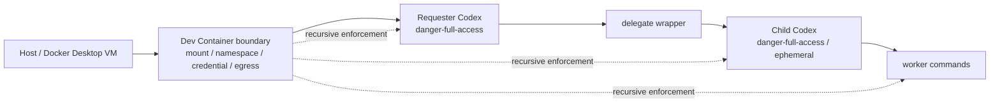

# Dev Container を境界とする Codex requester delegation 設計・実装計画

[spec.md の委譲アーキテクチャ](../design/spec.md#2-アーキテクチャ概要)と
[development.md の test execution capability](../design/development.md#テスト)に対応し、requester と delegate worker を必ず Dev Container 内で動かす運用における Codex の実行境界を定義する。

本計画の結論は、Dev Container を唯一の security boundary とし、requester / child Codex では inner OS sandbox を重ねない構成を採用することである。requester は `--sandbox danger-full-access` で起動し、child は現行の `codex exec --sandbox danger-full-access` を維持する。Codex app-server、`externalSandbox`、managed permission profile、host-issued attestation はこの構成には不要である。

この文書は、すべての coding agent を Dev Container 内でだけ動かす運用を対象とする。通常 terminal、共有 host、managed workstation での full-access 実行はサポート対象外とし、必要になった時点で別の境界設計を行う。

## 1. 対応スコープ

| 要件                                                               | 開始時の状態                                                                             | 完了条件                                                                                                        | 最終状態                          | 状態                         |
| ------------------------------------------------------------------ | ---------------------------------------------------------------------------------------- | --------------------------------------------------------------------------------------------------------------- | --------------------------------- | ---------------------------- |
| [MUST] requester Codex から契約テストと delegate を起動できる      | requester の inner sandbox で Node anonymous pipe、network、nested `bwrap` が失敗する    | Dev Container 内の requester から canonical test と最小 Codex delegate が成功する                               | 起動方式を本計画で確定            | 設計済み・実装未着手         |
| [MUST] sandbox owner を Dev Container に一意化する                 | requester、child、host sandbox の責任が混在している                                      | requester / child の Codex sandbox を境界と数えず、mount・namespace・credential・egress の owner を明記する     | 契約を §3 に定義                  | 設計済み                     |
| [MUST] host での full-access 誤起動を防ぐ                          | child Codex は環境を問わず `danger-full-access` が既定                                   | container 専用 launcher または同等の operator guard が container 外で fail-closed する                          | 固定 marker を確認する launcher   | 実装完了                     |
| [MUST] Dev Container 自体を境界として成立させる                    | `docker-in-docker` feature が outer container を privileged にする                       | 通常 profile が non-privileged で、host Docker socket、host PID/network namespace、不要な host mount を持たない | 通常 profile の設定を §2.3 に固定 | 実装完了・qualification 待ち |
| [MUST] Codex 固有の full-access 条件を利用者へ公開する             | README には child Codex の sandbox 無効化と必要な outer boundary が明記されていない      | README / README_ja が起動条件、保護されない資産、Dev Container の注意点を説明する                               | 本計画と同時に注意を追加          | 完了                         |
| [SHOULD] delegate の資格情報 lifecycle と MCP authority を定義する | `auth.json` と MCP config を isolated `CODEX_HOME` へコピーし、失敗 run では auth も残す | auth copy は成否にかかわらず削除し、MCP 継承の設計判断・実装・テスト・公開説明が一致する                        | 未実装                            | 未着手                       |
| [SHOULD] inner sandbox 無しの運用を一度だけ qualification する     | test preflight は失敗を検出するが、container 境界自体は検証しない                        | image build / container start で境界と process capability を検証し、delegate ごとの probe は増やさない          | 方針を §6 に定義                  | 設計済み                     |

スコープ外:

- 通常 laptop や共有 Linux host で `danger-full-access` を安全にすること: Dev Container 外を対象にしない
- task kind ごとの完全な read-only 強制: inner sandbox を外すため、`explore` / `review` の非書き込みは prompt と main の diff 検証に依存する
- Dev Container 内の mounted workspace、container filesystem、container 内 credentials を悪意ある agent から保護すること: これらは同じ trust domain に属する
- Codex app-server client の実装: CLI の既存 surface で必要条件を満たすため採用しない

## 2. ベースライン / リファレンス

### 2.1 Codex の公式な container 運用

Codex の公式 security guide は、Dev Container を outer isolation boundary とする運用を明示している。container を意図した境界にする場合は、container 内で `--sandbox danger-full-access` を使い、Codex が二つ目の sandbox を作らない構成を選べる。一方、full access の agent は container 内の Codex credentials を含むすべてを読み出せるため、trusted repository と限定された credential scope が前提になる。

| 公式仕様                                                                                                               | 本計画での扱い                                                                                       |
| ---------------------------------------------------------------------------------------------------------------------- | ---------------------------------------------------------------------------------------------------- |
| [Agent approvals & security](https://learn.chatgpt.com/docs/agent-approvals-security)                                  | Dev Container を境界とする `danger-full-access` を採用し、container 内 asset は保護対象外とする      |
| [Non-interactive mode](https://learn.chatgpt.com/docs/non-interactive-mode)                                            | child は controlled container 内の `codex exec --sandbox danger-full-access` と `--ephemeral` を使う |
| [Codex secure Dev Container example](https://github.com/openai/codex/blob/main/.devcontainer/devcontainer.secure.json) | mount と egress の参考にする。inner `bwrap` 用 capability は本計画では不要                           |
| [Codex app-server README](https://github.com/openai/codex/blob/main/codex-rs/app-server/README.md)                     | `externalSandbox` は app-server client 用であり、CLI delegation のためには導入しない                 |
| [Docker privileged mode](https://docs.docker.com/reference/cli/docker/container/run/#privileged)                       | privileged container は安全な host sandbox ではないため、通常の agent profile から除外する           |

### 2.2 Step 2 適用前の Dev Container 実測

2026-07-21 時点の `.devcontainer/devcontainer.json` と実行中 container を確認した。

| 項目                      | 実測                                                                                                           | 判定                                                                                                              |
| ------------------------- | -------------------------------------------------------------------------------------------------------------- | ----------------------------------------------------------------------------------------------------------------- |
| workspace                 | host の対象 repository だけを `/workspaces/delegate-skills` へ bind mount                                      | agent が repository と `.git` を変更・削除できることを受け入れる                                                  |
| Docker daemon             | `/var/run/docker.sock` は Dev Container 内の専用 daemon で、host Docker socket ではない                        | host daemon の直接公開は無い。ただし outer privileged mode は別の問題                                             |
| `docker-in-docker:2`      | feature manifest 自体が `"privileged": true` を要求                                                            | container を強い Linux host boundary とみなせない                                                                 |
| root capability           | `sudo` 後の root が全 capability、`Seccomp: 0`、read-write `/sys` を持つ                                       | [Docker の privileged mode の警告](https://docs.docker.com/reference/cli/docker/container/run/#privileged) と一致 |
| Docker Desktop            | container の外側に Docker Desktop Linux VM があり、host workspace だけが明示共有されている                     | macOS / Windows host には VM 境界が残るが、VM と共有 mount は full-access agent の到達範囲                        |
| repository の Docker 利用 | source、test、build から Docker CLI / daemon への依存は確認できず、主な参照は Dev Container のディスク運用のみ | 通常 profile から DinD を外す余地がある                                                                           |
| Codex child               | wrapper は既に `--sandbox danger-full-access` と `--ephemeral` を指定                                          | child 起動方式の変更は不要                                                                                        |
| canonical test            | requester の inner sandbox 外で `npm test` を実行し、36 files / 283 tests が成功                               | inner sandbox を外すだけで Node process / pipe preflight と全 test が成立                                         |
| real Codex delegate       | `gpt-5.6-luna` child が Node grandchild の sentinel を完全取得し、response / observe を生成                    | CLI 直接実行で worker command と model round trip が成立。成功 run の auth copy も削除済み                        |

Docker Desktop は Linux VM による追加境界を提供するが、privileged container は VM 内部と Docker Engine に強い権限を持つ。native Linux では VM 境界が無いため、Step 2 適用前の profile を security boundary として採用しない。Docker が必要な場合も、host Docker socket を mount する `docker-outside-of-docker` へ単純に置換しない。

### 2.3 Step 2 適用後の default profile

source、test、build script に Docker CLI / daemon 依存が無いことを再確認し、`docker-in-docker:2` とその lock entry を削除した。Docker 用の別 profile は、現時点で利用者がいないため追加しない。

| 項目                   | default profile の設定                          | effective state                                                                                  |
| ---------------------- | ----------------------------------------------- | ------------------------------------------------------------------------------------------------ |
| user                   | `remoteUser: "vscode"`                          | base image に含まれる non-root `vscode` user で VS Code lifecycle command と terminal を実行する |
| init                   | `init: true`                                    | container runtime の init が PID 1 となり、signal forwarding と zombie reaping を担う            |
| privilege / capability | `privileged: false`、`capAdd` なし              | privileged mode と追加 Linux capability を使わない                                               |
| namespace              | host namespace を選ぶ `runArgs` なし            | host PID / network / IPC namespace を共有しない                                                  |
| mount                  | `mounts` なし                                   | Dev Container が管理する workspace mount 以外の host path と host Docker socket を追加しない     |
| seccomp                | `securityOpt` なし                              | runtime の default seccomp / AppArmor または Docker Desktop の同等 isolation を無効化しない      |
| boundary marker        | `containerEnv.DELEGATE_DEVCONTAINER_BOUNDARY=1` | container 内の process にだけ Step 3 launcher 用 marker を公開する                               |

この表は configuration contract を記録するもので、image rebuild 後の runtime 状態は Step 5 の container qualification で検証する。

## 3. 設計の中核

### 3.1 Dev Container を唯一の強制境界にする

Codex の sandbox と approval は次のように扱う。

| surface                  | 設定                                                               | 役割                                                                                         |
| ------------------------ | ------------------------------------------------------------------ | -------------------------------------------------------------------------------------------- |
| interactive requester    | `codex --sandbox danger-full-access --ask-for-approval on-request` | inner OS sandbox を省く。approval は operator UX として残すが security boundary には数えない |
| unattended requester     | `codex --dangerously-bypass-approvals-and-sandbox`                 | 外層が十分に制御され、MCP / remote credential も限定した専用 run にだけ使う                  |
| normal Codex delegate    | 現行 `codex exec --sandbox danger-full-access --ephemeral`         | wrapper の one-shot protocol を維持する                                                      |
| resumable Codex delegate | `danger-full-access` + isolated `CODEX_HOME` の session            | 明示的な follow-up だけを保持し、container の寿命を越えるかは mount 方針で決める             |

`danger-full-access` は inner filesystem / network sandbox を外すが、approval policy の選択を別に残せる。`--dangerously-bypass-approvals-and-sandbox` は sandbox と approval の両方を外すため、通常の interactive requester では既定にしない。

child wrapper の `CODEX_DELEGATE_SANDBOX` は互換性・診断用の override として維持する。qualification 対象は override 未設定時の `danger-full-access` とし、override を指定した経路は Dev Container の標準構成として保証しない。通常 run と resumable initial run は `--sandbox <value>`、follow-up は `-c sandbox_mode=<value>` で同じ値を適用する。

### 3.2 通常 Dev Container profile の必須契約

| 境界               | MUST                                                                                                 | SHOULD                                                                                   |
| ------------------ | ---------------------------------------------------------------------------------------------------- | ---------------------------------------------------------------------------------------- |
| privilege          | `privileged: false`、host PID / network / IPC namespace を共有しない                                 | default seccomp / AppArmor、non-root `remoteUser`、`init: true`                          |
| mount              | workspace 以外の host path を必要最小限にし、host Docker socket を mount しない                      | host `.gitconfig` が必要なら read-only、cache / `CODEX_HOME` は named volume             |
| Docker             | repository が Docker を必要としない通常 profile から `docker-in-docker` を外す                       | Docker が必要なら別 profile / remote builder に分離し、その profile を強い境界と称さない |
| credential         | container に入れた credential は requester / child / repository code から読めるものとして scope する | workflow 専用・短命 token、remote service ごとの最小権限、定期 rotation                  |
| network            | full access 時の Codex network policyを強制境界とみなさない                                          | 必要なら agent が変更できない外層 egress proxy / firewall で domain を制限               |
| process / resource | descendant process を同じ container / cgroup 内に留め、container stop でまとめて終了させる           | PID / memory / CPU limit と init による zombie reaping                                   |
| persistence        | workspace と明示 volume 以外は再作成可能にする                                                       | command history、auth、sessions、cache を別 volume に分け、寿命と削除手順を明記          |

Step 2 適用前の `docker-in-docker` feature は [feature manifest](https://github.com/devcontainers/features/blob/main/src/docker-in-docker/devcontainer-feature.json) で privileged を要求していた。Rootless DinD も outer `--privileged` を必要とするため、通常 agent profile の境界強化にはならない。Docker を使わない本 repository の通常作業では feature 自体を外す。

### 3.3 credential と MCP は container 境界の内側にある

full-access agent からは次が読み取り・利用可能になる。

- root requester の `$CODEX_HOME/auth.json` または access token
- child isolated `CODEX_HOME` へコピーされた `auth.json`
- GitHub CLI、各 backend CLI、package registry の login state
- MCP server の command、URL、bearer token、environment value
- mounted workspace の source、`.git`、未 commit 差分

このため、isolated `CODEX_HOME` は security boundary ではなく、session/config の衝突を避ける operational isolation と位置付ける。現行の auth copy は実用上維持できるが、成功・失敗を問わず wrapper 終了時に削除する。cache prune の無効化は auth copy の削除を無効化しない。失敗診断には redacted event、exit status、session metadata を残し、credential 自体は残さない。

resumable initial run と follow-up は session JSONL と `config.toml` を含む isolated `CODEX_HOME` を再利用するが、auth copy 自体には依存しない。各 follow-up は起動時に root requester の auth を同じ session home へ再コピーし、終了時に再び削除するため、auth の短命化と session resume は両立する。

MCP 継承は full-access shell と別の remote authority を worker に与える。本計画では backend 間の互換性を優先し、親の user-scope MCP server 集合を isolated config へ注入する現行動作を維持する。config へ不要な secret value を複製せず、server/token 側で credential と tool scope を絞り、observe には server name だけを記録する。MCP 無しや server identity allowlist を必要とする環境は、別の hardening profile として扱う。

repository の信頼度によって、container 内へ渡す authority を分ける。

| 運用モード                    | credential / MCP                                                | persistence              | network                                                |
| ----------------------------- | --------------------------------------------------------------- | ------------------------ | ------------------------------------------------------ |
| trusted repository の通常開発 | workflow に必要な login だけ。MCP は明示 server に限定          | root auth / cache を許可 | outbound を許可し、remote write は token scope で制限  |
| untrusted repository の確認   | GitHub write token と MCP を渡さず、必要なら一時 API credential | container ごと破棄       | 採用 provider だけを外層で許可。任意 live web は無効化 |

untrusted repository に personal Codex / GitHub / MCP credential を同時に渡す構成は、Dev Container 内であっても採用しない。

### 3.4 egress は用途別に二段階で扱う

最小構成では Dev Container の outbound network を許可する。これは dependency install、各 backend API、Web / MCP 調査を最も単純に動かせる一方、container 内 credential と source の exfiltration を技術的には防がない。

より厳しい運用では次の二段階に分ける。

1. setup phase: package install と tool update に必要な広い network を許可する
2. agent phase: container 外で強制する egress proxy / firewall を使い、採用 backend、source control、明示 MCP endpoint だけを許可する

`danger-full-access` では Codex inner network proxy を外層の代替にしない。full access では live web search も利用可能になるため、不要なら `web_search = "disabled"` を container 用 Codex config に設定する。

### 3.5 container 外での誤起動を operator guard で止める

repository の `.codex/config.toml` に無条件の `sandbox_mode = "danger-full-access"` を追加すると、repository を通常 host で開いた利用者にも適用され得る。このため、次の順で実装する。

1. Dev Container config が `DELEGATE_DEVCONTAINER_BOUNDARY=1` を container 内だけに設定する
2. container 専用 launcher が明示 marker と `/.dockerenv` または `/run/.containerenv` を確認する。`REMOTE_CONTAINERS` は VS Code 接続時の補助情報にだけ使う
3. 条件を満たした場合だけ `codex --sandbox danger-full-access` を実行する
4. IDE extension では container 内 user-scope config を使い、host の user config と共有しない
5. launcher の判定は誤操作防止であり、悪意ある container process に対する attestation ではないことを明記する

## 4. 実装ステップ

### Step 1: (完了済み) 適用前提と公開上の警告を定義する

- Dev Container-only の適用条件と、通常 host をサポートしない方針を明記する
- README / README_ja に Codex child の full-access と outer boundary の必要条件を追加する

成果物: 本文書 + README 注意事項

### Step 2: (完了済み) 通常 Dev Container を non-privileged にする

- repository の Docker CLI / daemon 依存が無いことを最終確認する
- `.devcontainer/devcontainer.json` から `docker-in-docker:2` を外す
- Docker 依存が無いため privileged な別 profile は作成しない。将来必要になった場合は別名 profile へ分離し、通常 agent 起動では選択しない
- `remoteUser`、`init`、host namespace、mount、capability、seccomp の effective state を記録する

成果物: non-privileged default Dev Container + 必要なら明示的な別 Docker profile

### Step 3: (完了済み) requester の container 専用起動経路を追加する

- container marker を確認してから Codex を起動する薄い launcher を追加する
- `.devcontainer/devcontainer.json` に launcher 用の明示 marker を設定する
- interactive 既定を `--sandbox danger-full-access --ask-for-approval on-request` にする
- unattended bypass は別 flag とし、README で追加条件を示す
- IDE extension 用の container-local config 手順を追加する

`scripts/codex-devcontainer.sh` は `DELEGATE_DEVCONTAINER_BOUNDARY=1` と固定 runtime marker の二条件を満たす場合だけ Codex を `exec` する。通常 mode は `danger-full-access` と `on-request` を組み合わせ、argv 全体から execution boundary または policy を上書きし得る remote app-server flag、sandbox / approval flag、config、profile 選択を拒否する。`--unattended` を指定した場合だけ `codex exec` と approval bypass を launcher が構成する。launcher test は production の判定を環境変数で差し替えず、一時コピーの固定 marker path を fixture path へ置換して全組合せ、adversarial argv、fake Codex の argv / PID を検証し、fixture を test ごとに削除する。README 英日と development guide に CLI と IDE extension の container-local 設定手順を記載した。

成果物: host で fail-closed する requester launcher + 利用手順

### Step 4: (未着手) Codex credential / MCP lifecycle を hardening する

- `auth.json` copy を wrapper の成否にかかわらず削除する
- cache prune の override から auth cleanup を分離し、session JSONL と `config.toml` は保持する
- config / observe / stderr の credential redaction test を追加する
- Codex MCP 継承が §5 の互換性維持判断と一致し、注入した server name だけを observe に記録することを確認する
- GitHub / backend / MCP credential の推奨 scope を README に追加する

成果物: secret cleanup + MCP authority contract

### Step 5: (一部完了) Dev Container qualification と real delegate を固定する

- host から `Privileged=false`、host namespace 非共有、host Docker socket 非 mount を検証する
- container 内で Node sync / async pipe、multi-level process、canonical test を検証する
- requester Codex から最小の `gpt-*` delegate を一度実行する
- failure run 後に auth copy が無いことを検証する
- 2026-07-21 の現行 profile では、inner sandbox 外の `npm test`（36 files / 283 tests）と `gpt-5.6-luna` delegate の Node child sentinel capture が成功した。non-privileged profile への変更後に同じ確認を再実行する

成果物: container boundary report + test / delegate の成功記録

### Step 6: (未着手) 永続文書へ反映する

- `docs/design/spec.md` に Dev Container boundary と Codex child の full-access 契約を反映する
- `docs/design/development.md` に requester launcher と qualification command を追加する
- 本文書の完了項目を更新し、ユーザー確認後に archive する

成果物: design / development 更新 + archive 判断

## 5. 設計判断

### a. Codex integration surface

| 候補                                          | 採用 | 理由                                                                               |
| --------------------------------------------- | ---- | ---------------------------------------------------------------------------------- |
| **CLI `danger-full-access`**                  | ✓    | 現行 wrapper と公式 Dev Container guidance に一致し、追加 daemon / protocol が不要 |
| app-server `externalSandbox`                  | ✗    | rich client protocol が不要で、transport と privileged control plane だけが増える  |
| inner `workspace-write` + nested `bwrap`      | ✗    | Dev Container と責任が重複し、今回の pipe / namespace 制約を再導入する             |
| managed permission profile + host attestation | ✗    | Dev Container-only 運用には fleet rollout と未実装 handoff が過剰                  |

### b. requester の approval policy

| 候補                                         | 採用     | 理由                                                                        |
| -------------------------------------------- | -------- | --------------------------------------------------------------------------- |
| **`danger-full-access` + `on-request`**      | ✓        | inner sandbox を外しつつ、interactive な operator UX と MCP prompt を残せる |
| `--dangerously-bypass-approvals-and-sandbox` | 条件付き | unattended 専用。remote credential と MCP を限定した run では最も単純       |
| project config に無条件の full access        | ✗        | host で repository を開いた利用者へ誤適用される                             |

### c. Docker capability

| 候補                                     | 採用     | 理由                                                                                   |
| ---------------------------------------- | -------- | -------------------------------------------------------------------------------------- |
| **通常 profile から DinD を外す**        | ✓        | repository runtime に Docker 依存がなく、privileged mode を除去できる                  |
| privileged DinD を通常 profile に残す    | ✗        | native Linux で host boundary とみなせず、Docker Desktop VM 内の attack surface も広い |
| host Docker socket を mount する         | ✗        | agent に host daemon 相当の権限を与え、container boundary を崩す                       |
| Docker 専用の別 profile / remote builder | 条件付き | Docker が必要な作業だけ明示的に選び、通常 coding agent と分離できる                    |

### d. network enforcement

| 候補                                     | 採用     | 理由                                                         |
| ---------------------------------------- | -------- | ------------------------------------------------------------ |
| **通常開発は container outbound を許可** | ✓        | backend、dependency、Web / MCP の互換性を保ち、最も単純      |
| 外層 egress allowlist                    | 条件付き | secret exfiltration を threat model に含める環境で採用       |
| Codex inner network proxy だけに依存     | ✗        | `danger-full-access` では outer enforcement の代替にならない |

### e. MCP authority

| 候補                                                 | 採用     | 理由                                                                                      |
| ---------------------------------------------------- | -------- | ----------------------------------------------------------------------------------------- |
| **親の user-scope MCP server 集合を継承する**        | ✓        | backend 間の互換性を維持し、既存 skill の MCP 利用契約を変えない                          |
| skill ごとの server opt-in / identity allowlist      | 将来候補 | remote authority を縮小できるが、skill metadata と設定移行を含む別の hardening 設計が必要 |
| MCP config と credential value を observe に記録する | ✗        | 診断 artifact から secret が漏れるため、server name だけを記録する                        |

## 6. テスト方針

### 自動確認

- `scripts/test-execution-capability.ts`
  - Node 24 の sync pipe に spawn error が無く sentinel stdout が完全一致する
  - async Node child の stdout が close 前に drain される
- wrapper test
  - override 未設定の通常 run が `--sandbox danger-full-access --ephemeral` を使う
  - resumable initial run は `--sandbox danger-full-access` を使い、`--ephemeral` を使わない
  - follow-up は `-c sandbox_mode=danger-full-access` を使い、`--sandbox` と `--ephemeral` を使わない
  - `CODEX_DELEGATE_SANDBOX` override が通常・resumable・follow-up の各経路へ反映される
  - 成功 / child error / response missing / signal termination のすべてで auth copy を削除する
  - `DELEGATE_CODEX_HOME_PRUNE=0` でも auth copy を削除し、session JSONL と `config.toml` は保持する
  - resumable initial と follow-up の各起動で auth を再コピーし、終了時に削除する
  - 親から注入した MCP server name と observe の記録が fixture と一致し、credential value を記録しない
- launcher test
  - 明示 marker と runtime marker が揃う場合だけ期待 argv を exec する
  - 片方または両方の marker が欠ける場合は Codex を起動せず非 0 で終了する

### container qualification

- [ ] host の `docker inspect` で `Privileged=false` である
- [ ] host PID / network / IPC namespace を共有していない
- [ ] host Docker socket と host `$HOME` が mount されていない
- [ ] workspace と明示した named volume だけが writable である
- [ ] default seccomp / AppArmor または同等の Docker Desktop isolation が有効である
- [ ] requester から `npm test` が canonical baseline 以上の件数で成功する
- [ ] requester から最小 Codex delegate が response / observe を生成する
- [ ] container 外で launcher を実行すると Codex を起動せず非 0 で終了する
- [ ] container stop 後に requester / child / worker process が残らない

## 7. 受け入れ基準

- §1 の MUST 要件をすべて満たす
- 通常 Dev Container が non-privileged で host Docker socket と host namespace を公開しない
- requester Codex を container 専用経路から `danger-full-access` で起動でき、container 外では同経路が fail-closed する
- Node sync / async pipe、canonical test、実 Codex delegate が同じ container で成功する
- child Codex に app-server、`externalSandbox`、managed permission profile、追加 capability probe を導入していない
- mounted repository、container 内 credentials、MCP、remote service authority が保護対象外であることを README が説明する
- auth copy が成功・失敗を問わず isolated `CODEX_HOME` / `session_home` に残らず、resumable session artifact は follow-up に再利用できる
- MCP 継承動作、observe に記録する server name、README の remote authority 説明が §5 の設計判断と一致する
- design / development / README / README_ja が実装と一致する

## 8. 想定リスクと回避策

| リスク                                                           | 回避策                                                                                                                   |
| ---------------------------------------------------------------- | ------------------------------------------------------------------------------------------------------------------------ |
| full-access agent が mounted repository や `.git` を破壊する     | clean branch、頻繁な commit、host backup、main による diff review を rollback boundary とする                            |
| container 内の OpenAI / GitHub / MCP credential を持ち出す       | trusted repository、短命・最小 scope credential、失敗時を含む cleanup、必要なら外層 egress allowlist                     |
| prompt injection が live web / MCP / shell を利用する            | 不要な web / MCP を無効化し、remote write authority を server/token 側で制限する                                         |
| privileged DinD により container escape の影響が広がる           | 通常 profile から除去する。Docker Desktop では必要に応じ Enhanced Container Isolation、native Linux では別 runner を使う |
| operator が通常 host で full-access launcher を実行する          | container marker の二条件確認と明示エラー。project config へ full access を固定しない                                    |
| `on-request` を security boundary と誤認する                     | approval は UX / audit と明記し、強制境界は container runtime と remote credential scope に限定する                      |
| persistent volume が container recreate 後も auth/history を残す | `CODEX_HOME`、history、cache を別 volume にし、削除・rotation 手順と retention を定義する                                |

## 9. 参考

- [Agent approvals & security](https://learn.chatgpt.com/docs/agent-approvals-security)
- [Non-interactive mode](https://learn.chatgpt.com/docs/non-interactive-mode)
- [Codex secure Dev Container example](https://github.com/openai/codex/blob/main/.devcontainer/devcontainer.secure.json)
- [Dev Container docker-in-docker feature manifest](https://github.com/devcontainers/features/blob/main/src/docker-in-docker/devcontainer-feature.json)
- [Docker privileged mode](https://docs.docker.com/reference/cli/docker/container/run/#privileged)
- [Docker Desktop container security FAQ](https://docs.docker.com/security/faqs/containers/)
- [Docker rootless mode](https://docs.docker.com/engine/security/rootless/)
- [spec.md](../design/spec.md)
- [development.md](../design/development.md)
