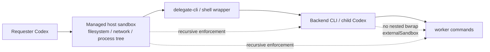

# Codex requester の delegate 対応 sandbox 設計・実装計画

[](https://mkdn.review/?url=https%3A%2F%2Fraw.githubusercontent.com%2Foubakiou%2Fdelegate-skills%2Frefs%2Fheads%2Fmain%2Fdocs%2Ffeature%2Fcodex-requester-delegation-sandbox.md)

[spec.md の委譲アーキテクチャ](../design/spec.md#2-アーキテクチャ概要)と
[development.md の test execution capability](../design/development.md#テスト)に対応し、Codex requester が
managed `workspace-write` 相当の境界を維持したまま、契約テストと delegate worker に必要な子プロセスを正しく実行するための設計判断と実装手順をまとめる。

本計画の結論は、repository 内の fail-fast や個別の file capture への置換だけでは根本解決にならない、というものである。恒久策は、外層の host sandbox が Node の child-process / pipe 契約と descendant の実行を正しく提供し、その外層を唯一の強制境界として子 Codex に伝えることである。Codex の managed permission profile は filesystem / network の最小権限を定義するために併用するが、公開されている profile schema だけでは process / pipe / namespace capability を許可できない。

## 1. 対応スコープ

| 要件                                                         | 開始時の状態                                                                                                  | 完了条件                                                                                                                                              | 最終状態                           | 状態                 |
| ------------------------------------------------------------ | ------------------------------------------------------------------------------------------------------------- | ----------------------------------------------------------------------------------------------------------------------------------------------------- | ---------------------------------- | -------------------- |
| [MUST] host sandbox 内の child-process / pipe 契約を修復する | Node の pipe 付き `spawnSync` が、子の exit 0 と `error.code = "EPERM"` を同時に返す                          | sync / async、Node / shell / backend CLI、pipe / file descriptor の qualification matrix が managed workspace profile 内で全件成功する                | 未実装。失敗条件と層は本計画で確定 | 調査完了・実装未着手 |
| [MUST] 子 Codex の sandbox 所有者を一意にする                | requester の外層 sandbox と child Codex の bubblewrap が重なり、inner `--unshare-net` が失敗し得る            | 外層 host policy が全 descendant を制約し、child Codex は attested external sandbox mode で二重 sandbox を作らずに起動する                            | 未実装                             | 未着手               |
| [MUST] delegate worker に必要な network を最小権限で提供する | `CODEX_SANDBOX_NETWORK_DISABLED=1` で、child CLI の provider endpoint への DNS / HTTPS / WebSocket が失敗する | 選択した managed profile だけが必要な provider domain へ到達し、未許可 domain と local/private destination は拒否される                               | 未実装                             | 未着手               |
| [MUST] managed policy で delegate 用 profile を配布する      | built-in workspace profile は network off、process capability は profile schema に存在しない                  | Codex 0.138+ の custom permission profile と、対応する host execution profile を pilot group へ配布できる                                             | 設定案を §3.3 に定義               | 設計済み・配布未着手 |
| [MUST] test と実 delegate の双方で回帰を防ぐ                 | test preflight は偽失敗を早期分類するが、実行環境自体は直さない                                               | canonical full test と最小の real child-Codex delegation が同じ managed profile 内で成功する                                                          | 未実装                             | 未着手               |
| [MUST] token / latency の恒常的な追加コストを発生させない    | repository の preflight は test 起動時に local probe を行う                                                   | delegate ごとの capability probe、追加 LLM turn、失敗後 retry を 0 件にし、qualification は image build / policy rollout / session startup に限定する | 方針を §3.4 に定義                 | 設計済み・実装未着手 |
| [SHOULD] policy rollout を可観測にする                       | host denial の正確な syscall / broker operation は requester から取得できない                                 | redacted host audit に profile id、denied capability、Codex / Node / bwrap version、qualification case id を記録する                                  | 未実装                             | 未着手               |

スコープ外:

- `scripts/test-execution-capability.ts` の即時削除: 現在は false result の拡散を止める guardrail として有効であり、host 修正の全 rollout が完了するまでは残す
- 個々の契約テストを file capture に書き換える対応: pipe 契約の破損を隠し、実装内の別の pipe 利用を取りこぼすため恒久策にしない
- repository の `.codex/config.toml` で全 session を `danger-full-access` にする対応: managed / host policy を解除できず、trusted repository を開くだけで境界を広げるため採用しない
- backend ごとの model 選定、token 単価、prompt 最適化: 本計画は worker の起動・I/O・network 境界だけを扱う
- Codex 以外の provider domain の確定: profile の拡張方法は定義するが、Claude / Cursor / Devin / Grok の endpoint allowlist は各 CLI の管理者向け仕様と実測を別途確認する

## 2. ベースライン / リファレンス

### 2.1 現行実装と公式仕様

| 参照元 / 現行実装                                                                   | 本実装での扱い                                                                                                                                                                                            |
| ----------------------------------------------------------------------------------- | --------------------------------------------------------------------------------------------------------------------------------------------------------------------------------------------------------- |
| Codex `workspace-write` / built-in `:workspace`                                     | 公式には workspace 内の編集と routine local command の実行を許す境界であり、子プロセスや pipe を全面禁止するモードとは扱わない                                                                            |
| Codex permission profiles                                                           | filesystem と network の named policy として採用する。process creation、pipe、signal、namespace の許可項目は公開 schema に無いため host profile の代替にはしない                                          |
| Codex Linux sandbox                                                                 | bubblewrap が user / PID namespace を作り、network off の場合は network namespace も分離する。host が外層 sandbox を提供する child worker では二重適用しない                                              |
| `shared/src/dispatch.ts` / `wrapper-wait.ts`                                        | worker 本体は stdout / stderr を file descriptor へ capture して起動する。この経路は現環境でも process start 自体は成功したため維持する                                                                   |
| `shared/src/prepare.ts` / `observe-store.ts` / `delegate-mcp.ts` / backend wrappers | repo root、git metadata、MCP list、`ps`、backend preflight などに pipe 付き `execFileSync` / `spawnSync` が残る。host 修正後も spawn error を status と独立に検証する hardening 対象とする                |
| `scripts/test-execution-capability.ts`                                              | test 結果を信用できない環境を fail-closed で分類する P0 guardrail として維持する。host 修正の代替とは位置づけない                                                                                         |
| `local_setup.sh`                                                                    | `bubblewrap` の install だけでなく、system `bwrap`、user namespace、network namespace、Codex sandbox qualification を検証する入口へ拡張する。ただし host policy 自体の変更は image / runtime 管理側で行う |
| managed `requirements.toml`                                                         | `allowed_permission_profiles`、managed default、approval policy、network allowlist を中央配布する。外層 host sandbox の capability を拡張する設定ではないことを明示する                                   |

### 2.2 実測した現象

調査時点の主要バージョンは Codex CLI 0.144.1、Node.js 25.9.0、Ubuntu 24.04、bubblewrap 0.9.0 である。同一 workspace と同一 executable を使い、requester の制限内と承認済みの制限外で比較した。

| case                                                                    | requester host sandbox 内                                        | 同じ host sandbox の外                | 判定                                                         |
| ----------------------------------------------------------------------- | ---------------------------------------------------------------- | ------------------------------------- | ------------------------------------------------------------ |
| Node `spawnSync(node, ...)`、default pipe、async `process.stdout.write` | `status = 0`、`signal = null`、`error.code = "EPERM"`、stdout 空 | error 無し、status 0、sentinel stdout | host sandbox 固有の異常                                      |
| Node `spawnSync(node, ...)`、default pipe、`fs.writeSync(1, ...)`       | `error.code = "EPERM"` は残るが stdout は取得                    | error 無し、stdout 取得               | child の実行可否ではなく pipe / libuv I/O lifecycle が関与   |
| Node `spawnSync(echo, ...)`、stdout または stderr の一つだけを pipe     | status 0 と期待 stdout に加えて `EPERM`                          | error 無し                            | executable 種別ではなく pipe の存在と相関                    |
| Node `spawnSync(...)`、全 stdio を `ignore` または file descriptor      | error 無し、status 0                                             | error 無し、status 0                  | process creation の全面禁止ではない                          |
| Node async `spawn(node, ...)`、pipe                                     | error event 無し、close 0、async stdout が欠落                   | sentinel stdout                       | sync API だけの問題でもない                                  |
| production 相当の Node → bash / Codex、file descriptor capture          | `codex --version` を sync / async とも取得                       | 取得                                  | main worker launch の file capture は成立                    |
| `bwrap --unshare-user --unshare-pid`                                    | 成功                                                             | 成功                                  | user / PID namespace の全面禁止ではない                      |
| 同じ `bwrap` に `--unshare-net` を追加                                  | loopback 用 `NETLINK_ROUTE` socket が `EPERM`                    | 成功                                  | 外層 network policy と nested network namespace setup の衝突 |
| `codex sandbox -P :workspace`                                           | 同じ loopback / `NETLINK_ROUTE` error                            | 成功                                  | Codex install 単体ではなく外層との nesting が原因            |
| `codex sandbox -P :danger-full-access`                                  | 成功                                                             | 成功                                  | inner bubblewrap を省くと child command は起動可能           |
| `codex doctor --json` の provider reachability                          | `chatgpt.com/backend-api` の DNS / HTTPS / WebSocket が到達不能  | 本比較では network request を実施せず | child CLI に必要な outer egress が無い                       |

Node の公式契約では `spawnSync().error` は child process が失敗または timeout した場合の値であり、`status` は child の exit code である。正常終了した child の status 0、spawn error、欠落 stdout が同時に現れる現在の結果は、application が通常想定できる戻り値ではない。

`/proc/self/status` では requester command 自身の `Seccomp` は 0 だった一方、`strace` の `PTRACE_TRACEME` は `EPERM` で拒否された。したがって「どの kernel syscall または host broker operation が pipe 付き child process に最初の `EPERM` を返したか」は requester からは確定できていない。any-pipe case だけが失敗し、制限外で消えることまでは確定しているため、host audit / trace を使って denial point を特定する。

### 2.3 影響範囲

| 経路                            | 影響                                                                                                                                                                                                                                           |
| ------------------------------- | ---------------------------------------------------------------------------------------------------------------------------------------------------------------------------------------------------------------------------------------------- |
| 契約テスト                      | 多くの harness が default pipe で bundled CLI / shim / fake backend を起動する。空 stdout、throw、status 0 の混在により false failure、false success、終了待ちが起こる                                                                         |
| delegate の main worker launch  | `dispatch.ts` と `wrapper-wait.ts` は file descriptor capture のため、process start 自体は全面的には壊れていない                                                                                                                               |
| delegate 内の補助 subprocess    | `git rev-parse`、git metadata、MCP list、`ps`、backend model / session preflight には pipe があり、fallback、metadata 欠落、誤った availability 判定を起こし得る                                                                               |
| child Codex の inner sandbox    | 現行 wrapper の既定 `--sandbox danger-full-access` は nested bubblewrap を避ける。ただし managed policy が inner workspace profile を強制する場合や `CODEX_DELEGATE_SANDBOX` 環境変数で既定を変更した場合は `NETLINK_ROUTE` failure が再発する |
| child backend CLI の model call | provider にかかわらず outer network が off なら API 通信できない。inner `danger-full-access` は外層 host policy を越えられない                                                                                                                 |

以上から、この問題は「テストだけの fork 禁止」ではない。ただし、すべての child process が起動不能なのでもない。test では pipe 契約破損が直接 false result を作り、実 delegate では補助 pipe と provider egress が別々に実害を作る。

## 3. 設計の中核

### 3.1 sandbox ownership を外層 host に固定する



外層 host sandbox を security boundary の owner とし、delegate-cli、backend CLI、その worker command の全 descendant に同じ filesystem / network / process policy を再帰適用する。child Codex は「無制限な process」としてではなく「すでに外層で sandbox 済みの process」として起動し、自身の bubblewrap / network namespace を重ねない。

Codex app-server の `externalSandbox` 相当の明示的な契約、または host が発行する偽造不能な sandbox-state / execution-profile handle を child 起動へ伝播する方式を第一候補とする。単なる環境変数や repository config は child 自身が書き換えられるため、boundary の証明には使わない。

CLI しか利用できない期間は、外層が実際に全 descendant を制約する専用 runner に限り、child Codex の `--dangerously-bypass-approvals-and-sandbox` または現行 `--sandbox danger-full-access` を transitional adapter として使える。これは user に host full access を与える managed profile とは分ける。outer enforcement が無い通常 terminal では使用しない。

### 3.2 host execution profile の必須契約

公開 Codex permission profile で表現できない次の capability は host execution profile が所有する。

| capability      | 必須契約                                                                                                                                                 |
| --------------- | -------------------------------------------------------------------------------------------------------------------------------------------------------- |
| Process tree    | Node → shell → Node / Rust CLI → worker command の深さを許可し、PID / resource limit は profile 単位で明示する                                           |
| Child lifecycle | spawn、exec、wait、exit code、signal delivery が POSIX / Node の通常契約と矛盾しない。失敗なら status 0 を併記せず一意な error にする                    |
| stdio           | stdin / stdout / stderr の anonymous pipe、file descriptor inheritance、EOF、backpressure、close-before-drain を正しく扱う                               |
| Async I/O       | descendant Node が pipe へ行う libuv async write を欠落させず、parent の close event より前に全 capture を drain する                                    |
| Namespace       | user / PID namespace と、採用する場合は nested network namespace の loopback setup を許可する。external sandbox mode 採用時は inner namespace を作らない |
| Network         | active profile の domain allowlist を全 descendant へ適用し、DNS / HTTPS / WebSocket を同じ policy で扱う                                                |
| Filesystem      | workspace roots への write、必要 runtime への read、secret / `.git` / `.codex` の protection を全 descendant に継承する                                  |
| Audit           | denial を executable 名だけでなく capability / operation と profile id で記録し、stdout / prompt / token は記録しない                                    |

host 側の修正は次の順で行う。

1. any-pipe case に対する host audit を有効化し、最初に拒否された operation を特定する
2. native pipe descriptor と poll / lifecycle operation を network socket policy から分離し、Node / libuv の sync・async capture contract を満たす
3. outer network-off 実装が inner bwrap の loopback setup を拒否している箇所を修正するか、attested external sandbox mode により inner `--unshare-net` 自体を省く
4. provider egress を wildcard ではなく profile の domain proxy へ接続する
5. 同一 image / policy build を §6 の qualification suite で検証してから rollout する

Ubuntu 24.04 の一般的な Codex host では system `/usr/bin/bwrap` と AppArmor の `bwrap-userns-restrict` profile も確認する。ただし今回の環境では、同じ `/usr/bin/bwrap --unshare-net` が外層 sandbox の外では成功したため、bubblewrap の再 install や system-wide の `kernel.apparmor_restrict_unprivileged_userns=0` だけを今回の root fix とはしない。

### 3.3 managed execution profile

推奨構成は、host の `delegate-capable-workspace` execution profile と、Codex の `delegate_worker_workspace` permission profile を同じ admin-assigned group に配布する二層構成である。

- host profile: §3.2 の process / pipe / namespace contract を実装し、全 descendant に再帰適用する
- Codex profile: workspace filesystem と provider domain network を定義する
- managed requirements: 選択可能な profile、default、approval reviewer、admin-owned network allowlist を固定する

Codex 0.138+ 向け `requirements.toml` の例を次に示す。domain は child Codex の ChatGPT auth と API-key auth の双方を例示している。実配布では利用する auth/provider だけを残す。この例は公開 profile schema からの設計案であり実 CLI では未検証のため、そのまま本番配布せず、effective config の確認（Step 5）を経てから使う。

```toml
allowed_approval_policies = ["on-request"]
allowed_approvals_reviewers = ["auto_review"]
default_permissions = ":workspace"

[allowed_permission_profiles]
":read-only" = true
":workspace" = true
delegate_worker_workspace = true
# ":danger-full-access" は通常 bundle では許可しない。

[permissions.delegate_worker_workspace]
description = "Workspace-scoped delegate workers with approved provider egress."
extends = ":workspace"

[permissions.delegate_worker_workspace.filesystem]
glob_scan_max_depth = 3

[permissions.delegate_worker_workspace.filesystem.":workspace_roots"]
"**/*.env" = "deny"

[permissions.delegate_worker_workspace.network]
enabled = true

[permissions.delegate_worker_workspace.network.domains]
"chatgpt.com" = "allow"
"api.openai.com" = "allow"

[experimental_network]
enabled = true
managed_allowed_domains_only = true
allowed_domains = ["chatgpt.com", "api.openai.com"]
```

運用規則:

- 通常の default は `:workspace` のままにし、delegation が必要な session だけ `/permissions` または管理された起動設定で `delegate_worker_workspace` を選ぶ
- delegation を常用する専用 devbox group では、その group に割り当てる bundle だけ `default_permissions = "delegate_worker_workspace"` にできる
- profile の domain rule と `experimental_network` の admin allowlist の双方を満たす宛先だけを許可する。`*`、local/private destination、任意 Unix socket は許可しない
- Claude / Cursor / Devin / Grok を許可する場合は provider ごとに別 profile を作るか、実測した endpoint だけを追加する。更新 check の失敗を避けるためだけに `api.github.com` を許可しない
- custom profile は process capability を増やさない。host が `delegate-capable-workspace` を割り当てていない端末では、この TOML を配っても pipe / namespace 問題は直らない
- permission profile と legacy `sandbox_mode` は混在させない。managed `allowed_permission_profiles` を有効にする fleet では、root requester の loaded config から legacy sandbox setting を除去する
- Codex 0.137 以下は `allowed_permission_profiles` と managed `default_permissions` を無視するため、fleet を 0.138+ に揃えてから配布する
- `remote_sandbox_config` は現時点で legacy `allowed_sandbox_modes` だけを host 別 override する。permission profile の host scope には使わず、cloud-managed group assignment、SCIM group、runner image の system requirements で対象を分ける

#### 一時的な full-access fallback

host 側の profile 実装に時間がかかる場合、ephemeral VM / container 自体を security boundary とする専用 runner group に限り、別 bundle で built-in `:danger-full-access` を選択可能にできる。

```toml
default_permissions = ":workspace"

[allowed_permission_profiles]
":read-only" = true
":workspace" = true
":danger-full-access" = true
```

これは通常 laptop group へ配布しない。default を full access にせず、runner の disposable 性、secret scope、egress firewall、audit を先に成立させる。また、Codex の `:danger-full-access` は外層 host sandbox を自動解除しないため、host がその profile を trusted runner の execution mode へ明示的に map できない環境では fallback としても機能しない。

### 3.4 probe と token / latency cost

root fix 後の通常 delegation path には capability probe を追加しない。host profile は image build、policy canary、session startup のいずれかで一度 qualification し、その結果を session の immutable execution context として渡す。

| 実行時点                  | probe                                    | LLM token | 通常 delegation への影響                                         |
| ------------------------- | ---------------------------------------- | --------- | ---------------------------------------------------------------- |
| image / policy build      | full qualification matrix                | 0         | なし                                                             |
| requester session startup | version / profile attestation の検証だけ | 0         | local fixed cost 1 回                                            |
| `npm test`                | 既存 P0 sync / async sentinel            | 0         | test command のみ。rollout 安定後に二重 probe の整理を別判断する |
| delegate 1 run ごと       | なし                                     | 0         | 追加 process、retry、model turn なし                             |

provider endpoint の到達確認を毎 delegate で `codex doctor` により行う案は採用しない。profile rollout 時の smoke test と、実 worker の一度の明示的な failure で診断する。

## 4. 実装ステップ

### Step 1: (完了済み) failure matrix と owner boundary の確定

- pipe / file descriptor、sync / async、Node / shell / Codex の最小 case を制限内外で比較
- bare bubblewrap、Codex `:workspace`、inner full access を比較
- `codex doctor --json`、official Codex docs、Node child-process contract を照合
- 確定事実と host trace が必要な未確定事項を §2 に分離

成果物: 本計画の §2 と、host issue に転記可能な reproduction matrix

### Step 2: (未着手) reusable host qualification suite

- repository の test preflight とは別に、host / image CI から実行できる self-contained qualification tool を作る
- case id ごとに sync pipe、async pipe、file descriptor、exit / signal、multi-level process tree、bwrap network namespace、provider DNS / HTTPS / WebSocket を検証する
- Node は README 前提の LTS 系（24.x）を matrix に含める（§2.2 の実測は 25.9.0 のみ）
- JSON output は version、profile id、case id、status、error code だけに限定し、environment 全体や credentials を出力しない
- sandbox 内 / 外の期待値を fixture に固定せず、target managed profile は全 MUST case success を要求する

成果物: host CI 用 qualification tool + machine-readable report schema

### Step 3: (未着手) host sandbox の pipe / process fix

- host audit で any-pipe case の最初の denial point を特定
- child stdio descriptor、poll、wait、signal、capture drain の実装を修正
- descendant が parent と同じ filesystem / network boundary を継承することを integration test で固定
- denial 時の結果を `error` または exit status の一方に正規化し、成功 status と spawn error を併記しない

成果物: host sandbox release + qualification suite 全成功

### Step 4: (未着手) external sandbox handoff

- host が発行する execution-profile / sandbox-state handle を child Codex 起動へ渡す
- child Codex が外層の recursive enforcement を検証した場合だけ inner bubblewrap を省く
- handoff が無い、期限切れ、改ざんされた場合は workspace sandbox を適用するか明示的に fail-closed する
- CLI adapter と app-server `externalSandbox` path のどちらを正式 surface にするか Codex owner と決定する
- nested bwrap を継続サポートする host では `--unshare-net` / loopback setup も qualification する

成果物: 二重 sandbox 無しで起動する child Codex + fail-closed fallback

### Step 5: (未着手) managed profile の pilot 配布

- Codex client を 0.138+ の検証済み version に揃える
- §3.3 の `delegate_worker_workspace` と host `delegate-capable-workspace` を pilot group に割り当てる
- ChatGPT auth と API-key auth のうち利用する endpoint だけを allowlist に残す
- `/debug-config` または `codex doctor --json` で effective profile、requirements source、provider reachability を確認する
- full-access fallback を使う場合は別の ephemeral runner group / bundle に隔離する

成果物: managed requirements bundle + group assignment + rollback procedure

### Step 6: (未着手) delegate-skills integration hardening

- `shared/src/dispatch.ts` などで `spawned.error`、status、signal、capture artifact を矛盾なく検証し、infrastructure failure を product response failure と分離する
- pipe を使う補助 subprocess の error handling を見直す。host が修復済みでも error を無視しない
- child Codex の外部 sandbox handoff を wrapper に統合し、transitional full-access flag を恒久 surface から外す
- `local_setup.sh` に system `bwrap` / namespace / Codex sandbox qualification を追加し、install 成功だけで ready と判定しない
- `npm run build` → `npm run sync-shared` と canonical test gate を実行する

成果物: delegate runtime hardening + bundled CLI / shims + focused regression tests

### Step 7: (未着手) canary、performance、security validation

- pilot で test、Codex delegation、各採用 backend の smoke test を実行
- delegate startup latency、first useful event、failure / retry count を修正前 baseline と比較
- workspace 外 write、denied file read、unlisted domain、local/private network、descendant escape を negative test する
- host / Codex release rollback と `:workspace` への profile rollback を演習する

成果物: canary report + rollout / rollback 判定

### Step 8: (未着手) design docs 反映と archive 化

- [spec.md](../design/spec.md) §2 / §5 に sandbox ownership と managed environment prerequisite を永続仕様として追加
- [development.md](../design/development.md) の setup / test 節に qualification command と診断順を追加。テスト節の一覧から欠落している `scripts/delegate-cli-bundle.test.ts` の記載もここで補う
- README prerequisites に managed Codex requester で必要な profile を公開仕様として追記
- P0 preflight の縮小または維持は rollout データを見て別 commit で判断
- 本ドキュメントを `docs/archive/codex-requester-delegation-sandbox.archive.md` に移す

成果物: design / development / README 更新 + archive（archive 化はユーザー確認後）

## 5. 設計判断

### a. root fix の場所

| 候補                                                                            | 採用 | 理由                                                                                                               |
| ------------------------------------------------------------------------------- | ---- | ------------------------------------------------------------------------------------------------------------------ |
| **host pipe / process contract を直し、outer sandbox を descendant に再帰適用** | ✓    | 同一 binary が sandbox 外で正常であり、pipe の有無だけで結果が変わる。test と実 runtime の共通原因を境界側で直せる |
| 個別 test / runtime を file capture へ置換                                      | ✗    | 現在の main worker launch を救う局所 workaround にはなるが、pipe contract と補助 subprocess の問題を残す           |
| delegate ごとの capability probe / retry                                        | ✗    | latency を恒常的に増やし、provider へ到達後の失敗では token も消費する                                             |
| project `.codex/config.toml` を full access にする                              | ✗    | host / managed requirement を越えず、repository trust と OS access を不必要に結合する                              |

### b. child Codex の inner sandbox

| 候補                                                | 採用 | 理由                                                                                                             |
| --------------------------------------------------- | ---- | ---------------------------------------------------------------------------------------------------------------- |
| **attested external sandbox mode**                  | ✓    | outer boundary を保ったまま bubblewrap / network namespace の二重適用を避けられる                                |
| nested bubblewrap を host で完全サポート            | 補助 | third-party / standalone CLI compatibility のため qualification はするが、同じ policy を二重構築する複雑さが残る |
| AppArmor userns restriction を system-wide に無効化 | ✗    | 今回は outer sandbox 外で bwrap が成功しており原因に合わない。host 全体の security mitigation も弱める           |
| child に自己申告 env var だけを渡す                 | ✗    | child / repository が偽造でき、sandbox を省く根拠にならない                                                      |

### c. managed profile

| 候補                                                                | 採用 | 理由                                                                                                            |
| ------------------------------------------------------------------- | ---- | --------------------------------------------------------------------------------------------------------------- |
| **custom workspace + provider allowlist と host capability の二層** | ✓    | 公開 schema の責務に合わせて filesystem / network と process / namespace を分離し、least privilege を維持できる |
| 全員に `:danger-full-access` を許可                                 | ✗    | child 起動以外の command も host 全体へ広がり、通常端末では outer boundary が無い                               |
| ephemeral runner group だけ full access                             | 暫定 | VM / container が実 boundary なら rollout blocker を回避できるが、恒久 profile にはしない                       |
| `remote_sandbox_config` で custom profile を host scope             | ✗    | 現行仕様では legacy `allowed_sandbox_modes` だけが対象で、hostname も authenticated identity ではない           |

### d. P0 test preflight の扱い

| 候補                                                | 採用 | 理由                                                                     |
| --------------------------------------------------- | ---- | ------------------------------------------------------------------------ |
| **host rollout 中は維持し、安定後に重複だけ再評価** | ✓    | false result を fail-closed に変える独立した防護で、LLM token は使わない |
| host fix と同時に削除                               | ✗    | old client / old image / unmanaged CI で同じ false result が再発し得る   |
| preflight 成功時に test を skip                     | ✗    | contract coverage を実行しない false green になる                        |

## 6. テスト方針

### 6.1 host qualification

- child lifecycle
  - sync / async の spawn success、non-zero exit、signal termination、timeout
  - Node → bash → Node、Node → backend CLI → worker command の multi-level tree
  - failure 時に status 0 と spawn error が併記されない
- stdio
  - stdout / stderr の各 pipe、両 pipe、stdin pipe
  - child の sync write / async write、大きな output、EOF、backpressure
  - file descriptor capture と inherited stdio
- namespace
  - system bwrap の user / PID / network namespace
  - loopback setup
  - `codex sandbox -P :workspace` と external sandbox mode
- network
  - allowed provider の DNS / HTTPS / WebSocket
  - unlisted public domain、loopback、link-local、private IP の deny

### 6.2 repository 自動テスト

- `scripts/test-execution-capability.test.ts`
  - error / status / signal / stdout の矛盾を infrastructure failure に分類
- `scripts/delegate-cli-bundle.test.ts`
  - pipe capture を使う実 bundle / shim contract
- `scripts/delegate-wrapper-session.test.ts`
  - fake Codex の initial / resumable / follow-up
  - child spawn error と response-missing の分類を分離
- `scripts/delegate-run.test.ts`
  - one-shot が hang せず request / response / observe を完成
- `shared/src/dispatch.ts` / pipe helper の in-source test
  - spawn error を status 0 で上書きしない
  - file capture read failure と worker failure を区別

### 6.3 managed profile security test

- [ ] workspace root 内の expected write が parent / child / grandchild で成功する
- [ ] workspace root 外の write が parent / child / grandchild で拒否される
- [ ] managed deny-read file を descendant が読めない
- [ ] `chatgpt.com` または採用した provider endpoint だけに到達できる
- [ ] `*`、local/private destination、任意 Unix socket が許可されていない
- [ ] `:danger-full-access` が通常 bundle の picker / effective config に現れない
- [ ] attestation 無しで external sandbox mode を要求すると fail-closed する

### 6.4 end-to-end / performance

- [ ] managed profile 内で `npm test` が canonical baseline 以上の test 件数で全成功する
- [ ] gpt backend を指定した最小 delegate run が response / observe を生成する
- [ ] child Codex が worker command を 1 回以上実行できる
- [ ] delegate 1 run あたりの capability probe と追加 model turn が 0 件である
- [ ] startup / first-useful-event latency が修正前の正常環境 baseline から有意に悪化していない
- [ ] network deny 時は retry loop ではなく一度の明示的な infrastructure error で終了する

## 7. 受け入れ基準

- §1 の MUST 要件をすべて満たす
- managed workspace profile 内の any-pipe qualification が `error = null`、expected status / signal、完全な sentinel output を返す
- 同じ qualification が file descriptor、sync、async、multi-level process tree でも成功する
- outer sandbox が child / grandchild の workspace 外 write と未許可 network を拒否する
- child Codex は attested external sandbox mode で起動し、inner bubblewrap を作らず real delegate response を生成する
- nested workspace sandbox をサポート対象にする host では `bwrap --unshare-net` と `codex sandbox -P :workspace` も成功する
- 通常 managed bundle は `:danger-full-access` を許可せず、full-access fallback は専用 ephemeral runner group に限定される
- `requirements.toml` の effective config を Codex 0.138+ で確認し、legacy `sandbox_mode` との混在がない
- canonical full test、build、sync-shared check、lint / typecheck が成功する
- 通常 delegate path に probe、retry、追加 LLM turn が増えていない
- host audit で当初の `EPERM` denial point と修正 version を追跡できる
- spec / development / README が実装と一致する

## 8. 想定リスクと回避策

| リスク                                                      | 回避策                                                                                                           |
| ----------------------------------------------------------- | ---------------------------------------------------------------------------------------------------------------- |
| pipe の `EPERM` 発生 syscall を誤推定する                   | any-pipe 相関は確定事実、epoll / broker 等は仮説として扱い、host audit で最初の denial を確認してから修正する    |
| external sandbox mode が sandbox bypass に悪用される        | host-issued の短命・偽造不能 handle、profile / process tree binding、attestation 欠落時 fail-closed を必須にする |
| descendant だけ outer policy から外れる                     | process tree / cgroup 単位で policy を継承し、grandchild escape の negative test を gate にする                  |
| provider allowlist が不足して auth / WebSocket だけ失敗する | `codex doctor --json` と real smoke で DNS / HTTPS / WebSocket を別 case として検証する                          |
| allowlist を広げ過ぎて source / credential が流出する       | provider 別 profile、allowlist-first、deny-over-allow、local/private deny、restricted credentials を使う         |
| permission profiles が beta で client version により変わる  | fleet を検証済み Codex version に pin し、pilot / rollback 後に段階 rollout する                                 |
| old client が managed profile を無視する                    | Codex 0.138+ を最低 version とし、upgrade 完了までは legacy constraints を compatibility guard として残す        |
| managed deny-read と full access fallback が競合する        | fallback は別 bundle / runner group にし、通常 requirements と合成しない                                         |
| bwrap AppArmor fix を全環境の root cause と誤認する         | bare bwrap の sandbox 内外比較を qualification に含め、host nesting、AppArmor、userns を別 case にする           |
| repository hardening が host bug を隠す                     | test を file capture だけに寄せず、pipe qualification と canonical contract test を残す                          |
| P0 probe の二重実行コストが残る                             | root fix rollout の安定データ取得後に package entry / globalSetup の重複だけを別計画で測定・整理する             |

## 9. 参考

### Repository

- [spec.md](../design/spec.md)
- [development.md](../design/development.md)
- [refactoring-plan.md](../refactoring/refactoring-plan.md)
- [`scripts/test-execution-capability.ts`](../../scripts/test-execution-capability.ts)
- [`shared/src/dispatch.ts`](../../shared/src/dispatch.ts)
- [`shared/src/wrapper-wait.ts`](../../shared/src/wrapper-wait.ts)
- [`shared/src/wrapper-codex.ts`](../../shared/src/wrapper-codex.ts)
- [`local_setup.sh`](../../local_setup.sh)

### External primary sources

- [OpenAI: Sandbox](https://learn.chatgpt.com/docs/sandboxing)
- [OpenAI: Permissions](https://learn.chatgpt.com/docs/permissions)
- [OpenAI: Managed configuration](https://learn.chatgpt.com/docs/enterprise/managed-configuration)
- [OpenAI: Agent approvals & security / network isolation](https://learn.chatgpt.com/docs/agent-approvals-security#network-isolation)
- [openai/codex: Linux sandbox implementation notes](https://github.com/openai/codex/blob/main/codex-rs/linux-sandbox/README.md)
- [openai/codex: app-server external sandbox API](https://github.com/openai/codex/blob/main/codex-rs/app-server/README.md)
- [openai/codex-action: Linux runner sandbox prerequisites](https://github.com/openai/codex-action#operating-system-support)
- [openai/codex issue #14919: bubblewrap loopback / RTM_NEWADDR](https://github.com/openai/codex/issues/14919)
- [Node.js: Child process API](https://nodejs.org/api/child_process.html)
- [bubblewrap: Sandboxing model](https://github.com/containers/bubblewrap#sandboxing)
