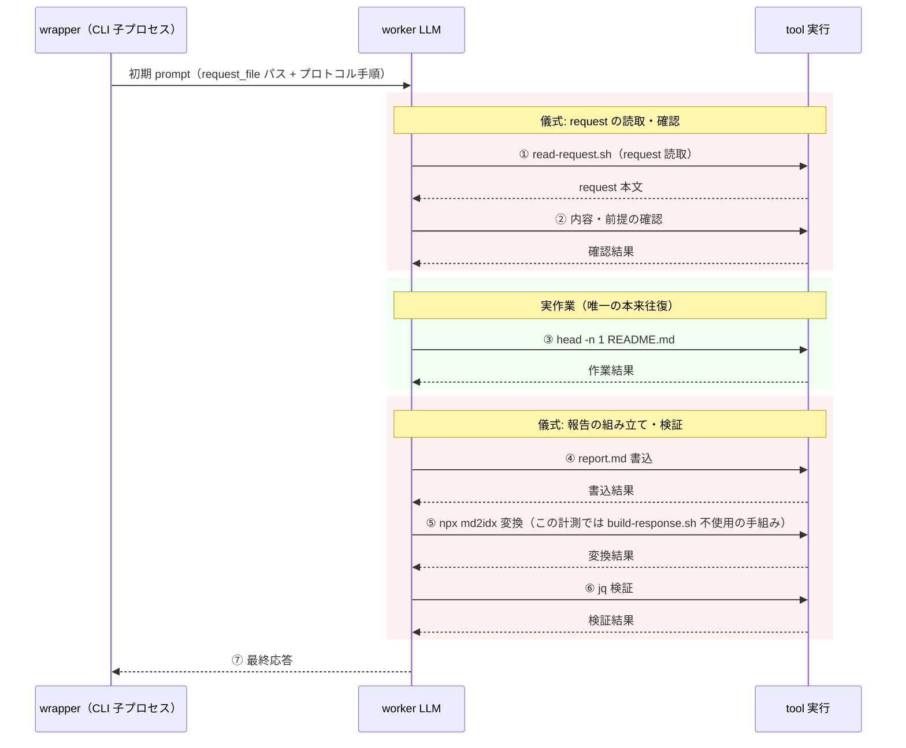
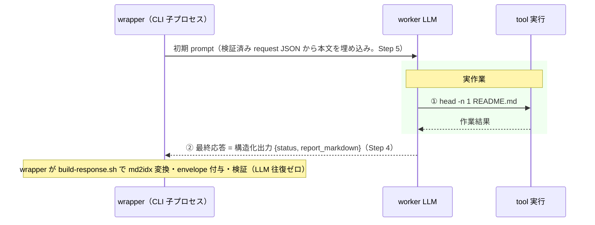
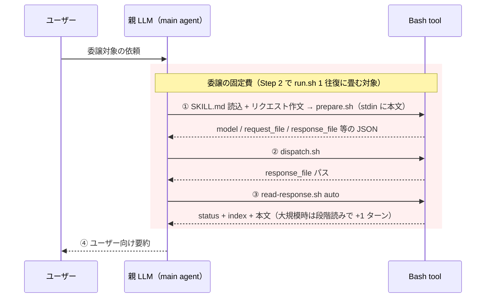
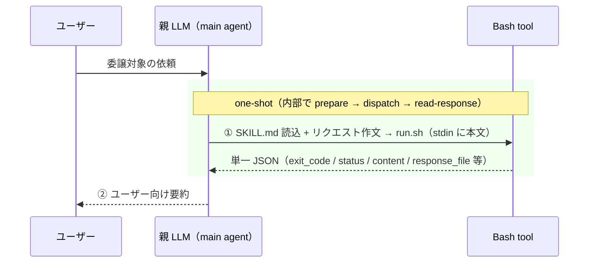

# 委譲オーバーヘッド削減 設計・実装計画

[](https://mkdn.review/?url=https%3A%2F%2Fraw.githubusercontent.com%2Foubakiou%2Fdelegate-skills%2Frefs%2Fheads%2Fmain%2Fdocs%2Ffeature%2Fdelegate-latency-reduction.md)

delegate 1 回あたり約 3 分かかっている委譲オーバーヘッド（実作業以外の固定コスト）を削減する。実測の結果、主因はシェル配管や CLI 起動ではなく **プロトコル儀式に費やされる LLM 往復回数**（worker 側 6 往復 + 親側 3〜4 ターン）であり、往復の削減を中核に据える。worker の報告は最終 assistant message の構造化出力で回収して儀式を 6 往復 → 1 往復に、親側は `run.sh` 1 本化で 3 Bash 往復 → 1 に畳む。目標は typical な小タスクの委譲で 3 分 → 60〜90 秒。

完了後は `docs/design/spec.md` / `docs/design/protocol-v1.md` / README / README_ja に永続情報を移し、本ファイルは archive する。

## 1. 対応スコープ

| 要件                                                                                    | 開始時の状態                                                                                                  | 完了条件                                                                                                                                                                                                                                                                            | 最終状態 | 状態                                                                   |
| --------------------------------------------------------------------------------------- | ------------------------------------------------------------------------------------------------------------- | ----------------------------------------------------------------------------------------------------------------------------------------------------------------------------------------------------------------------------------------------------------------------------------- | -------- | ---------------------------------------------------------------------- |
| [MUST] worker のプロトコル儀式往復を実作業 + 1 往復（最終応答が report を兼ねる）へ削減 | trivial タスクで 7 往復中 6 往復が儀式（read-request 実行、response 変換・検証等）。実測 37 秒（§2 計測記録） | generic 4 backend wrapper と専用 2 wrapper（imagegen / x-research）のすべてで、worker の最終 assistant message（構造化出力 `{status, report_markdown}`）を wrapper が response へ組み立てる。報告方式は起動前に選択し（§3.1）、実行後の parse 失敗は failed response（fail-closed） | -        | 未着手                                                                 |
| [MUST] 親側のスクリプト呼び出しを 1 Bash 往復に集約                                     | prepare → dispatch → read-response の 3 呼び出し（親 LLM の 3 ターン以上）                                    | 通常 run は `run.sh`（専用 2 skill は同一出力契約の `run-*.sh`）1 回で完結する。成功・失敗とも単一 JSON 契約の stdout を返し、失敗時にも親の追加往復を要求しない。既存 3 スクリプトの個別利用も引き続き可能                                                                         | -        | 未着手                                                                 |
| [SHOULD] フェーズ別 wall time と worker 往復回数のテレメトリ                            | `DELEGATE_METRICS_FILE` はトークン proxy のみで所要時間の記録なし                                             | backend / model 別に p50/p95 を集計できる契約（monotonic duration・欠損規則・最低サンプル数・backend 別抽出仕様）で、フェーズ wall time・`model_turns`・`tool_calls`・`time_to_first_useful_event`・構造化出力 parse 失敗率が読める                                                 | -        | 着手中（計測契約・抽出・集計は実装済み。実運用ベースラインの蓄積が残） |
| [SHOULD] 待ち時間隠蔽（background dispatch）の利用ガイドを整備                          | SKILL.md は非対話親向けに「フォアグラウンド必須」とだけ記載                                                   | 対話親では background 実行 + observe 監視で待ちを隠蔽できることを SKILL.md / README に明記（体感改善であり、wall time 削減の集計には含めない）                                                                                                                                      | -        | 未着手                                                                 |

スコープ外:

- **session reuse（resumable / followup）の拡張**: 反復 2 回目以降の再 prefill 回避は既存機能で達成済み。利用ガイドの充実は本計画のドキュメント反映内で触れるに留める
- **worker モデル自体の高速化・変更**: 既定モデル（haiku / sonnet 等）の見直しは行わない。オーバーヘッドはモデル選択と独立に存在する
- **task 種別ごとの tool / MCP capability 絞り込み**: `--tools` による tool schema 削減と task 別 MCP 注入の限定は、prefill 削減として有望だが効果が環境の MCP 設定量に依存する。MCP 継承統一（完了済み: [delegate-worker-mcp-config.archive.md](../archive/delegate-worker-mcp-config.archive.md)）の後続計画として切り出し、本計画の Step 1 テレメトリで効果測定の材料だけ先に揃える
- **latency-first の break-even gate / effort・fast 系モデルへの routing**: opt-in の `@effort` suffix 指定は実装済み（[delegate-effort-suffix.archive.md](../archive/delegate-effort-suffix.archive.md)）。本計画で扱わないのは、latency を基準に委譲可否や effort・fast 系モデルを機械的に選ぶ gate / routing の自動化で、これは別計画とする。委譲すべきでないタスクの判断は従来どおり各 SKILL.md のコストゲートに委ねる
- **stall 判定の高度化（first-useful-event deadline / 総 deadline / backend circuit breaker）**: 現行の byte 増加ベース stall 判定は接続リトライログを進捗と誤認する盲点があるが、これは tail latency（p95）対策であり中央値の固定費削減という本計画と目的が異なる。`time_to_first_useful_event` の計測だけを Step 1 に先取りし、deadline 設計は別計画とする
- **md2idx / npx の高速化**: warm cache で 0.15 秒と実測済みでボトルネックではない（§2）
- **protocol v1 のファイル形式変更**: request / response JSON の形式（md2idx envelope）は変えない。変わるのは「誰が組み立てるか」のみ（§5-e）

## 2. ベースライン / リファレンス

### 計測記録（2026-07-18）

手法: devcontainer 上で各要素を単体計測し、さらに「README.md の 1 行目を報告する」だけの trivial リクエストを `shared/prepare.sh` → `shared/dispatch.sh` で実 delegate 実行（backend: Codex / gpt-5.5、`DELEGATE_EXPLORE_MODEL` による env 解決）。observe JSON と worker stream capture から往復内訳を抽出した。この trivial リクエストは SKILL.md のコストゲート上は委譲すべきでないタスクであり、固定費測定専用の基準として使う。

| 計測項目                           | 実測値                                                                             |
| ---------------------------------- | ---------------------------------------------------------------------------------- |
| `npx --yes md2idx --help`（warm）  | 0.15 秒                                                                            |
| `claude -p` 最小往復（haiku）      | 3.7 秒                                                                             |
| trivial delegate-explore の worker | 37 秒 / 7 LLM 往復（tool call 6 + 最終応答 1）/ 入力 98k tokens（うち cached 81k） |
| うちプロトコル儀式                 | 6 往復（読取 1 + 確認 1 + 書込 1 + md2idx 変換 1 + jq 検証 1 + 最終応答 1）        |
| うち実作業                         | 1 往復（`head -n 1 README.md`）                                                    |

計画実施前の worker 7 往復の内訳（①②④⑤⑥⑦ が儀式、③ のみ実作業）:



計画実施後（Step 4 + 5 の主経路）は実作業 + 最終応答の 2 往復になる（§3.1。report.md 方式選択時は report 書込の +1 往復）:



worker の 1 往復 ≒ 5 秒（gpt-5.5）。親側は「SKILL.md 読込 → リクエスト作文 + prepare → dispatch → read-response → ユーザー向け要約」の 3〜4 ターンで、親が thinking の長い高価モデルの場合 1 ターン 15〜40 秒。両者の合計が約 3 分に一致する。

計画実施前の親側の典型 4 ターンの内訳（①〜③ が Bash 3 往復。隣接ターンが畳まれると 3 ターン）:



1 ターンごとに親 LLM の推論（高価モデルでは thinking 込みで 15〜40 秒）が挟まるため、Bash 3 往復は親 2 ターン分の削減余地に相当する（§5-f）。

計画実施後（Step 2）は Bash 1 往復・親 2 ターンになる（§3.2）:



この計測では worker が `build-response.sh` を使わず `npx md2idx` + `jq` を手組みで実行しており、プロンプト指示によるプロトコル遵守が backend によって揺れることも確認された（儀式を wrapper 側へ移す動機の一つ）。

### 確認済みの CLI 側事実（2026-07-19 Step 3 PoC 実測で更新）

| Backend | 構造化出力の回収手段                                                                                                             | prompt の非 argv 受け渡し               | 確認状況                                                                                               |
| ------- | -------------------------------------------------------------------------------------------------------------------------------- | --------------------------------------- | ------------------------------------------------------------------------------------------------------ |
| Claude  | `--json-schema <schema>`: stream-json の result event に parse 済み `structured_output` object と `result`（JSON 文字列）の両方  | `-p` の piped stdin（実測 ✓）           | 実測 ✓（haiku、Read tool 併用 + 構造化最終応答の両立を確認）                                           |
| Codex   | `--output-schema <FILE>`: `-o`（LAST_MSG）に schema 準拠 JSON がそのまま書かれる                                                 | positional `-` で piped stdin（実測 ✓） | 実測 ✓（gpt-5.5、tool 併用可。ambient config の非互換 effort は turn.failed になるため隔離 home 前提） |
| Cursor  | schema 強制フラグ無し。stream-json の最終 result event `.result` に最終 message 全文（prompt 指示で JSON を返させて parse する） | `-p` の piped stdin（実測 ✓）           | 実測 ✓（遵守は prompt 依存）                                                                           |
| Devin   | schema 強制フラグ無し。`--export`（ATIF）の最終 `source: "agent"` step の `.message` に最終 message 全文（stdout にも同文）      | `--prompt-file`（実測 ✓）               | 実測 ✓（swe-1.7、遵守は prompt 依存。step に `timestamp` があり timing 材料にもなる）                  |
| Grok    | 未確認（`--json-schema` / streaming-json は `--help` 記載のみ）                                                                  | `--prompt-file`（`--help` 記載のみ）    | CLI 未導入環境のため未実測。fail-closed で report.md 方式を既定にする                                  |

### 現行実装の扱い

| 参照元 / 現行実装                                                                                                                                | 本実装での扱い                                                                                                                       |
| ------------------------------------------------------------------------------------------------------------------------------------------------ | ------------------------------------------------------------------------------------------------------------------------------------ |
| `shared/prepare.sh`（ヘッダコメント「往復を減らすため 1 本に畳む」）                                                                             | 同じ設計判断をフロー全体へ拡張する根拠。prepare 自体は変更最小                                                                       |
| `shared/dispatch.sh`（grok backend を明示拒否 / exit 2）                                                                                         | 共通 `run.sh` が x-research を扱えない根拠。専用 `run-x-research.sh` を同一出力契約で設ける（§5-d）                                  |
| `skills/delegate-imagegen/scripts/prepare-imagegen.sh`                                                                                           | imagegen が共通 prepare を使えない根拠。専用 `run-imagegen.sh` を同一出力契約で設ける（§5-d）                                        |
| `shared/delegate-claude.sh` ほか 3 backend wrapper                                                                                               | prompt の stdin / prompt-file 化と、最終 message からの response 組み立て（構造化出力 parse → md2idx + envelope）を追加              |
| 専用 wrapper（`skills/delegate-imagegen/scripts/delegate-imagegen-codex.sh` / `skills/delegate-x-research/scripts/delegate-x-research-grok.sh`） | generic wrapper と同じ read-request 実行・worker 側 response 生成の指示を持つため、同様に prompt 埋め込みと wrapper 側組み立てを適用 |
| `shared/build-request.sh`（companion `.md` は `\|\| true` の best-effort 書込）                                                                  | companion `.md` は従来どおり人間向け派生物に留める。prompt は正本 JSON から組み立てる（§5-a）                                        |
| `shared/build-response.sh`                                                                                                                       | worker 実行前提から wrapper 実行前提へ役割を移す（スクリプト自体は流用。入力が構造化出力か report.md かは wrapper が吸収）           |
| `shared/read-request.sh`                                                                                                                         | context 上限超過級の巨大 request 用 fallback として残す（§5-a）                                                                      |
| `shared/observe-json.sh`（failed response helper / usage 記録）                                                                                  | フェーズ別 wall time・`time_to_first_useful_event`・parse 失敗率等の記録 helper を追加。failed response 経路は既存のまま流用         |
| `shared/read-response.sh auto`                                                                                                                   | `run.sh` の最終段として内包する（単体利用も維持）。大規模 response 向けに `decision` selector を追加し run.sh から接続（§3.2）       |
| `scripts/delegate-wrapper-session.test.ts`（fake CLI による wrapper test）                                                                       | 儀式移管後の wrapper 挙動（構造化出力 parse / 起動前 fallback 選択 / fail-closed）のテスト手法として踏襲                             |
| `fixtures/metrics/` + `scripts/check-metrics-baseline.sh`                                                                                        | タイミングテレメトリのベースライン監視に流用                                                                                         |

## 3. 設計の中核

### 3.1 worker 儀式の wrapper 移管

主経路: worker は作業後、**最終 assistant message を構造化出力 `{status, report_markdown}` で返すだけ**にする。回収手段は backend 別に §2 の表のとおり。wrapper が回収した `report_markdown` を `build-response.sh` へ渡して md2idx 変換・envelope 付与・検証を行う。prompt は wrapper が**検証済み request JSON の `.sections` から直接組み立てる**（companion `.md` は使わない。§5-a）。

| 責務                       | 現行                                            | 変更後（主経路）                                                                  |
| -------------------------- | ----------------------------------------------- | --------------------------------------------------------------------------------- |
| request の読取             | worker（`read-request.sh` 実行 = 1 往復）       | wrapper が正本 JSON から抽出した本文を stdin / prompt-file で初期 prompt に含める |
| 作業レポートの執筆         | worker（report.md 書込 + build-response 実行）  | worker の最終 assistant message（構造化出力）が report を兼ねる = 追加往復ゼロ    |
| md2idx 変換・envelope 付与 | worker（`build-response.sh` 実行 = 1 往復以上） | wrapper が最終 message から回収して組み立て（§5-b）                               |
| response の検証            | worker（jq 検証 = 1 往復）                      | wrapper（既存の envelope 検証を流用）                                             |
| status の伝達              | worker（envelope の `.status`）                 | 構造化出力の `status` フィールドを wrapper が envelope へ転記                     |

**報告方式は起動前に選択する**（§5-c）。wrapper は子プロセス起動前に、構造化最終応答方式か report.md 方式（front-matter `status:` 付き Markdown の 1 回書込 = + 1 往復)かを決め、prompt と tool 許可をその方式に合わせて構成する。初期実装の選択規則は機械判定可能な backend 既定のみとする: **claude / codex は構造化最終応答、cursor / devin / grok は report.md**（Step 3 実施結果）。task 種別による上書き（最終 message の出力上限に当たり得る長大報告種別を report.md へ倒す等）は初期実装では入れず、Step 4 の truncate 検知（failed response）と parse 失敗率テレメトリで必要が確認された種別にのみ導入する。

**実行後の parse 失敗・truncate は failed response（fail-closed）とする**。wrapper が失敗を検知する時点で非永続セッションの worker は終了済みであり、そこから report.md へ切り替えることはできない。リトライは丸ごと再実行（コストは worker wall 全額）になるため wrapper は自動で行わず、failed response を受けた親の判断に委ねる。parse 失敗率は `timing` テレメトリで監視し、高止まりする backend は起動前選択を report.md 方式へ倒す。構造化出力の `status` は protocol の 4 値（`completed | partial | failed | needs_input`）に schema で制約し、語彙外の値が返った場合も parse 失敗と同じ failed response とする。

報告方式の選択と wrapper 側組み立ては、session_mode（resumable / followup）を含む全 run に適用する。resumable では worker プロセス終了後も backend session を follow-up run で再開して report を再要求する余地が残るが、再要求には新しい follow-up run の起動（worker 往復のコスト）が必要なため wrapper は自動で行わない（§5-c と同判断）。実行後の失敗処理は非永続と同じ fail-closed に統一し、follow-up で再要求するかは failed response を受けた親が判断する。

主経路（構造化最終応答）を選んだ run では worker に報告用の書込許可が不要になるため、read-only 種別（explore / review）の tool 許可をさらに絞れる（Codex read-only sandbox や Cursor plan / ask mode の利用余地も広がる）。report.md 方式を選んだ run のみ run dir 配下への書込を許可する。

### 3.2 親側 one-shot `run.sh`

`shared/run.sh` を新設し、通常 run の親側フローを 1 Bash 呼び出しに畳む:

```
printf '%s' "$req_md" | bash <skill_dir>/scripts/run.sh <task_type> <TYPE_ENV> <default_model> "$PARENT_TASK_TYPE_CHAIN" "$REQUESTER_SESSION_ID" [selector]
```

内部で prepare → dispatch → read-response を順に実行する。stdout は**成功・失敗とも次の単一 JSON**（本文連結はしない）:

```json
{
  "exit_code": 0,
  "status": "completed",
  "content": "<selector が返した応答本文>",
  "content_truncated": false,
  "response_file": "...",
  "observe_file": "...",
  "run_dir": "..."
}
```

- `content` の上限は `DELEGATE_RUN_CONTENT_MAX`（既定は Step 1 実測から決定）。超過時は切り詰めて `content_truncated: true` とし、全文は `response_file` 参照に委ねる
- 失敗時（prepare の失敗 exit 1=md2idx 失敗 / 2=引数エラー / 3=前提条件不足 / 4=委譲サイクル / 6=effort 指定不正、dispatch 失敗、read-response 失敗）も同 schema で返し、`content` には failed response の Summary / Error 相当を上限付きで格納する。exit code は透過する。prepare の exit 5（follow-up 検証失敗）は run.sh の対象外（§5-h。follow-up は個別スクリプトのフロー契約に残る）
- `selector` 引数は `read-response.sh` へ渡す。省略時の既定は task 種別で切り、review は `decision`、他は `auto`。第 6 位置引数は `prepare.sh` では `session_mode` であり意味が異なるため、SKILL.md の書き換え（Step 2）で混同しないよう明記する
- signal・外部 Bash timeout による強制終了時は構造化 stdout を保証できない（one-shot 保証の対象外）。復旧経路として run.sh は dispatch 前に `observe_file` パスを stderr へ出力する
- resumable / followup を含む高度なフロー（observe 監視、background 実行）では従来どおり個別スクリプトを使う（§5-h）

専用 2 skill は共通 dispatch を通れない（§2）ため、同一の引数・出力契約を満たす薄い `run-imagegen.sh` / `run-x-research.sh` を各 skill 配下に設ける（§5-d）。

`read-response.sh` には `decision` selector を追加する: 大規模 response（既定 10KB 以上）で Summary に加えて Findings / Blockers の要点を上限付きで返し、review 系フローで親の追加読み取り 1 ターン（15〜40 秒規模）を削る。run.sh の review 既定 selector として接続する。

### 3.3 タイミングテレメトリ

- `DELEGATE_METRICS_FILE` の各 record（`prepare` / `read_response`）に `duration_ms` を追加し、dispatch 完了時に `dispatch` record を追加する。`dispatch` record は wall time に加えて `model_turns` / `tool_calls`（stream capture の item / turn 数）・`time_to_first_useful_event_ms`（起動から最初の tool 実行または本文 delta までの経過時間）・`report_ready_at_ms`（起動から報告確定までの経過時間）・構造化出力の parse 成否を持つ
- observe JSON に `usage` と並ぶ `timing` を追加する。契約: 時間値はすべて **monotonic clock 由来の経過 ms**（時刻ではない）。backend の stream から取得できない項目は `null` とし、`measurement_source`（`claude_stream_json` / `codex_json` / `cursor_stream_json` / `devin_atif` / `grok_streaming_json` / `unavailable`）を併記する。抽出仕様は backend 別に `shared/observe-json.sh` へ実装し、`scripts/observe-json.test.ts` に fixture を置く
- 集計（`scripts/summarize-metrics.ts`）は backend / model 別の p50/p95 を出す。`null` は分母から除外し、除外数を併記する。p95 は**最低 20 run 以上**のサンプルで評価し、それ未満は p50 と件数のみ報告する。background dispatch は wall time 削減として集計しない

## 4. 実装ステップ

順序は「独立で削減見込みが最大の run.sh を先、6 wrapper 改修は PoC で回収経路を確定させてから」とする（§5-g）。公開仕様（protocol-v1 / README / SKILL.md）が変わる Step では、同じ Step 内でドキュメントも更新する（`feature-plan-template.md` の原則）。

### Step 1: (計測基盤 実装済み / 実運用ベースライン収集中) タイミングテレメトリとベースライン取得

- §3.3 のテレメトリを契約（monotonic ms / null + `measurement_source` / backend 別抽出仕様 / 最低サンプル数）ごと実装し、`fixtures/metrics/` のベースラインへ組み込む
- 実運用の delegate で backend / model 別のフェーズ分布を取得する（p95 を語る backend は 20 run 以上を集める）。同じ run 群の observe JSON `usage`（既存計測）もトークン before/after 比較のベースラインとして記録する。比較は同一 backend / model / task 条件かつ `measurement: "measured"` の run に限り、input / cached input / output を区分別に扱う（`estimated` は protocol payload のみの下限値のため比較対象外。§5-f）
- README の環境変数・テレメトリ記述を同 Step で更新する

成果物: 施策効果を分布で比較できる計測基盤と着手前ベースライン

### Step 2: (実装済み) 親側 one-shot 化（run.sh + 専用 run スクリプト）

- `shared/run.sh` を新設し `sync-shared` 対象へ追加。§3.2 の単一 JSON 契約・selector 引数・stderr への observe_file 先出しを実装
- `shared/read-response.sh` に `decision` selector を追加し、run.sh の review 既定として接続
- 専用 2 skill に同一契約の `run-imagegen.sh` / `run-x-research.sh` を追加
- 全 skill の SKILL.md の実行フローを one-shot 前提に書き換え（`allowed-tools` 更新を含む）。個別スクリプトによる高度なフローは補足として残す。対話親向けに background dispatch + observe 監視の利用ガイドも同 Step で追記
- README / README_ja の How it works と環境変数表（`DELEGATE_RUN_CONTENT_MAX` の追加）を同 Step で更新

成果物: 親の Bash 往復 3 → 1（親 LLM 2 ターン相当の削減、1 回あたり 30〜80 秒見込み）。wrapper 改修と独立に先行投入できる

### Step 3: (実施済み 2026-07-19。Grok のみ CLI 未導入で未実測) PoC — 構造化出力回収の backend 別確定

実モデルを呼ぶ live 実行で以下を確定させる（`delegate-worker-mcp-config.archive.md` Step 1 と同じ流儀）:

- Claude: `--json-schema` で `{status, report_markdown}` が安定して返るか。長文 report での遵守度と truncate 挙動
- Codex: `--output-schema` + 最終 message 回収（既存 `LAST_MSG`）で同上
- Cursor: stream-json の最終 result からの report 回収可否。schema 指定手段の有無
- Devin: `--prompt-file` の実在と、export 最終 assistant message からの回収可否
- Grok: `--json-schema` / streaming-json での回収と遵守度（x-research 専用 wrapper）
- 各 backend の stdin / prompt-file による prompt 受け渡し（§5-a）
- 長文 report の truncate 発生条件（起動前選択のヒューリスティック閾値の材料）

成果物: §2 の表の「Step 3 PoC」を解消した確定仕様と、backend 別の起動前選択既定（構造化最終応答 / report.md）。効かない backend は report.md 方式を既定として §8 へ記録

実施結果（2026-07-19。§2 の表を実測で更新済み）:

- **起動前選択の backend 別既定**: schema を CLI で強制できる Claude（`--json-schema` → result event の `structured_output`）と Codex（`--output-schema` → LAST_MSG）は**構造化最終応答を既定**とする。schema 強制手段が無い Cursor / Devin は最終 message の全文回収は実測できたが遵守が prompt 依存のため、**report.md 方式を初期既定**とし、Step 4 以降 parse 失敗率テレメトリが低位で安定した backend から構造化最終応答へ切り替える。CLI 未導入で未実測の Grok は fail-closed で **report.md 方式を既定**とする
- **prompt の非 argv 受け渡し**: Claude / Codex / Cursor は piped stdin（Codex は positional `-`）、Devin / Grok は `--prompt-file`（Step 5 の実装手段が全 backend で確定）
- **長文 report の truncate 発生条件**: 実測は未実施（コスト対効果から見送り）。上限は各モデルの最大出力トークンに一致する。初期実装は task 種別上書きなし（全種別 backend 既定に従う）で開始し、Step 4 の truncate 検知（failed response）・parse 失敗率テレメトリで必要が確認された種別にのみ report.md 上書きを導入する（§3.1 と同規則）
- **注意事項**: Codex は ambient config の非互換 `model_reasoning_effort` で turn.failed になり得る（wrapper は隔離 CODEX_HOME を使うため通常影響しないが、follow-up の継承 config では注意）

### Step 4: (未着手) wrapper 側 report 回収

- generic 4 backend wrapper と専用 2 wrapper（`delegate-imagegen-codex.sh` / `delegate-x-research-grok.sh`。固有の report 見出し・出力検証を含む）に、起動前の報告方式選択（§3.1）と、構造化出力の回収 → `build-response.sh` 組み立てを実装
- 実行後の parse 失敗・truncate は failed response（fail-closed）。parse 成否を `timing` テレメトリへ記録
- 主経路選択時は read-only 種別の tool 許可から報告用書込を外す（Claude の `minimal_allowed_tools` 縮小等）。report.md 方式選択時のみ run dir 配下の書込を許可
- `scripts/delegate-wrapper-session.test.ts` に方式選択の分岐 / parse 成功 / parse 失敗 → failed response の各ケースを backend ごとに追加
- `docs/design/protocol-v1.md` の worker / wrapper 責務と README を同 Step で更新

成果物: report 関連の儀式往復を削減し、この時点では 6 → 2（read-request と最終応答が残る。report.md 方式は 3）。6 → 1 は Step 5 との合成成果。プロトコル遵守が backend のプロンプト追従性に依存しなくなる

### Step 5: (未着手) request の初期 prompt 埋め込み

- wrapper（専用 2 wrapper を含む）が**検証済み request JSON の `.sections`（と `task_type_chain` 等のメタデータ）から prompt を組み立て**、stdin / prompt-file で渡す。companion `.md` は実行入力に使わない（§5-a）
- gate は OS の argv 制限ではなくモデル context 上限に対して設け、超過時のみ現行の `read-request.sh` 指示へ fallback
- request_file / companion `.md` は監査用に従来どおり生成する
- `docs/design/protocol-v1.md` の request 受け渡し記述を同 Step で更新

成果物: worker の初回往復（read-request）削減。Step 4 と合わせて trivial タスクの worker wall 37 秒 → 10 秒前後（§2 の往復単価から見込み）

### Step 6: (未着手) 実測記録と archive 化

- Step 1 のベースラインと比較した削減実測（wall time の p50/p95 と、observe JSON `usage` による worker トークン消費の before/after（Step 1 と同一の比較条件）。§5-f）を本ドキュメントの最終状態欄へ記録
- 公開ドキュメントは各 Step で更新済みのため、ここでは整合の最終確認のみ行う
- 本ドキュメントを `docs/archive/delegate-latency-reduction.archive.md` へリネーム（ユーザー確認後）

成果物: 削減効果の実測記録と計画のクローズ

## 5. 設計判断

### a. request の受け渡し方式

| 候補                                                                                 | 採用 | 理由                                                                                                                                                             |
| ------------------------------------------------------------------------------------ | ---- | ---------------------------------------------------------------------------------------------------------------------------------------------------------------- |
| **正本 request JSON から抽出し stdin / prompt-file で埋め込み（context 上限 gate）** | ✓    | worker の初回往復が丸ごと消える。argv を経由しないため ARG_MAX に縛られず、gate はモデル context 上限にだけ置けばよい。prompt が `ps` から見えない副次効果もある |
| companion `.md` を prompt に流用                                                     | ✗    | `.md` は `\|\| true` の best-effort 派生物で protocol の正本ではない（protocol-v1）。黙って欠落・不整合し得るものを実行入力にすると source of truth が崩れる     |
| argv（`-p` 引数）へ inline + ARG_MAX 閾値 fallback                                   | ✗    | OS 制限が binding になり、閾値設計が本質（モデル context）とずれる                                                                                               |
| 常にファイル読取（現行）                                                             | ✗    | 「読み飛ばせる情報は無い」request を読むためだけに毎回 1 往復（≒5 秒 + tool 結果の再入力）を払う                                                                 |

### b. report の回収方式

| 候補                                                                                      | 採用 | 理由                                                                                                                                                      |
| ----------------------------------------------------------------------------------------- | ---- | --------------------------------------------------------------------------------------------------------------------------------------------------------- |
| **構造化最終応答 `{status, report_markdown}` を主経路、report.md を起動前選択の代替方式** | ✓    | report 執筆と最終応答が 1 往復に畳まれ、儀式が最小になる。read-only 種別で報告用書込許可が不要になり、wrapper が backend 別の回収手段（§2）を正規化できる |
| report.md 書込 + status 一語の最終応答（改訂前案の主経路）                                | ✗    | 儀式が 2 往復残る。長大 report・非対応 backend 向けの起動前選択肢としては有効なので代替方式として残す                                                     |
| 現行維持（worker が build-response.sh を実行）                                            | ✗    | 儀式 3 往復 + プロトコル逸脱時のリトライループを払い続ける。§2 で観測した「build-response.sh を使わない backend」の脆弱性も残る                           |

### c. 報告方式の選択タイミングと失敗時の扱い

| 候補                                                            | 採用 | 理由                                                                                                                                                                                                                              |
| --------------------------------------------------------------- | ---- | --------------------------------------------------------------------------------------------------------------------------------------------------------------------------------------------------------------------------------- |
| **起動前に方式を確定し、実行後の parse 失敗は failed response** | ✓    | 非永続セッションでは wrapper が parse 失敗を検知した時点で worker は終了済みで、実行後の方式切替は原理的に不成立。resumable の report 再要求も自動では行わず親判断に委ねる（§3.1）。起動前選択なら read-only sandbox とも両立する |
| 実行後に parse 失敗を検知したら report.md fallback へ切替       | ✗    | 終了済みの worker にファイルは書かせられない。「+1 往復」ではなく丸ごと再実行になり、fallback の名に値しない                                                                                                                      |
| parse 失敗時に wrapper が自動リトライ                           | ✗    | 再実行は worker wall 全額のコストで、無条件に払う判断を wrapper がすべきでない。failed response を受けた親（またはユーザー）の判断に委ねる                                                                                        |

### d. 専用 2 skill（imagegen / x-research）の one-shot 化

| 候補                                                           | 採用 | 理由                                                                                                                                                                                                 |
| -------------------------------------------------------------- | ---- | ---------------------------------------------------------------------------------------------------------------------------------------------------------------------------------------------------- |
| **同一出力契約の薄い `run-imagegen.sh` / `run-x-research.sh`** | ✓    | 共通 dispatch.sh は grok を明示拒否し、imagegen は専用 prepare を要するため共通 run.sh を通れない。例外 2 系統のために共通側へ間接層を足すより、契約だけ共有する方が self-contained 方針とも整合する |
| 共通 run.sh に prepare / dispatch の adapter 契約を追加        | ✗    | generic 5 skill にとって不要な間接化。adapter の検証・テスト面も増える                                                                                                                               |
| 専用 2 skill は one-shot 化の対象外にする                      | ✗    | 親側往復の削減効果が skill によって受けられず、SKILL.md のフロー記述も分裂する                                                                                                                       |

### e. protocol v1 との互換

| 候補                                                      | 採用 | 理由                                                                                                                         |
| --------------------------------------------------------- | ---- | ---------------------------------------------------------------------------------------------------------------------------- |
| **ファイル形式は不変、責務の所在だけ変える（v1 のまま）** | ✓    | request / response JSON の形式・置き場・読み方（read-response.sh）は変わらないため、既読側（親・監査・テスト）への影響がない |
| protocol v2 として形式ごと再設計                          | ✗    | 削減対象は往復回数であって形式ではない。形式変更は既存テスト・fixtures・ドキュメントの書き換え範囲を不必要に広げる           |

### f. 削減効果の見込み（§2 の実測に基づく）

| 施策                          | 削減対象                                            | 見込み                                                                                                                                   |
| ----------------------------- | --------------------------------------------------- | ---------------------------------------------------------------------------------------------------------------------------------------- |
| Step 2（one-shot 化）         | 親の 4 ターン中 2 ターン                            | 約 30〜80 秒/回（親ターン単価 15〜40 秒 × 2、親モデル依存）                                                                              |
| Step 4 + 5（worker 儀式移管） | worker の儀式 6 往復中 5 往復（残りは最終応答のみ） | 約 25〜30 秒/回（1 往復 ≒ 5 秒）。前提: parse 失敗率が低いこと（失敗 1 回 = 再実行 1 回分のコスト。Step 3 PoC と失敗率テレメトリで担保） |
| `decision` selector（Step 2） | 大規模 response 時の親の追加読み取り 1 ターン       | 該当時 15〜40 秒/回                                                                                                                      |
| background dispatch ガイド    | 体感ブロック時間                                    | 体感ほぼゼロ化（総所要は不変。wall time 削減として集計しない）                                                                           |
| 合算                          | -                                                   | 小タスクの委譲で 3 分 → 60〜90 秒                                                                                                        |

トークンへの副次効果: 本計画の目標は latency だが、往復削減は消費トークンにも同方向に効く。親側は削減ターン分の出力トークン（thinking 含む）に加え、中間 tool 結果（prepare の JSON、dispatch のパス出力）が context に積もらなくなる分の入力トークンが減る。worker 側は往復ごとの再 prefill が減るため入力トークン（cached 区分中心）が減る（§2 の trivial 実測: 入力 98k / 7 往復。往復数比例は仮説であり Step 1 / 6 の実測で検証する）。read-request 廃止（Step 5）は request 本文の載り方を tool 結果から初期 prompt へ移すもので本文トークン自体は中立だが、read-request の tool call とその結果が後続ターンで再 prefill され続ける分は消える。逆方向に増えるのは parse 失敗時の再実行（worker 消費全額。§5-c）と report.md 方式の +1 往復のみ。実測比較は worker トークンに限る: observe JSON `usage` は worker 側のみの記録で親 LLM の消費を含まないため、親側の効果はターン数削減からの定性評価に留める。

### g. 実装順序（run.sh 先行）

| 候補                                        | 採用 | 理由                                                                                                                                           |
| ------------------------------------------- | ---- | ---------------------------------------------------------------------------------------------------------------------------------------------- |
| **計測 → one-shot 化 → PoC → wrapper 改修** | ✓    | run.sh は 6 wrapper 改修と独立で、削減見込みが最大（30〜80 秒 > 25〜30 秒）かつ変更リスクが小さい。wrapper 改修は PoC で回収経路を確定してから |
| 計測 → wrapper 改修 → run.sh（改訂前案）    | ✗    | 効果の小さい方に先へ複雑な 6 wrapper 改修を置くことになり、ROI の順序が逆                                                                      |

### h. `run.sh` の対象範囲

| 候補                                                            | 採用 | 理由                                                                                                                                                              |
| --------------------------------------------------------------- | ---- | ----------------------------------------------------------------------------------------------------------------------------------------------------------------- |
| **通常 run のみ（session_mode / background は個別スクリプト）** | ✓    | 委譲の大多数を占める通常 run に最適化し、単一 JSON 契約を単純に保つ。resumable / followup は observe JSON の受け渡しと親のリカバリ判断が挟まり 1 本化の利得が薄い |
| session_mode も含め全フローを 1 本化                            | ✗    | followup の事前検証失敗（exit 5）後の親のリカバリ判断など、途中で親の判断が挟まるフローを 1 本に畳むと失敗時の分岐が複雑化する                                    |

## 6. テスト方針

### 自動テスト

- `scripts/delegate-wrapper-session.test.ts`（更新、fake CLI）
  - 起動前の報告方式選択（構造化最終応答 / report.md）の分岐が prompt・tool 許可・CLI フラグに反映されること（generic 4 backend + 専用 2 wrapper）
  - 構造化最終応答 `{status, report_markdown}` → response JSON 組み立て（status 転記、md2idx envelope 検証）
  - parse 失敗・truncate・`status` 語彙外 → failed response（fail-closed）と parse 成否のテレメトリ記録
  - request の正本 JSON からの prompt 組み立て（companion `.md` 欠落時でも成立すること）と、context 上限 gate 超過時の read-request 指示 fallback
  - 通常 run / resumable / followup のいずれにも報告方式選択・wrapper 組み立てが適用され、既存の session 管理挙動（handle 記録・follow-up 検証）が変わらないこと
- `run.sh` / `run-imagegen.sh` / `run-x-research.sh` の shell test（新規）
  - 成功・失敗とも §3.2 の単一 JSON schema（`content_truncated` / 上限 / nullable パス含む）で stdout が返ること
  - prepare の各失敗 exit（1/2/3/4/6。6 は `DELEGATE_<TYPE>_MODEL` の不正 `@effort` suffix で再現）と dispatch 失敗の exit code 透過、dispatch 前の stderr への observe_file 出力
  - selector 引数と task 種別既定（review → `decision`、他 → `auto`）が `read-response.sh` へ届くこと
  - response 欠落・不正 JSON でも同 schema の失敗 stdout が返ること
- `read-response.sh` の `decision` selector（既存テスト形式に追加）
  - 大規模 response で Summary + Findings / Blockers 要点が上限付きで返ること
- `scripts/observe-json.test.ts` / metrics fixtures
  - `timing` の backend 別抽出（fixture）、取得不能時の `null` + `measurement_source`、`duration_ms` / `dispatch` record のベースライン反映と `check-metrics-baseline.sh` でのドリフト監視

### 手動確認

- [ ] Step 1 完了時に着手前ベースライン（backend / model 別。p95 は 20 run 以上）を記録済み
- [x] Step 3 PoC: 実測対象 backend（Claude / Codex / Cursor / Devin）の回収経路・prompt 受け渡し・起動前選択の backend 別既定を確定済み（§2 の表・§4 Step 3 実施結果）
- [ ] follow-up（Step 3 残）: Grok の streaming-json 回収は CLI 導入後に PoC する（それまで report.md 既定を維持）。長文 truncate 発生条件は実測せず、Step 4 以降のテレメトリ（truncate 検知・parse 失敗率）で監視する
- [ ] Step 5 完了時に §2 と同一の trivial リクエストで削減効果を再計測し、見込み（§5-f）と比較
- [ ] managed-policy 環境相当（bypass 無効）で Claude backend worker の報告回収が成立すること
- [ ] `npm run sync-shared:check` / `vp check` / `vp test` が全パス

## 7. 受け入れ基準

- §1 の MUST 要件を満たす
- trivial リクエストの worker 往復が実作業 + 1 往復（構造化最終応答）に収まる。report.md 方式選択時でも実作業 + 2 往復以内
- 通常 run の親側フローが成功・失敗とも one-shot スクリプト 1 回で完結し（専用 2 skill 含む）、既存 3 スクリプトの個別利用も従来どおり動く
- 既存の delegate 実行（実在する skill × backend の組合せ。generic 系 skill は 4 backend、imagegen は Codex 専用、x-research は Grok 専用）と session reuse のテストが通る
- 公開仕様が変わった Step で protocol-v1 / README / SKILL.md が同 Step 内で更新されている
- `npm run sync-shared:check` が通る（生成コピーの直接編集なし）

## 8. 想定リスクと回避策

| リスク                                                                       | 回避策                                                                                                                                                                                        |
| ---------------------------------------------------------------------------- | --------------------------------------------------------------------------------------------------------------------------------------------------------------------------------------------- |
| 構造化出力の遵守度が backend / モデルによって揺れ、parse 失敗が頻発する      | Step 3 PoC で backend 別に実測してから起動前既定を決める。実行後失敗は failed response（fail-closed）とし、parse 失敗率をテレメトリで監視。高止まりする backend は既定を report.md 方式へ倒す |
| 長大な report が最終 message の出力上限で truncate される                    | 初期実装は task 種別上書きなしの backend 既定で開始し、truncate 検知（failed response）と parse 失敗率テレメトリで必要が確認された種別にのみ report.md 上書きを導入する（§3.1 / §4 Step 3）   |
| parse 失敗のリトライコストが「+1 往復」ではなく再実行全額になる              | wrapper は自動リトライしない（§5-c）。§5-f の見込みに失敗率前提を明記し、失敗率が見込みを崩す水準ならその backend の主経路採用を見直す                                                        |
| request の prompt 埋め込みがモデル context 上限に当たる                      | context 上限に対する gate で超過時は現行のファイル読取方式へ fallback（§5-a）。gate 既定値は Step 1 の実測と各 backend の context 長から決める                                                |
| signal・外部 Bash timeout で run.sh が強制終了し構造化 stdout を返せない     | one-shot 保証の対象外と明記（§3.2）。run.sh は dispatch 前に observe_file を stderr へ出しておき、親は observe / response_file 経由の既存経路で回収する                                       |
| run.sh の失敗時 `content` が大きな stderr を親へ流し込む                     | `content` は `DELEGATE_RUN_CONTENT_MAX` で切り詰めて `content_truncated` を立て、全文は response_file / observe_file への参照に留める                                                         |
| run.sh 一本化で dispatch 中の observe 監視・途中中断がしにくくなる           | run.sh は通常 run 専用とし、監視が要るフローは従来の個別スクリプトを使う（§5-h）。observe_file は stderr へ先出しされ、外部 watchdog からは従来どおり見える                                   |
| 報告用書込許可の縮小（allowlist 変更）が managed-policy 環境の完走性を変える | 主経路は書込ゼロで managed-policy 耐性はむしろ上がる。report.md 方式選択時のみ run dir 配下限定の書込を許可し、Step 4 で managed-policy 相当の手動確認を行う（§6）                            |

## 9. 参考

- [docs/design/spec.md](../design/spec.md) / [docs/design/development.md](../design/development.md) / [docs/design/protocol-v1.md](../design/protocol-v1.md)
- 計画テンプレート: [feature-plan-template.md](feature-plan-template.md)（「公開仕様は遅延させない」原則を §4 の Step 構成に適用）
- 関連計画: [delegate-worker-mcp-config.archive.md](../archive/delegate-worker-mcp-config.archive.md)（MCP 継承統一、完了済み。capability 絞り込みはその後続計画として切り出す）
- 既存実装: `shared/prepare.sh` / `shared/dispatch.sh` / `shared/build-request.sh` / `shared/build-response.sh` / `shared/read-request.sh` / `shared/read-response.sh` / `shared/observe-json.sh` / generic 4 backend wrapper / 専用 2 wrapper
- 計測記録: §2（2026-07-18、devcontainer 上の実測。CLI フラグの実在確認を含む）
